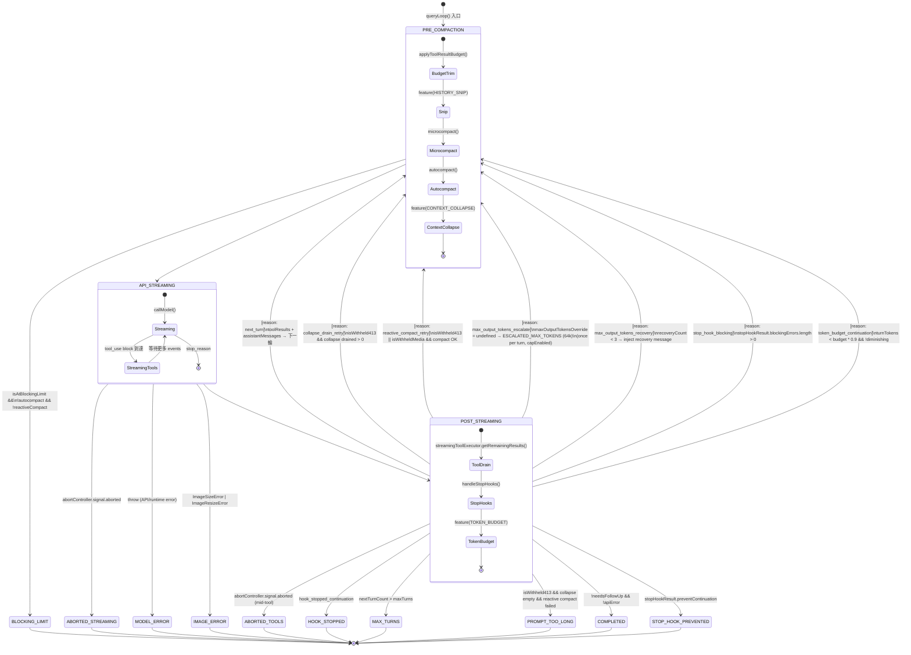

# Ch.07 Master Query State Machine

## Overview

Chapter 07 currently has a simplified pseudo-code `query()` function and a table
of 7 terminal conditions. The real `query.ts` has:
- 1,729 lines
- An explicit `State` type with 10 fields tracking cross-iteration state
- 7 labeled **Continue** transitions (with `reason` field)
- 10 labeled **Terminal** return conditions
- A pre-compaction pipeline with 4 distinct stages (snip → microcompact → autocompact → context-collapse)
- A StreamingToolExecutor that runs tools **concurrently with LLM streaming**

This plan adds a production-accurate `stateDiagram-v2` state machine, updates the
State type documentation, and deepens the terminal/continue condition table.

---

## Source Verification

All findings verified against `/Users/weirenlan/Desktop/self_project/labs/claude-code-src/src/query.ts`.

Key verified facts:
- `State` type defined at line ~201, carries loop state across iterations
- `while (true)` loop body at line ~307, `continue`/`return` are the only exits
- `MAX_OUTPUT_TOKENS_RECOVERY_LIMIT = 3` (line ~154)
- `autoCompact.ts`: `AUTOCOMPACT_BUFFER_TOKENS = 13_000`, reserves 20k for summary output
- `tokenBudget.ts`: `COMPLETION_THRESHOLD = 0.9`, `DIMINISHING_THRESHOLD = 500`

---

## Implementation Plan

### Phase 1: Add Master Query State Machine Diagram

**Location in Ch.07:** Insert as a new section "## Master Query 狀態機" BEFORE the existing
"## Query Loop — 系統的心臟" section.

**Diagram to add (mermaid stateDiagram-v2):**

````markdown

````

**Note:** The diagram above may need minor simplification to render properly in Mermaid.
Test render before committing. The key requirement is showing all 7 Continue paths
and all 10 Terminal paths.

---

### Phase 2: Add State Type Documentation

**Location:** Add after the existing query() function code block.

**New section to add:**

```markdown
## 狀態機的記憶體 — State 型別

`queryLoop` 的跨迭代狀態全部封裝在一個 `State` 物件中：

\```typescript
// src/query.ts — State 型別（真實定義）
type State = {
  messages: Message[]                              // 當前完整對話歷史
  toolUseContext: ToolUseContext                   // 工具上下文（含 abortController）
  autoCompactTracking: AutoCompactTrackingState | undefined  // 壓縮追蹤
  maxOutputTokensRecoveryCount: number            // max_output_tokens 恢復次數（最多 3 次）
  hasAttemptedReactiveCompact: boolean            // 防止 reactive compact 無限循環
  maxOutputTokensOverride: number | undefined     // 首次 escalate 到 64k
  pendingToolUseSummary: Promise<...> | undefined // 背景產生的工具摘要（Haiku）
  stopHookActive: boolean | undefined             // stop hook 是否已觸發
  turnCount: number                               // 當前輪次計數
  transition: Continue | undefined               // 上一輪 continue 的原因
}
\```

**關鍵設計：** 每個 `continue` 站點都寫 `state = { ...new_state }` 而非修改 9 個獨立變數。
這讓每次循環的入口有明確的快照，也讓 debug 更容易（只需打印 `state.transition`）。
```

---

### Phase 3: Update Terminal Conditions Table

Replace the existing 7-row table with the complete 10-condition table:

```markdown
| Terminal 原因 | 觸發條件 | 對應程式碼 |
|---|---|---|
| `completed` | LLM `end_turn`，無待執行工具 | `return { reason: 'completed' }` |
| `max_turns` | `nextTurnCount > maxTurns` | `return { reason: 'max_turns' }` |
| `blocking_limit` | Context 超硬性上限且無自動壓縮 | `return { reason: 'blocking_limit' }` |
| `prompt_too_long` | Context 過長，reactive compact 也失敗 | `return { reason: 'prompt_too_long' }` |
| `aborted_streaming` | 使用者 Ctrl+C（串流中） | `return { reason: 'aborted_streaming' }` |
| `aborted_tools` | 使用者 Ctrl+C（工具執行中） | `return { reason: 'aborted_tools' }` |
| `model_error` | API 或 runtime 拋出異常 | `return { reason: 'model_error', error }` |
| `image_error` | 圖片超過大小限制或無法 resize | `return { reason: 'image_error' }` |
| `stop_hook_prevented` | Stop hook 返回 `preventContinuation: true` | `return { reason: 'stop_hook_prevented' }` |
| `hook_stopped` | Hook 在工具執行中停止繼續 | `return { reason: 'hook_stopped' }` |
```

---

### Phase 4: Update Continue Transitions Table

Add a new "## Continue 轉換路徑" section with the 7 labeled transitions:

```markdown
| Continue 原因 | 觸發條件 | 效果 |
|---|---|---|
| `next_turn` | 收到 tool_use blocks，工具執行完成 | 正常下一輪 |
| `collapse_drain_retry` | 收到 413，contextCollapse 有已暫存的 collapse | drain 後重試，保持 granular 歷史 |
| `reactive_compact_retry` | 413 或 media error，reactive compact 成功 | 壓縮後重試，`hasAttemptedReactiveCompact = true` |
| `max_output_tokens_escalate` | 觸達 token 上限，首次嘗試 escalate 到 64k | `maxOutputTokensOverride = ESCALATED_MAX_TOKENS` |
| `max_output_tokens_recovery` | 觸達 token 上限（escalate 後），注入 recovery message | `maxOutputTokensRecoveryCount++`，最多 3 次 |
| `stop_hook_blocking` | Stop hook 返回 blocking errors | 將 errors 加入訊息，`stopHookActive = true` |
| `token_budget_continuation` | `turnTokens < budget × 0.9` 且非 diminishing | 注入 nudge message，`continuationCount++` |
```

---

### Phase 5: Fix E5 — Remove Generic Phrases

In the existing chapter, the following phrases need rewriting:
- "系統的心臟" → OK (concrete metaphor, keep)
- "很快完成" (vague) → if found, replace with specific time/condition
- Check "關鍵要點" box for generic AI phrases

---

## Acceptance Criteria

- [ ] E1 (Source accuracy): All 10 terminals and 7 continue transitions in the table exist verbatim in `src/query.ts`
- [ ] E2 (State machine): `stateDiagram-v2` renders without error and shows ≥ 5 states with labeled transitions
- [ ] E3 (Design motivation): At least one "why this design" paragraph per major new section (State type, terminal table, continue table)
- [ ] E4 (Accessible entry): New sections begin with the problem/motivation before showing code
- [ ] E5 (No AI smell): Zero generic filler phrases in new/modified text

---

## Files to Modify

- `src/content/docs/chapters/07-coordinator-concurrency.mdx` — main target

---

## Git Commit Message

```
feat(ch07): add master query state machine FSM + complete terminal/continue tables

Verified against src/query.ts (1729 lines). Adds:
- stateDiagram-v2 with all 7 Continue reasons and 10 Terminal conditions
- Real State type documentation (10 fields)
- Complete terminal conditions table (was 7 rows, now 10)
- Continue transitions table (new)
```
