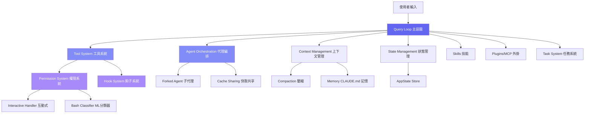

## 全書路線圖

在進入細節之前，先看清楚整座山的形狀。以下是全書 14 章的結構，每一章都在前一章的基礎上增加複雜度。

| 章節 | 主題 | 前置章節 | 本章引入的核心概念 |
|------|------|---------|-----------------|
| Ch.01 | 什麼是 Harness Engineering？ | 無 | Harness 定義、架構鳥瞰、啟動序列、端對端旅程 |
| Ch.02 | Tool System — 工具即一等公民 | Ch.01 | `Tool` 型別介面、`buildTool`、`inputSchema`、工具生命週期 |
| Ch.03 | Agent Orchestration — 代理編排 | Ch.02 | `AgentTool`、`forkSubagent`、子代理生命週期 FSM |
| Ch.04 | Permission Architecture — 分層權限 | Ch.02 | `ToolPermissionContext`、`PermissionMode`、BashClassifier |
| Ch.05 | Hook System — 可擴展的生命週期 | Ch.02 | `HookEvent`、`pre_tool_use`、`post_tool_use`、外部程序集成 |
| Ch.06 | Context Management — 上下文工程 | Ch.01, Ch.02 | `getSystemContext`、`getUserContext`、CLAUDE.md 注入、Compaction |
| Ch.07 | Coordinator & Concurrency — 協調與並行 | Ch.02, Ch.03 | `query`、`queryLoop`、`QueryEngine`、工具並行執行 |
| Ch.08 | Skills & Plugin System — 技能與外掛 | Ch.02 | `initBundledSkills`、MCP server 協議、Plugin 安裝流程 |
| Ch.09 | State Management — 狀態流 | Ch.07 | `AppState`、`AppStateStore`、`createStore`、`onChangeAppState` |
| Ch.10 | 設計模式總結與啟示 | Ch.01–Ch.09 | 容錯設計、分層抽象、可觀測性模式 |
| Ch.11 | Prompt Engineering — 系統提示詞設計 | Ch.06, Ch.09 | Prompt Cache、section system、`clearSystemPromptSections` |
| Ch.12 | Feature Inventory — 隱藏功能清單 | Ch.01–Ch.11 | `feature()` 編譯旗標、GrowthBook 閘門、`.hideHelp()` |
| Ch.13 | System Prompt Deep Dive — 提示詞逐節解析 | Ch.11 | Prompt 優先級 5 層、身份多態、防禦性設計 |
| Ch.14 | Prompt 全景圖 — Tool Prompts 與 Service Prompts 完整解析 | Ch.11, Ch.13 | BashTool Git Safety Protocol、AgentTool meta-prompt、Compact NO_TOOLS 模式、記憶三層架構、Coordinator 指揮官指令 |

:::tip[讀書建議]
本表是 **唯一出現在 Ch.01** 的全書路線圖。建議第一次閱讀時先看此表，讀完每章後再回來確認自己的理解是否對應到正確的章節位置。
:::

---

## 從聊天機器人到工程代理

2024-2025 年，AI 編程助手經歷了一場質變。早期的 AI 編程工具（如 GitHub Copilot）僅提供「自動完成」功能 — 它們在你的游標位置預測下幾行程式碼。但 Claude Code 代表了一種全新的範式：**自主工程代理**。

這個代理可以：
- 直接在你的終端中讀寫檔案
- 執行 shell 命令
- 搜尋整個程式碼庫
- 同時派遣多個子代理處理不同任務
- 自主決定下一步行動

但讓一個 LLM「自主行動」聽起來很可怕。如果它刪除了重要檔案？如果它執行了危險命令？如果它無限迴圈消耗 token？

這就是 **Harness Engineering**（駕馭工程）的核心挑戰。

## Harness Engineering 定義

> **Harness Engineering** 是一套工程實踐，目標是在 LLM 和真實世界之間建立安全、高效、可控的介面層，使 AI 模型能可靠地操作真實系統。

如同馬韁（harness）讓騎手控制馬匹的力量和方向，Harness Engineering 讓開發者控制 LLM 的能力和邊界。

核心原則包括：

1. **工具即一等公民** — 所有與外部世界的互動都通過標準化的工具介面
2. **分層權限** — 從自動批准到人工確認，多層安全機制
3. **可觀測性** — 每個操作都有明確的輸入、輸出和進度回報
4. **容錯設計** — 服務降級不會導致系統崩潰
5. **成本意識** — Prompt Cache 共享等機制控制 API 成本

## Claude Code 架構鳥瞰

Claude Code 的整體架構可以分為以下核心子系統：



## Architecture 責任矩陣

架構圖中每個元件的職責邊界，決定了任何 bug 最終會落在哪個子系統。以下表格補充說明每個方塊的具體責任、對應的主要原始碼，以及深入解析的章節。

| 元件名稱 | 負責什麼 | 主要 Source Files | 詳見 |
|---------|---------|-----------------|------|
| **Query Loop 主迴圈** | 接收使用者輸入、驅動 LLM API 呼叫、協調工具執行迴圈、處理 terminal 狀態 | `src/query.ts`（`query`、`queryLoop`）、`src/QueryEngine.ts` | Ch.07 |
| **Tool System 工具系統** | 定義工具介面、驗證輸入 schema、執行工具呼叫、回傳結果 | `src/Tool.ts`、`src/tools.ts`、`src/tools/` | Ch.02 |
| **Agent Orchestration 代理編排** | 派遣子代理（fork）、管理子代理生命週期、共享 prompt cache | `src/tools/AgentTool/AgentTool.tsx`、`src/tools/AgentTool/forkSubagent.ts`、`src/tools/AgentTool/runAgent.ts` | Ch.03 |
| **Permission System 權限系統** | 判斷工具呼叫是否需要使用者確認、執行 BashClassifier ML 分類、管理 `PermissionMode` | `src/hooks/toolPermission/`、`src/utils/permissions/` | Ch.04 |
| **Hook System 鉤子系統** | 在工具執行前後觸發外部程序（`pre_tool_use`、`post_tool_use`）、Session 生命週期事件 | `src/utils/hooks.ts`、`src/utils/hooks/` | Ch.05 |
| **Context Management 上下文管理** | 組裝 system prompt、注入 CLAUDE.md 記憶、管理 context window 壓縮 | `src/context.ts`（`getSystemContext`、`getUserContext`）、`src/context/` | Ch.06 |
| **Compaction 壓縮** | 偵測 context 接近上限、自動觸發摘要、保留關鍵訊息 | `src/context/compaction.ts`、`src/services/contextCollapse/` | Ch.06 |
| **Memory CLAUDE.md** | 載入並解析 `.claude/CLAUDE.md`、全域與專案層級的記憶注入 | `src/utils/claudemd.ts`、`src/memdir/` | Ch.06 |
| **State Management 狀態管理** | 維護全 session 的不可變狀態樹、驅動 React/Ink UI 更新 | `src/state/AppStateStore.ts`（`AppState`、`createStore`）、`src/state/onChangeAppState.ts` | Ch.09 |
| **AppState Store** | 單一事實來源的 session 狀態；包含 MCP 連線清單、工具權限上下文、FPS 指標 | `src/state/AppStateStore.ts`、`src/state/store.ts` | Ch.09 |
| **Skills 技能** | 提供使用者自定義的 slash command 擴展點，bundled 技能隨 Claude Code 預裝 | `src/skills/`、`src/skills/bundled/`（`initBundledSkills`） | Ch.08 |
| **Plugins/MCP 外掛** | 連接 MCP server、發現 MCP 工具並注入工具清單、管理外掛生命週期 | `src/services/mcp/client.ts`（`getMcpToolsCommandsAndResources`）、`src/utils/plugins/` | Ch.08 |
| **Task System 任務系統** | 管理長期任務狀態、追蹤工具執行進度 | `src/tasks.ts`、`src/Task.ts`、`src/tasks/` | Ch.09 |
| **Forked Agent 子代理** | 在獨立上下文中執行子任務、與主代理隔離 | `src/tools/AgentTool/AgentTool.tsx`、`src/tools/AgentTool/builtInAgents.ts` | Ch.03 |
| **Cache Sharing 快取共享** | 子代理共享主代理的 prompt cache prefix，減少重複 token 消耗 | `src/tools/AgentTool/AgentTool.tsx`、`src/utils/api.ts` | Ch.03 |
| **Interactive Handler 互動式** | 在終端向使用者顯示確認對話框，等待 `yes/no` 回應 | `src/utils/permissions/permissionSetup.ts` | Ch.04 |
| **Bash Classifier ML 分類器** | 使用輕量 ML 模型評估 bash 命令的危險等級，決定是否自動允許 | `src/utils/permissions/autoModeState.ts`（`TRANSCRIPT_CLASSIFIER` feature gate） | Ch.04 |

---

## 為什麼需要 Harness？

讓我們用一個實際場景說明。當你在終端輸入：

```
claude "幫我重構 auth 模組，加入 OAuth2 支援"
```

Claude Code 需要：

1. **理解上下文** — 讀取專案結構、現有的 auth 實作、CLAUDE.md 中的慣例
2. **規劃行動** — 決定需要修改哪些檔案、建立哪些新檔案
3. **安全執行** — 每個檔案修改和命令執行都需要適當的權限檢查
4. **平行處理** — 多個讀取操作可以同時進行，寫入操作需要排他
5. **串流回報** — 即時顯示進度，不讓使用者等待完整結果
6. **成本控制** — 子代理共享 prompt cache，避免重複的 token 消耗

每一項都對應到一個具體的子系統。接下來的章節將逐一深入解析。

## Startup Flow：啟動序列的因果鏈

大多數人以為 Claude Code 啟動時會「先載入設定，再初始化 MCP，最後進入主迴圈」——但實際上，**啟動序列的因果約束比這複雜得多，某些步驟必須嚴格串行，違反順序會導致靜默 bug。**

**問題陳述：** 如果 tool list 在 MCP 連線完成之前就產生，MCP 工具將永遠不會出現在這次 session 的可用工具清單中。

**Context：** Claude Code 的工具清單在啟動時靜態組裝，送入 API 呼叫的 tool list 不會在 session 中途更新。MCP server 的連線是非同步的，可能需要數百毫秒。

**Solution：** Claude Code 採用「平行化不違反因果約束」的策略：能安全並行的工作盡量並行，但凡是有依賴關係的步驟一律串行。啟動序列分三個階段：

### 階段一：Module Loading（同步，import 階段）

在 `src/main.tsx` 的模組頂層，三個關鍵函式按嚴格順序呼叫，這些呼叫發生在所有其他 import 之前：

```typescript
// src/main.tsx — 模組頂層，必須在所有 import 之前執行
import { profileCheckpoint, profileReport } from './utils/startupProfiler.js';
profileCheckpoint('main_tsx_entry');  // 記錄啟動時間點

import { startMdmRawRead } from './utils/settings/mdm/rawRead.js';
startMdmRawRead();  // 立即觸發 MDM 子程序（plutil/reg query），與後續 ~135ms 的 import 並行

import { ensureKeychainPrefetchCompleted, startKeychainPrefetch } from './utils/secureStorage/keychainPrefetch.js';
startKeychainPrefetch();  // 同時觸發 macOS keychain 讀取（OAuth + API key），兩個讀取並行
```

**為什麼這三個必須在最頂層？** 因為 keychain 讀取和 MDM 讀取各需要 65ms 以上（spawn 子程序），而後續的 import chain 約需 135ms。把這些 I/O 放在最頂層，讓它們與 import 完全重疊，是 Claude Code 對 startup latency 做出的最重要優化。

### 階段二：init()（非同步，信任建立前）

`src/entrypoints/init.ts` 中的 `init()` 函式處理無需使用者信任即可執行的初始化：

```typescript
// src/entrypoints/init.ts
export const init = memoize(async (): Promise<void> => {
  enableConfigs()                    // 載入並驗證設定系統
  applySafeConfigEnvironmentVariables()  // 僅套用安全的環境變數（信任建立前）
  applyExtraCACertsFromConfig()     // 在任何 TLS 連線前套用 CA 憑證
  setupGracefulShutdown()           // 註冊 process.exit 清理程序
  configureGlobalMTLS()             // 設定 mTLS（必須在 MCP 連線之前）
  configureGlobalAgents()           // 設定 HTTP proxy agents
  // ...
})
```

`init()` 使用 `memoize` 包裝，確保在整個 session 中只執行一次。

### 階段三：action handler（非同步，因果約束最嚴格）

這是啟動序列最關鍵的部分，位於 `src/main.tsx` 的 `action` handler 中：

```typescript
// src/main.tsx — action handler 內的關鍵順序
// 步驟 1：先取得工具清單（此時不含 MCP 工具）
let tools = getTools(toolPermissionContext);  // src/tools.ts

// 步驟 2：initBundledSkills() 和 initBuiltinPlugins() 必須在 getCommands() 之前
initBuiltinPlugins();   // src/plugins/bundled/index.ts
initBundledSkills();    // src/skills/bundled/index.ts

// 步驟 3：setup() 和 getCommands() 可以並行（無直接依賴）
const setupPromise = setup(preSetupCwd, permissionMode, ...);  // src/setup.ts
const commandsPromise = getCommands(preSetupCwd);              // src/commands.ts
await setupPromise;  // 必須 await，因為 setup() 可能 process.chdir()

// 步驟 4：MCP 連線（print mode 必須 await；interactive mode 可以延後）
// 關鍵注釋："SDK init message and turn-1 tool list both need configured MCP tools present"
await connectMcpBatch(regularMcpConfigs, 'regular');
// MCP 工具現在才注入到 headlessStore.mcp.tools

// 步驟 5：進入 Query Loop
// src/query.ts — queryLoop() 從 store 讀取包含 MCP 工具的工具清單
```

**Consequence（代價）：** 這個設計在 interactive mode 和 print mode（`-p` flag）之間做了不同的取捨。Print mode 在 `connectMcpBatch()` 完成前阻塞，確保 turn-1 的工具清單完整；interactive mode 允許 MCP 在背景連線，MCP 工具在 turn-2 才保證出現。這意味著 `claude -p "用 MCP 工具做 X"` 比 interactive mode 啟動更慢，但更可靠。

### setup.ts 的職責

`src/setup.ts` 中的 `setup()` 函式處理與工作目錄和 session 環境相關的初始化：

```typescript
// src/setup.ts — setup() 函式的關鍵步驟順序
export async function setup(cwd: string, permissionMode: PermissionMode, ...): Promise<void> {
  // 1. setCwd() 必須最先呼叫 — 後續所有依賴 cwd 的程式碼都需要它
  setCwd(cwd)

  // 2. captureHooksConfigSnapshot() 必須在 setCwd() 之後
  //    因為它需要從正確目錄載入 hooks 設定
  captureHooksConfigSnapshot()

  // 3. initializeFileChangedWatcher() — 讀取 hook config snapshot，必須在步驟 2 後
  initializeFileChangedWatcher(cwd)

  // 4. worktree 建立（如果啟用）— 可能 process.chdir()
  if (worktreeEnabled) {
    const worktreeSession = await createWorktreeForSession(...)
    setCwd(worktreeSession.worktreePath)
    setProjectRoot(getCwd())
  }

  // 5. 背景工作初始化（不阻塞主流程）
  initSessionMemory()       // 同步，僅註冊 hook
  void lockCurrentVersion() // 鎖定版本，防止被其他程序刪除

  // 6. Plugin 預取（如果不是 bare mode）
  void getCommands(getProjectRoot())
  void loadPluginHooks()

  // 7. 安全驗證 — 確認 bypassPermissions 只在 sandbox 中使用
  if (permissionMode === 'bypassPermissions') {
    // 驗證 Docker/sandbox 環境
  }
}
```

**bootstrap/state.ts 的角色：** `src/bootstrap/state.ts` 是整個系統的全局狀態根，定義了 `State` 型別，包含超過 50 個 session 級別的狀態欄位。這個模組是「bootstrap isolation」的葉節點 — 它只被 import，從不 import 其他業務邏輯模組，以確保循環依賴不會出現在啟動路徑上。

---

## 從輸入到回應：一次完整的旅程

大多數教程會按章節順序介紹各個子系統，但這掩蓋了一個關鍵事實：**這些子系統從來不會孤立運行。** 每一個使用者輸入都會穿越全部 13 章涵蓋的子系統，在毫秒內完成數十個協調操作。

以下是一個具體例子的完整旅程。

---

**當你輸入 `refactor my auth module` 並按下 Enter，接下來發生的是：**

### 1. 輸入進入 Query Loop（→ Ch.07）

你的輸入抵達 `src/query.ts` 的 `query()` 函式。`query()` 呼叫 `queryLoop()`，這是整個執行引擎的核心 generator 函式。`queryLoop` 收到的 `params` 包含：`systemPrompt`（已組裝好的提示詞）、`messages`（對話歷史）、`toolUseContext`（工具集合）、以及 `userContext`。

此時，`queryLoop` 的第一個任務是**組裝第一個 API 呼叫**，但在送出之前，它需要確保 context 已準備好。

### 2. Context 組裝：CLAUDE.md 注入 + System Prompt 建構（→ Ch.06, Ch.11）

在 API 呼叫發出前，`src/context.ts` 的 `getSystemContext()` 和 `getUserContext()` 已在啟動時被 prefetch（`startDeferredPrefetches()` 中觸發）。這兩個函式使用 `memoize` 快取結果。

System prompt 由 `src/constants/prompts.ts` 中的 section system 組裝。當你在專案根目錄有 `.claude/CLAUDE.md` 時，`src/utils/claudemd.ts` 負責讀取並解析它，將其內容注入為 system prompt 的一個 section。這個注入在每次 turn 時重新計算（因為 CLAUDE.md 可能在 session 中被修改），但靜態 section 會命中 Anthropic 推論伺服器的 prompt cache（→ Ch.11 詳解 cache 機制）。

### 3. 第一次 LLM API 呼叫：Streaming 工具呼叫（→ Ch.07）

`queryLoop` 呼叫 Anthropic API，傳入組裝好的訊息和工具清單（包含所有 built-in 工具和已連線的 MCP 工具）。回應以 streaming 方式傳回。

Claude 分析你的 `refactor my auth module` 請求，決定先呼叫 `Read` 工具讀取 `src/auth.ts`，然後呼叫 `Glob` 搜尋所有相關檔案。API 回應包含 `tool_use` 類型的訊息，指定工具名稱和輸入參數。

### 4. 工具執行：權限檢查 → Hook → 執行 → Hook（→ Ch.02, Ch.04, Ch.05）

`queryLoop` 收到工具呼叫後，進入工具執行流程。這個流程有嚴格的順序：

**步驟 4a — 權限檢查（Ch.04）：**
`ToolPermissionContext`（定義在 `src/utils/permissions/`）評估這個工具呼叫是否需要使用者確認。`Read` 操作通常自動允許，但如果使用者設定了 `permission mode: default` 且路徑在 allowed 列表之外，則觸發互動式確認。`BashClassifier`（`autoModeState.ts`，`TRANSCRIPT_CLASSIFIER` feature gate）在 bash 命令的情況下額外執行 ML 分類。

**步驟 4b — pre_tool_use Hook（Ch.05）：**
在工具實際執行前，`src/utils/hooks.ts` 觸發 `pre_tool_use` hook event。任何在 `.claude/settings.json` 中配置了 `PreToolUse` hook 的外部程序此時被呼叫，可以修改工具輸入或阻止執行。

**步驟 4c — 工具執行（Ch.02）：**
工具的 `call()` 方法被呼叫。`Read` 工具讀取 `src/auth.ts`，`Glob` 搜尋匹配模式，結果以 `ToolResult` 形式返回。

**步驟 4d — post_tool_use Hook（Ch.05）：**
工具執行完成後，`post_tool_use` hook 觸發，讓外部程序有機會觀察或記錄工具的輸出。

### 5. 如果 Claude 決定派遣子代理（→ Ch.03）

假設 Claude 判斷重構任務複雜，決定派遣一個子代理處理「為 auth 模組加入測試」的子任務。此時 `AgentTool`（`src/tools/AgentTool/AgentTool.tsx`）被呼叫。

`forkSubagent()`（`src/tools/AgentTool/forkSubagent.ts`）建立一個新的獨立 query 上下文，這個子代理：
- 獲得自己的 `messages` 歷史（從空白開始）
- 繼承主代理的工具清單
- **共享主代理的 prompt cache prefix**，節省 token 消耗
- 在子任務完成或達到 `maxTurns` 上限後終止

子代理的執行結果以 `tool_result` 訊息返回給主代理，主代理繼續下一個迭代。

### 6. 工具結果注入 → 下一個迭代或終止（→ Ch.07）

工具執行結果作為 `tool_result` 訊息加入 `messages`。`queryLoop` 進入下一個迭代，再次呼叫 API（這次帶有工具執行結果）。

Claude 分析 `Read` 返回的 auth 模組程式碼，計劃具體的重構操作，可能再次呼叫 `Edit` 工具修改檔案。這個 **request → tool_use → tool_result → request** 的迴圈持續進行，直到：

- Claude 返回純文字回應（沒有工具呼叫）→ `queryLoop` 達到 terminal 狀態，返回 `Terminal`
- 達到 `maxTurns` 上限
- 發生不可恢復的錯誤

整個旅程從你按下 Enter 到看見第一個回應，通常在 500ms-2s 之間完成。這個速度得益於啟動時的 prefetch（keychain、system context）、MCP 的非同步連線（不阻塞第一次回應）、以及 prompt cache 命中（節省 60-80% 的輸入 token 費用）。

---

## 原始碼導覽

Claude Code 的原始碼組織清晰地反映了這些子系統：

| 目錄 | 對應子系統 | 章節 |
|------|-----------|------|
| `src/Tool.ts`, `src/tools/` | 工具系統 | Ch.2 |
| `src/tools/AgentTool/` | 代理編排 | Ch.3 |
| `src/hooks/toolPermission/` | 權限系統 | Ch.4 |
| `src/utils/hooks.ts` | Hook 系統 | Ch.5 |
| `src/context.ts` | 上下文管理 | Ch.6 |
| `src/query.ts` | 主迴圈與並行 | Ch.7 |
| `src/skills/`, `src/plugins/` | 技能與外掛 | Ch.8 |
| `src/state/` | 狀態管理 | Ch.9 |
| `src/constants/prompts.ts` | 系統提示詞設計 | Ch.11 |

## 關鍵要點

:::tip[Key Insight]
Harness Engineering 的核心思維是：**LLM 是強大但不可信的執行者**。我們需要建立一套精密的框架來引導它的能力、約束它的邊界、並在出錯時提供安全網。Claude Code 的架構正是這一思維的產品級實現。
:::

---

## 承先啟後

Ch.01 是唯一有「**全書路線圖**」的地方——如果你在閱讀後續章節時迷失了方向，回到本章的路線圖表格重新定位。

接下來，Ch.02 從 Claude Code 最基礎的抽象開始——`Tool` interface。理解 `Tool` 型別定義（`src/Tool.ts`）是理解後續所有章節的前提：Permission System 需要知道工具的 `needsPermissions`，Hook System 在工具執行前後觸發，Agent Orchestration 透過 `AgentTool` 派遣子代理。**沒有 Tool 的概念，後面 12 章都無從談起。**
