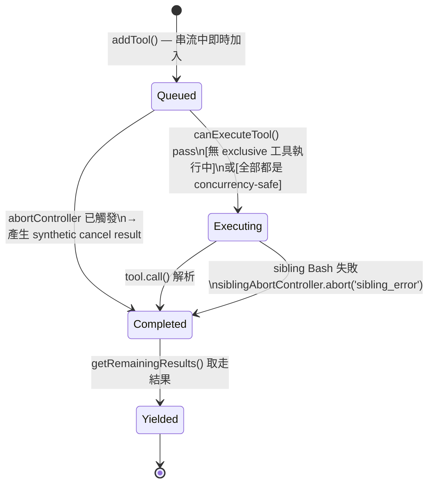
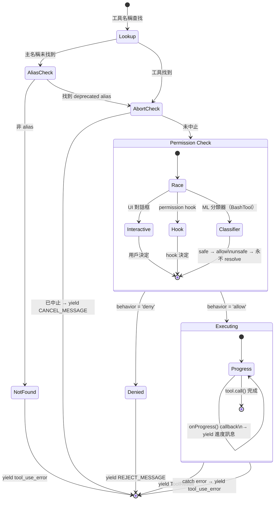
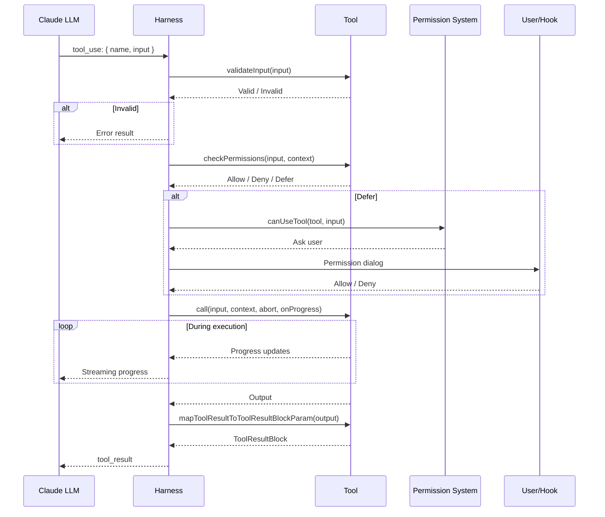

:::note[前置知識橋]
本章的 `Tool` interface 是後續所有章節的基礎。Ch.03 的子代理、Ch.04 的權限系統、Ch.05 的 hook system 都建立在這個 interface 之上。理解 `Tool` 型別，就是理解整個 harness 的骨架。
:::

## 為什麼工具是核心？

在 Claude Code 中，LLM 與真實世界的每一次互動都必須通過**工具（Tool）** — 讀取檔案是工具、編輯檔案是工具、執行 bash 命令是工具、甚至派遣子代理也是工具。

這不是偶然的設計，而是 Harness Engineering 的核心原則：

> **所有副作用都必須經過受控的介面。** LLM 不能直接操作任何系統，它只能「呼叫工具」，而工具的執行由 harness 完全掌控。

## Tool 型別定義

Claude Code 的工具系統以 TypeScript 泛型為基礎，定義在 `src/Tool.ts`：

```typescript
// src/Tool.ts — 核心工具介面（真實型別定義，50+ 方法）
export type Tool<
  Input extends AnyObject = AnyObject,
  Output = unknown,
  P extends ToolProgressData = ToolProgressData,
> = {
  name: string
  aliases?: string[]                    // 舊名稱向後相容
  searchHint?: string                   // ToolSearch 搜尋提示
  readonly inputSchema: Input           // Zod schema
  readonly inputJSONSchema?: ToolInputJSONSchema  // JSON Schema（給 API）

  // 核心生命週期
  call(
    args: z.infer<Input>,
    context: ToolUseContext,
    canUseTool: CanUseToolFn,
    parentMessage: AssistantMessage,
    onProgress?: ToolCallProgress<P>,
  ): Promise<ToolResult<Output>>

  description(
    input: z.infer<Input>,
    options: {
      isNonInteractiveSession: boolean
      toolPermissionContext: ToolPermissionContext
      tools: Tools
    },
  ): Promise<string>

  // 並行與安全元資料（input-dependent！）
  isConcurrencySafe(input: z.infer<Input>): boolean
  isReadOnly(input: z.infer<Input>): boolean
  isDestructive?(input: z.infer<Input>): boolean
  isEnabled(): boolean
  interruptBehavior?(): 'cancel' | 'block'

  // 權限
  checkPermissions(input, context): Promise<PermissionDecision>
  toAutoClassifierInput(input: z.infer<Input>): string

  // 結果渲染（React/Ink TUI）
  renderToolResultMessage(output, verbose): ReactNode
  renderToolUseMessage(input, isSuccess?): ReactNode | null
  // ... 還有 20+ 個渲染、分析、快取相關方法
}
```

:::tip[Tip]
注意 `isReadOnly` 和 `isConcurrencySafe` 的參數是 `input` 而非無參數。這意味著**同一個工具在不同輸入下可以有不同的並行策略**。例如 `BashTool` 執行 `ls` 是唯讀的，但執行 `rm` 不是。
:::

:::tip[Key Insight]
注意三個布林方法：`isReadOnly`、`isDestructive`、`isConcurrencySafe`。它們決定了工具在並行執行時的排程策略（Ch.7 詳述）。
:::

## Tool 執行狀態機

一個工具呼叫從 LLM 產生 `tool_use` block，到結果送回 LLM，要經過兩層狀態機：

### 第一層：TrackedTool 狀態機（StreamingToolExecutor）

`StreamingToolExecutor` 為每個工具維護一個 `ToolStatus`，控制並行排程：



:::tip[Key Insight]
`completed` 和 `yielded` 是**兩個不同的狀態**，這是為了處理「非 concurrency-safe 工具的結果需要按序交付」的問題。如果一個 exclusive 工具正在執行，後面的工具結果必須等待，即使它已經 `completed`，也要等到前面的工具 `yielded` 後才能交付——這防止了工具結果亂序到達 LLM。
:::

### 第二層：runToolUse 執行序列

每個工具在 `src/services/tools/toolExecution.ts` 的 `runToolUse()` 中執行：



## buildTool — 安全預設值模式

Claude Code 使用 **Fail-Closed** 預設值：如果工具開發者忘記設定某個屬性，系統會採用最保守的行為。

```typescript
// src/Tool.ts — buildTool 的實際實現
const TOOL_DEFAULTS = {
  isEnabled: () => true,
  isConcurrencySafe: (_input?: unknown) => false,    // 預設：不可並行
  isReadOnly: (_input?: unknown) => false,           // 預設：有副作用
  isDestructive: (_input?: unknown) => false,
  checkPermissions: (input) =>
    Promise.resolve({ behavior: 'allow', updatedInput: input }),
  toAutoClassifierInput: (_input?: unknown) => '',   // 預設：不參與自動分類
  userFacingName: (_input?: unknown) => '',
}

export function buildTool<D extends AnyToolDef>(def: D): BuiltTool<D> {
  return {
    ...TOOL_DEFAULTS,
    userFacingName: () => def.name,
    ...def,            // 使用者定義覆蓋預設值
  } as BuiltTool<D>
}
```

:::tip[Tip]
這是一個經典的安全工程模式：**Fail-Closed Default**。如果你忘記聲明一個工具是可以並行的，它會被當作不可並行處理 — 寧可犧牲效能也不冒正確性的風險。
:::

## 工具生命週期

每次 LLM 呼叫工具時，會經歷以下流程：



## Zod + JSON Schema：雙軌驗證的為什麼

LLM 可以被明確告知工具的輸入 schema，卻仍然幻覺出不合法的參數。JSON Schema 防止錯誤的呼叫被送出——Zod 防止錯誤的呼叫讓系統崩潰。

這是 Claude Code 工具驗證的核心洞見：兩套 schema 看似冗餘，實則服務於完全不同的對象。

**JSON Schema 是給 LLM 看的合約**。當 Claude Code 向 Anthropic API 發出工具列表時，每個工具的 `inputJSONSchema` 會作為 tool calling protocol 的一部分嵌入到 API payload 中。LLM 在生成 `tool_use` block 時，參照的是這份 JSON Schema——它決定了 LLM 「知道」如何格式化參數。

**Zod Schema 是給 harness 看的防線**。即使 LLM 收到了完整的 JSON Schema，在高壓高速的 token 生成過程中，它仍然可能輸出類型錯誤、欄位缺失、或 coerce 錯誤的參數。`checkPermissionsAndCallTool()` 在 `tool.call()` 之前，一定先執行 `tool.inputSchema.safeParse(input)`：

```typescript
// src/services/tools/toolExecution.ts — checkPermissionsAndCallTool()
const parsedInput = tool.inputSchema.safeParse(input)
if (!parsedInput.success) {
  // 產生 InputValidationError，回報給 LLM，讓它重試
  let errorContent = formatZodValidationError(tool.name, parsedInput.error)
  return [createUserMessage({
    content: [{
      type: 'tool_result',
      content: `<tool_use_error>InputValidationError: ${errorContent}</tool_use_error>`,
      is_error: true,
      tool_use_id: toolUseID,
    }],
  })]
}
```

這個比喻最為精確：JSON Schema 是 HTTP API 的 OpenAPI spec（告訴客戶端如何呼叫），Zod Schema 是伺服器端的 input validation（保護伺服器不被非法請求崩潰）。兩者都存在不是因為沒人注意到重複，而是因為它們的失效對象根本不同。

`Tool` 型別本身也明確保留了這個雙軌設計：

```typescript
// src/Tool.ts — Tool 型別定義
export type Tool<Input extends AnyObject = AnyObject, ...> = {
  readonly inputSchema: Input              // Zod schema — harness 運行時驗證
  readonly inputJSONSchema?: ToolInputJSONSchema  // JSON Schema — 給 API 的合約
  // ...
}
```

**代價**：同一份資料的兩套描述必須保持同步。如果 Zod schema 加了一個新的必要欄位，JSON Schema 也必須同步更新，否則 LLM 永遠不知道這個欄位存在，會持續觸發 Zod 的 `InputValidationError`。這是刻意的冗餘，不是疏忽。

## lazySchema：打破循環依賴的惰性求值

`AgentTool` 的 schema 需要知道可用的工具列表才能驗證 `subagent_type` 欄位——而工具列表本身就包含 `AgentTool`。如果在模組載入時建構 schema，Node.js 的模組系統會在 `AgentTool` 嘗試引用自身模組時進入循環，導致未完成的 `undefined`。

這不是理論上的邊緣情況。`AgentTool.tsx` 同時需要：`tools.ts`（工具總表）、`agentToolUtils.ts`（工具過濾邏輯）、以及 `BashTool`、`FileEditTool` 等大量工具——而這些工具的模組都要先「完成載入」才能組成工具列表。模組載入時就建構 schema，等於在所有模組都準備好之前就要求它們全部就緒。

`lazySchema` 把這個建構推遲到「第一次被使用時」：

```typescript
// src/utils/lazySchema.ts — 完整實作
export function lazySchema<T>(factory: () => T): () => T {
  let cached: T | undefined
  return () => (cached ??= factory())
}
```

它的簽名不是 `ZodSchema<T>`，而是 `() => T`——一個回傳 schema 的函式。呼叫端需要主動呼叫這個 getter：

```typescript
// src/tools/AgentTool/AgentTool.tsx — lazySchema 在 AgentTool 的實際應用
const baseInputSchema = lazySchema(() => z.object({
  description: z.string().describe('A short (3-5 word) description of the task'),
  prompt: z.string().describe('The task for the agent to perform'),
  subagent_type: z.string().optional(),
  run_in_background: z.boolean().optional(),
}))

const fullInputSchema = lazySchema(() => {
  // 這裡才引用 tools 列表——此時所有模組都已載入完畢
  return baseInputSchema().merge(multiAgentInputSchema).extend({ isolation: ... })
})

export const inputSchema = lazySchema(() => {
  // 根據 feature flag 決定最終 schema 形態
  const schema = feature('KAIROS') ? fullInputSchema() : fullInputSchema().omit({ cwd: true })
  return isBackgroundTasksDisabled ? schema.omit({ run_in_background: true }) : schema
})
```

`Tool` 物件通過 getter 暴露 schema：

```typescript
// src/tools/AgentTool/AgentTool.tsx
get inputSchema(): InputSchema {
  return inputSchema()  // 呼叫 lazySchema getter，觸發（或回傳快取的）schema 建構
},
```

`BashTool` 同樣使用相同模式，因為它的 schema 需要讀取環境變數和 feature flag：

```typescript
// src/tools/BashTool/BashTool.tsx
const fullInputSchema = lazySchema(() => z.strictObject({
  command: z.string().describe('The command to execute'),
  timeout: semanticNumber(z.number().optional()),
  // _simulatedSedEdit 是內部欄位，永遠不暴露給 LLM
}))
```

**代價**：`lazySchema` 讓 schema 的首次存取比直接引用慢一個函式呼叫。更重要的是，錯誤會推遲到運行時才發現，而不是模組載入時立即崩潰。對 Claude Code 這種啟動速度敏感的工具，這個取捨是合理的。

## Progress Callback：從 BashTool 到螢幕的完整路徑

一個工具在 `tool.call()` 期間的輸出，要如何即時出現在使用者的終端機上？直觀的做法是讓工具直接 `process.stdout.write()`——但這打破了工具的隔離性：工具從此依賴具體的輸出媒介，測試變得困難，子代理的輸出也無法被擷取。

Claude Code 的解法是 `onProgress` callback：工具不決定輸出去哪，它只負責「報告有進度」，上層決定怎麼處理。

**路徑的五個節點：**

```
BashTool.call()
  │  stdout 每秒 poll 一次，產生 BashProgress
  ▼
onProgress({ toolUseID, data: { type: 'bash_progress', output, fullOutput } })
  │  這是 ToolCallProgress<BashProgress> 型別
  ▼
checkPermissionsAndCallTool() 裡的 onToolProgress()
  │  轉化為 ProgressMessage，推入 Stream
  ▼
StreamingToolExecutor
  │  收到 pendingProgress，立即 yield（不等工具完成）
  ▼
React/Ink renderToolUseProgressMessage()
  │  BashTool 渲染 stdout 的最新 N 行
  ▼
終端機螢幕
```

BashTool 的進度生成機制使用一個 shell-level poller：

```typescript
// src/tools/BashTool/BashTool.tsx — call() 內部
async call(input, toolUseContext, _canUseTool, parentMessage, onProgress?) {
  // ...
  const shellCommand = await exec(command, abortController.signal, 'bash', {
    timeout: timeoutMs,
    onProgress(lastLines, allLines, totalLines, totalBytes, isIncomplete) {
      // Shell poller 每秒觸發一次，將最新輸出推給上層
      lastProgressOutput = lastLines
      fullOutput = allLines
      resolveProgress?.()  // 喚醒 generator，讓它 yield 進度
    }
  })

  // Progress loop: 每次 poller 觸發就 yield 一次
  while (true) {
    const progressSignal = createProgressSignal()
    const result = await Promise.race([resultPromise, progressSignal])

    if (result === null && onProgress) {
      // 還沒完成，但有新輸出——立即回報
      onProgress({
        toolUseID: `bash-progress-${progressCounter++}`,
        data: {
          type: 'bash_progress',
          output: lastProgressOutput,
          fullOutput,
        }
      })
    }
  }
}
```

在 `StreamingToolExecutor` 中，progress message 的處理優先於 `completed` 狀態——它不進 results buffer，而是直接進 `pendingProgress` 立即被 `getRemainingResults()` yield 出去：

```typescript
// src/services/tools/StreamingToolExecutor.ts — TrackedTool 結構
type TrackedTool = {
  status: ToolStatus         // 'queued' | 'executing' | 'completed' | 'yielded'
  results?: Message[]        // 工具完成後的結果（需要等順序）
  pendingProgress: Message[] // 進度訊息（立即 yield，不等順序）
}
```

**為什麼要這樣分層？** `onProgress` 讓工具完全不知道自己的輸出要去哪——是 REPL 的 Ink TUI、還是 SDK 的 SSE stream、還是測試的 mock collector。`StreamingToolExecutor` 的 backpressure 處理確保即使工具輸出很快，也不會讓 UI 渲染週期過載。這是反應式設計的標準分層：產生者只管產生，消費者只管消費，中間的 buffer 協調速率差異。

## 實際工具清單

Claude Code 內建超過 30 個工具，涵蓋了軟體工程的各個面向：

| 類別 | 工具 | 說明 |
|------|------|------|
| 檔案操作 | `FileReadTool`, `FileEditTool`, `FileWriteTool` | 讀取、編輯、寫入檔案 |
| 搜尋 | `GlobTool`, `GrepTool` | 檔名搜尋、內容搜尋 |
| 執行 | `BashTool` | Shell 命令執行 |
| 代理 | `AgentTool`, `SendMessageTool` | 子代理派遣與通訊 |
| 任務 | `TaskCreateTool`, `TaskUpdateTool` | 任務管理 |
| 技能 | `SkillTool` | 技能執行 |
| MCP | `MCPTool`, `ListMcpResourcesTool` | MCP 協議工具 |

## 關鍵要點

:::tip[Key Insight]
Claude Code 的 Tool System 展現了一個核心設計理念：**透過泛型介面標準化所有外部互動，用 fail-closed 預設值保證安全，用雙軌 schema 驗證保證正確性。** 這是 Harness Engineering 的基石 — 沒有受控的工具層，就無法建立可靠的 AI 代理。
:::

---

工具執行的生命週期到此為止——輸入、驗證、執行、結果。但有時候，一個任務需要派遣另一個 Claude 來處理。Ch.03 介紹的 `AgentTool` 是特殊的工具，它的 `call()` 函式不操作文件，而是啟動另一個 AI 對話——它同時也是 `lazySchema` 使用最複雜的例子，因為子代理的工具列表本身就是一個遞迴問題。
