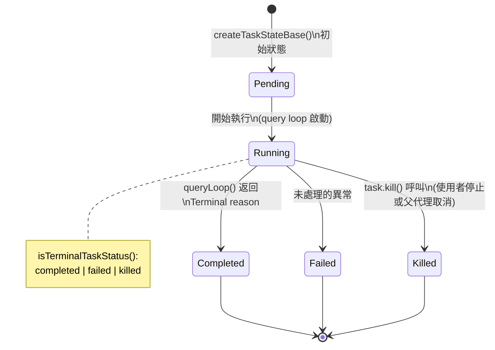
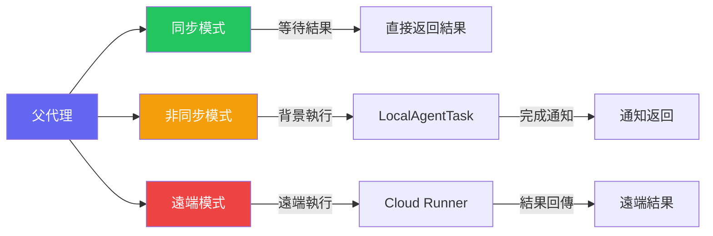
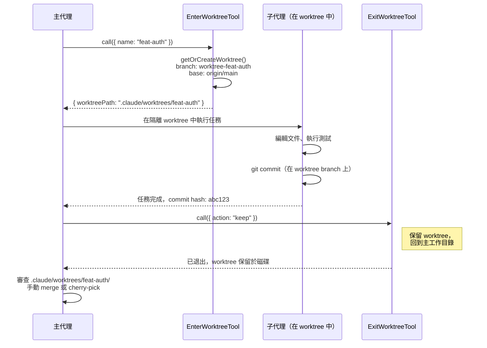
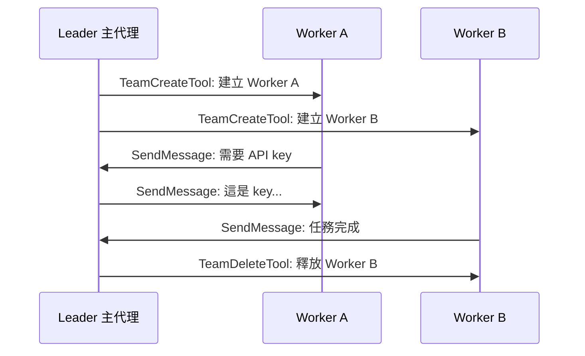

:::note[前置知識橋]
本章建立在 Ch.02 的 `Tool` interface 上。`AgentTool` 是一個特殊工具，它的 `call()` 不操作文件，而是用 `forkedAgent()` 啟動另一個 query loop——派遣出去的不是指令，而是整個對話上下文的複製品。
:::

## 為什麼需要子代理？

當使用者要求「重構整個認證模組」時，這不是一個單一的操作。它可能需要：
- 分析現有程式碼結構
- 搜尋所有相關的測試檔案
- 同時修改多個檔案
- 驗證修改後的程式碼能否通過測試

Claude Code 解決這個問題的方式是：**主代理可以派遣子代理**。每個子代理是一個獨立的 AI 對話，擁有自己的工具集和上下文，但共享父代理的 prompt cache。

## 代理生命週期狀態機

任何子代理都會被註冊為一個 `Task`，在 `AppState.tasks` 中有完整的生命週期追蹤。`Task.ts` 定義了統一的狀態機：



三種執行模式對生命週期的影響不同：

| 模式 | Task 類型 | `Pending` 狀態 | 父代理的行為 |
|---|---|---|---|
| 同步（`run_in_background: false`） | 無 Task（inline 執行） | 無 | 阻塞等待結果 |
| 非同步（`run_in_background: true`） | `LocalAgentTask` | pending → running | 立即返回 task ID |
| 遠端（`isolation: 'worktree'` + remote） | `RemoteAgentTask` | pending（輪詢中） | 立即返回，定期輪詢 |

## AgentTool 的三種執行模式



### 1. 同步模式（Sync/Inline）

子代理執行完畢後，結果直接返回給父代理。適合快速的搜尋或分析任務。

### 2. 非同步模式（Async/Background）

子代理在背景執行，父代理可以繼續其他工作。完成後通過 `LocalAgentTask` 通知系統回報結果。

### 3. 遠端模式（Remote）

子代理被「傳送」到遠端 Cloud Runner 執行，完全不佔用本地資源。

## CacheSafeParams — 成本優化的關鍵

**Prompt Cache 共享**是讓多代理系統成本可控的關鍵機制。

### 問題

每次呼叫 Anthropic API 時，system prompt + tool definitions 可能超過 50,000 tokens。如果每個子代理都重新傳送這些內容，成本會非常高。

### 解決方案

Anthropic API 支援 **Prompt Caching**：如果連續的 API 呼叫有相同的前綴（system prompt + tools + 前幾條訊息），快取命中的 tokens 只收 10% 的費用。

```typescript
// src/utils/forkedAgent.ts
type CacheSafeParams = {
  systemPrompt: string;
  tools: ToolDefinition[];
  model: string;
  messages: Message[];      // 前綴訊息
  thinkingConfig: ThinkingConfig;
};

// 父代理儲存自己的 cache-safe params
function saveCacheSafeParams(params: CacheSafeParams) {
  globalCacheSafeParams = params;
}

// 子代理取得父代理的 params，確保前綴匹配
function getLastCacheSafeParams(): CacheSafeParams | null {
  return globalCacheSafeParams;
}
```

:::tip[Key Insight]
這意味著父代理和所有子代理共享同一個 prompt cache。子代理的 system prompt、tools、model 必須與父代理完全一致，才能命中快取。這是刻意的架構約束 — 犧牲子代理的客製化彈性，換取巨大的成本節省。
:::

## 為什麼是 Fork 而不是 Spawn?

每次 API 呼叫重新組裝 system prompt 的代價，讓多代理系統在財務上幾乎不可行。一個有 10 個子代理的協調任務，如果每個子代理都從頭傳送完整的上下文，光是 token 費用就足以讓大多數使用案例的 ROI 變成負數。

### 兩種模型的根本差異

設計多代理系統有兩種基本選擇：

| 維度 | Naive Spawn 模型 | Fork 模型（Claude Code 的選擇） |
|------|-----------------|-------------------------------|
| System prompt 傳遞 | 子代理重新傳送整個 50k token prompt | 子代理共享父代理的 `CacheSafeParams` 前綴 |
| API Cache 命中率 | 0%（每次請求全新） | 85–90%（前綴完全 byte 相符） |
| 客製化彈性 | 子代理可有獨立 system prompt | 子代理 system prompt 必須與父代理完全一致 |
| 成本結構 | 線性增長（代理數 × 完整 token 費） | 接近固定（只有動態後綴重新計費） |

### 精確的成本計算

以一個啟動 10 個子代理的協調會話為例，system prompt + tool definitions 約 50,000 tokens，使用 Claude Sonnet（$15 / 1M input tokens）：

```
Naive Spawn 模型：
  10 個子代理 × 50,000 tokens × $15 / 1,000,000 = $7.50

Fork + Prompt Cache 模型：
  10 個子代理 × 50,000 tokens × $15 / 1,000,000 × 10% = $0.75

單次協調會話淨節省：$7.50 - $0.75 = $6.75（節省 90%）
```

這個數字會隨著代理數量線性放大：50 個子代理的任務，naive spawn 要 $37.50，fork 模型只要 $3.75。

### 真實的 CacheSafeParams 定義

Fork 模型的核心是 `CacheSafeParams`——一組必須在父代理和所有子代理之間保持**完全相同**的參數：

```typescript
// src/utils/forkedAgent.ts
export type CacheSafeParams = {
  /** System prompt - must match parent for cache hits */
  systemPrompt: SystemPrompt
  /** User context - prepended to messages, affects cache */
  userContext: { [k: string]: string }
  /** System context - appended to system prompt, affects cache */
  systemContext: { [k: string]: string }
  /** Tool use context containing tools, model, and other options */
  toolUseContext: ToolUseContext
  /** Parent context messages for prompt cache sharing */
  forkContextMessages: Message[]
}
```

`toolUseContext` 包含工具清單、model 名稱等——任何一個欄位改變，就等同於一個全新的 prompt cache key，前面所有的快取寫入都白費了。

父代理在每次 API 呼叫後透過 `saveCacheSafeParams()` 儲存自己的參數，子代理透過 `getLastCacheSafeParams()` 取得，確保前綴完全一致：

```typescript
// Slot written by handleStopHooks after each turn
let lastCacheSafeParams: CacheSafeParams | null = null

export function saveCacheSafeParams(params: CacheSafeParams | null): void {
  lastCacheSafeParams = params
}

export function getLastCacheSafeParams(): CacheSafeParams | null {
  return lastCacheSafeParams
}
```

### 刻意的設計約束

這個設計犧牲了子代理的客製化彈性，換取 85–90% 的 cache 命中率。子代理無法擁有獨立的 system prompt、不能換用不同的 model、不能改變 thinking 設定——任何這類改變都會讓 `CacheSafeParams` 不匹配，瞬間失去所有快取優勢。

這是刻意的工程選擇，不是 bug。Anthropic 在其 2024 年的技術指南《Building effective agents》中明確建議：「Consider token efficiency across the full multi-agent pipeline, not just individual calls. The cost of context assembly compounds with agent count.」（https://www.anthropic.com/research/building-effective-agents，2024 年 12 月）這句話精確描述了 Fork 模型所解決的問題——`CacheSafeParams` 是這個建議在程式碼層面的具體實現。

## 子代理建立流程

```typescript
// src/utils/forkedAgent.ts — 簡化版
type ForkedAgentParams = {
  promptMessages: Message[];         // 子代理專屬的輸入訊息
  cacheSafeParams: CacheSafeParams;  // 共享的快取安全參數
  canUseTool: CanUseToolFn;          // 權限檢查函數
  querySource: QuerySource;          // 分析追蹤
  forkLabel: string;                 // 遙測標籤
};
```

子代理本質上是一個新的 `query()` 呼叫（Ch.7），但使用了特殊的參數來確保 cache 共享。

## AgentTool 的輸入 Schema

AgentTool 的真實輸入定義使用了 `lazySchema`（延遲載入，避免循環依賴）：

```typescript
// src/tools/AgentTool/AgentTool.tsx
const baseInputSchema = lazySchema(() => z.object({
  description: z.string().describe('A short (3-5 word) description of the task'),
  prompt: z.string().describe('The task for the agent to perform'),
  subagent_type: z.string().optional()
    .describe('The type of specialized agent to use'),
  model: z.enum(['sonnet', 'opus', 'haiku']).optional(),
  run_in_background: z.boolean().optional()
    .describe('Set to true to run in background'),
}))

// 完整 schema 在基礎之上擴展多代理參數
const fullInputSchema = lazySchema(() => {
  return baseInputSchema().merge(z.object({
    name: z.string().optional()
      .describe('Name for spawned agent (addressable via SendMessage)'),
    team_name: z.string().optional(),
    isolation: z.enum(['worktree']).optional(),
    cwd: z.string().optional()
      .describe('Absolute path to run agent in'),
  }))
})
```

## Agent Definition System

子代理的「角色」由 **Agent Definition** 定義：

```markdown
---
name: explore
description: Fast agent for exploring codebases
model: sonnet
tools:
  - FileReadTool
  - GlobTool
  - GrepTool
---

You are a fast, specialized agent for codebase exploration...
```

Agent Definition 可以來自：
- 內建定義（`ONE_SHOT_BUILTIN_AGENT_TYPES`）
- 使用者定義（`.claude/agents/` 目錄下的 markdown 檔案）
- 專案定義（project-level agents）

## Worktree 隔離模式

對於可能修改檔案的子代理，Claude Code 提供了 **Git Worktree 隔離**：

```
主代理 (main worktree)
  ├── 子代理 A (isolated worktree: /tmp/worktree-abc)
  └── 子代理 B (isolated worktree: /tmp/worktree-def)
```

每個隔離的子代理在自己的 git worktree 中工作，修改不會影響主工作區。如果子代理的工作成功，變更可以被合併回主分支。

## Worktree 隔離：子代理的平行宇宙

兩個子代理同時修改同一個檔案——這在並行工作流程中幾乎必然發生。沒有隔離機制，後寫者覆蓋先寫者，所有並行性的好處全部消失，而且失敗是靜默的：不會有錯誤訊息，只有消失的變更。

### Git Worktree 提供了什麼

`git worktree` 讓同一個 repository 在不同的目錄中同時存在多個工作副本。每個副本有獨立的工作目錄和獨立的 HEAD，但共享同一個 `.git` object store（commits、blobs、trees 都共享）。

Claude Code 的子代理隔離利用這個機制：

```
主代理工作目錄：    /project/
子代理 A 工作目錄：  /project/.claude/worktrees/feat-auth/
子代理 B 工作目錄：  /project/.claude/worktrees/fix-tests/

三個目錄共享同一個 .git/objects/ — 沒有複製，沒有磁碟浪費
```

### 完整生命週期



### WorktreeSession 型別

每個活躍的 worktree 會話由 `WorktreeSession` 追蹤：

```typescript
// src/utils/worktree.ts
export type WorktreeSession = {
  originalCwd: string          // 主代理的工作目錄
  worktreePath: string         // .claude/worktrees/<slug>/
  worktreeName: string
  worktreeBranch?: string      // worktree-<flattenedSlug>
  originalBranch?: string      // 進入 worktree 前的分支
  originalHeadCommit?: string  // merge-base 基準點
  sessionId: string
  tmuxSessionName?: string     // 可選的 tmux 整合
  hookBased?: boolean
  creationDurationMs?: number
  usedSparsePaths?: boolean    // 是否啟用 sparse-checkout
}
```

`originalHeadCommit` 是關鍵欄位：`ExitWorktreeTool` 用它來計算子代理新增了多少 commit（`git rev-list --count <originalHeadCommit>..HEAD`），在有未 merge 變更時拒絕靜默刪除。

### 衝突解決策略

當兩個子代理修改了重疊的檔案：

1. **保留兩個 worktree**：`ExitWorktreeTool({ action: "keep" })`——工作成果不會消失
2. **協調者審查**：主代理逐一檢視各 worktree 的 commit diff
3. **顯式合併**：手動 `git merge` 或由第三個子代理處理衝突解決
4. **清理**：確認無誤後，`ExitWorktreeTool({ action: "remove" })` 刪除已合併的 worktree

這個設計的取捨是：協調者需要明確處理合併，沒有自動合併。代價是複雜度；回報是不會靜默丟失任何工作。

### 磁碟空間優化

`node_modules` 等大型目錄不會在每個 worktree 中複製——Claude Code 透過 `settings.worktree.symlinkDirectories` 設定，在建立 worktree 時自動創建 symlink：

```
主代理：     /project/node_modules/（實際目錄，約 500MB）
子代理 A：   /project/.claude/worktrees/feat-auth/node_modules → /project/node_modules
子代理 B：   /project/.claude/worktrees/fix-tests/node_modules → /project/node_modules
```

## 代理間通訊

在 Coordinator Mode（多代理 Swarm）中，代理可以通過 `SendMessageTool` 互相通訊：



## Prompt Caching 底層機制

Prompt cache 不是一個 key-value store。你無法為任意的字串組合建立快取——API 只快取**前綴**。這個看似微小的差異，決定了 Claude Code 整個 system prompt 的排列順序。

### `cache_control: { type: "ephemeral" }` 做了什麼

當 Claude Code 向 Anthropic API 發送請求時，它會在工具定義陣列的最後一個工具，或 system prompt 的最後一個 block，加上 `cache_control` 標記：

```typescript
// src/services/api/claude.ts
export function getCacheControl({
  scope,
  querySource,
}: {
  scope?: CacheScope
  querySource?: QuerySource
} = {}): {
  type: 'ephemeral'
  ttl?: '1h'
  scope?: CacheScope
} {
  return {
    type: 'ephemeral',
    ...(should1hCacheTTL(querySource) && { ttl: '1h' }),
    ...(scope === 'global' && { scope }),
  }
}
```

`type: 'ephemeral'` 告訴 API 伺服器：「請把從請求開始到這個標記位置的所有 tokens 寫入 KV cache，下次有相同前綴的請求可以直接讀取。」

### Prefix Match 規則

**快取命中的充要條件：本次請求的前綴，必須與建立快取時的前綴完全 byte 相同。**

這意味著：

```
快取建立時的請求前綴：
  [tool_def_1][tool_def_2]...[tool_def_N] ← cache_control marker
  [system_prompt 靜態部分]
  [system_prompt 動態部分: git status, CLAUDE.md]

第二次請求前綴（完全相同）→ cache HIT ✅
  [tool_def_1][tool_def_2]...[tool_def_N]
  [system_prompt 靜態部分]
  [system_prompt 動態部分: git status 更新了]
                                           ↑ 第一個不同的 byte
                                             從這裡開始全部重新計費 ❌
```

只要 git status 改變（這幾乎每次 commit 都會發生），從它開始之後的所有 tokens 都無法命中快取。

### 價格模型

| Token 類型 | 費用（Claude Sonnet 4） | 說明 |
|-----------|----------------------|------|
| 正常 input tokens | $3.00 / 1M | 無快取 |
| `cache_creation` | $3.75 / 1M | 寫入快取的成本（1.25× 溢價） |
| `cache_read` | $0.30 / 1M | **讀取快取，僅原始價的 10%** |

這解釋了「90% 節省」的來源：50k token system prompt 在快取命中時，等效只付 5k token 的費用。

### 工程後果：靜態 sections 必須在動態 sections 之前

任何在 `cache_control` marker **之前**發生的改變，都會讓整個快取失效。因此，Claude Code 將 system prompt 分成兩個區域，由一個邊界常數分隔：

```typescript
// src/constants/prompts.ts
export const SYSTEM_PROMPT_DYNAMIC_BOUNDARY =
  '__SYSTEM_PROMPT_DYNAMIC_BOUNDARY__'
```

正確的排列順序：

```
工具定義（Tool definitions）    ← 絕不改變，深度快取
Claude Code 核心指令           ← 幾乎不改變
CLAUDE.md 內容                ← 偶爾改變
─────── DYNAMIC_BOUNDARY ──────
git status                   ← 每次 commit 都改變
目前工作目錄內容               ← 動態
其他即時上下文                 ← 動態
```

`buildSystemPromptBlocks()` 函數讀取這個邊界，將邊界之前的 blocks 標記為可快取（加上 `cache_control`），邊界之後的 blocks 不加標記——它們每次都會重新計費，但不會污染靜態前綴的快取。

:::tip[工程直覺]
當有人說「把 git status 放到 system prompt 中」時，正確的問題是：「放在邊界的哪一側？」放在邊界前 = 每次 commit 都 bust 整個 50k token 的快取 = 每次 commit 多花 $0.75。放在邊界後 = 只有後綴重新計費。位置決定成本。
:::

## Task 生命週期管理

每個子代理都被註冊為一個 `Task`，有完整的生命週期追蹤：

```typescript
type TaskState = {
  id: string;           // 唯一識別（a/b/r/t + 8 bytes base36）
  type: TaskType;       // 'local_agent' | 'remote_agent' | ...
  status: TaskStatus;   // pending → running → completed / failed
  description: string;
  startTime: number;
  endTime?: number;
  outputFile: string;   // 輸出串流存檔路徑
};
```

## Coordinator Mode 的工具限制

如果 Worker 可以無限制地派生新 Worker，一個協調任務可能產生指數增長的代理樹——10 個 Worker 每個再派 10 個，瞬間產生 100 個子代理，費用和延遲都以 O(n²) 甚至 O(2ⁿ) 增長。這不是理論風險：沒有護欄的代理系統在實際部署中曾出現過這種情況。

### Workers 可以使用的工具（ASYNC_AGENT_ALLOWED_TOOLS）

Worker 子代理只能存取一個明確定義的工具白名單：

```typescript
// src/constants/tools.ts
export const ASYNC_AGENT_ALLOWED_TOOLS = new Set([
  FILE_READ_TOOL_NAME,      // 讀取文件
  WEB_SEARCH_TOOL_NAME,     // 網路搜尋
  TODO_WRITE_TOOL_NAME,     // 待辦清單
  GREP_TOOL_NAME,           // 文字搜尋
  WEB_FETCH_TOOL_NAME,      // HTTP 請求
  GLOB_TOOL_NAME,           // 文件路徑匹配
  ...SHELL_TOOL_NAMES,      // Bash / PowerShell
  FILE_EDIT_TOOL_NAME,      // 文件編輯
  FILE_WRITE_TOOL_NAME,     // 文件寫入
  NOTEBOOK_EDIT_TOOL_NAME,  // Jupyter Notebook
  SKILL_TOOL_NAME,          // 執行 skills
  SYNTHETIC_OUTPUT_TOOL_NAME,
  TOOL_SEARCH_TOOL_NAME,
  ENTER_WORKTREE_TOOL_NAME, // 進入 worktree
  EXIT_WORKTREE_TOOL_NAME,  // 離開 worktree
])
```

注意**不在清單中**的工具：`AgentTool`（無法派生新代理）、`TaskStopTool`（無法停止其他任務）、`AskUserQuestionTool`（無法直接詢問使用者）。

### Coordinator 自己的工具限制

在 Coordinator Mode 中，協調者本身的工具清單也被嚴格限制：

```typescript
// src/constants/tools.ts
export const COORDINATOR_MODE_ALLOWED_TOOLS = new Set([
  AGENT_TOOL_NAME,           // 派遣 Worker
  TASK_STOP_TOOL_NAME,       // 停止 Worker
  SEND_MESSAGE_TOOL_NAME,    // 向 Worker 傳訊息
  SYNTHETIC_OUTPUT_TOOL_NAME,
])
```

協調者不能編輯文件、不能執行 Bash——它只能下達指令和接收結果。這個設計強制分離了「規劃」和「執行」的職責：協調者思考，Worker 動手。

### 遞迴防護邏輯

`ALL_AGENT_DISALLOWED_TOOLS` 預設將 `AgentTool` 列為禁用：

```typescript
// src/constants/tools.ts
export const ALL_AGENT_DISALLOWED_TOOLS = new Set([
  TASK_OUTPUT_TOOL_NAME,
  EXIT_PLAN_MODE_V2_TOOL_NAME,
  ENTER_PLAN_MODE_TOOL_NAME,
  // Allow Agent tool for agents when user is ant (enables nested agents)
  ...(process.env.USER_TYPE === 'ant' ? [] : [AGENT_TOOL_NAME]),
  ASK_USER_QUESTION_TOOL_NAME,
  TASK_STOP_TOOL_NAME,
])
```

這條 `process.env.USER_TYPE === 'ant'` 的例外路徑，讓 Anthropic 內部開發人員可以測試巢狀代理，但對外部使用者完全關閉。這個設計切斷了遞迴的可能性：Worker 根本沒有啟動新 Worker 的工具，無論 LLM 多想這樣做都不行。

### 對比 Google Borg 的資源隔離

Google Borg（Verma et al., 2015）解決類似問題的方式是資源配額：每個 job 分配固定的 CPU/memory quota，超限則被 OOM killed 或 throttled。這是「允許一切但限制資源」的模型。

Verma 等人在論文中寫道：「Borg uses a combination of admission control, efficient task-packing, over-commitment, and machine sharing with process-level performance isolation.」（https://research.google/pubs/large-scale-cluster-management-at-google-with-borg/，EUROSYS 2015）這段描述的核心是「在允許的情況下控制」——Borg 不禁止你啟動任意多的 job，只是讓 quota 成為自然的限制。

Claude Code 的工具限制採取了相反的哲學：「不提供工具」比「提供工具但設配額」更安全。代理不需要一個 token budget 來防止它遞迴——它根本沒有啟動遞迴的手段。這個設計犧牲了靈活性（進階用戶無法輕易建立巢狀代理），換取了可預測性：工具清單是靜態的，行為是確定的。

## 關鍵要點

:::tip[Key Insight]
Claude Code 的 Agent Orchestration 展現了一個關鍵洞見：**子代理不需要是獨立的實體，它們可以是父代理的「快取共享分身」**。透過 CacheSafeParams 確保 prompt cache 命中，多代理系統的成本可以控制在可接受的範圍內。這是讓 AI 代理「可部署」的關鍵工程決策。
:::

## 承先啟後

子代理擁有工具，但能使用哪些工具、誰來批准？`ASYNC_AGENT_ALLOWED_TOOLS` 只是第一道防線——它限制了工具的**存在**，但不控制工具的**執行權限**。

Ch.04 的 permission system 是完整的答案。特別是，`bypassPermissions` mode 讓協調者可以信任子代理的判斷，不需要每次操作都彈出確認對話框——這個設計選擇在 Ch.04 有完整的安全分析，包括何時開啟它是合理的，以及它與 `shouldAvoidPermissionPrompts` 標記的關係。
