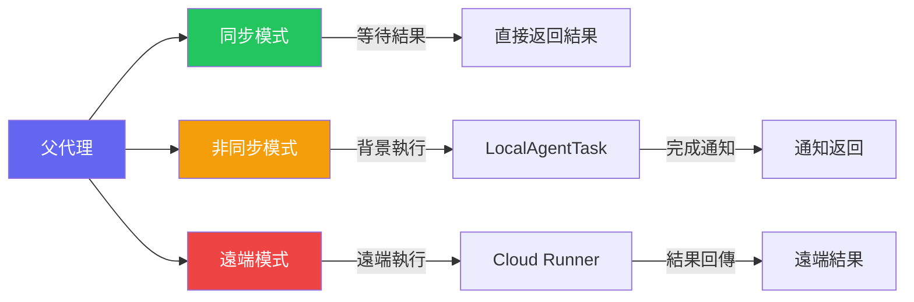
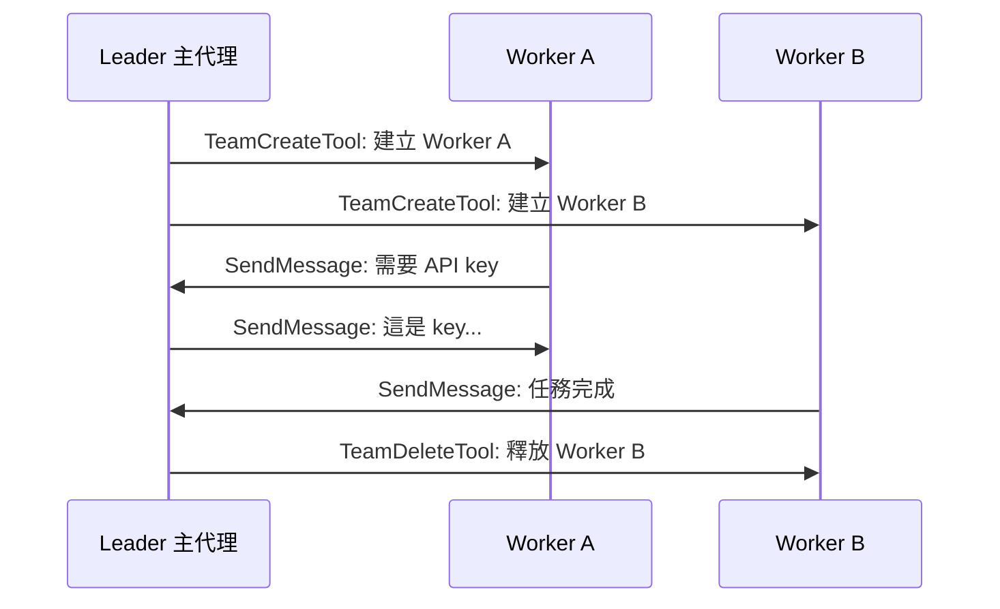

## 為什麼需要子代理？

當使用者要求「重構整個認證模組」時，這不是一個單一的操作。它可能需要：
- 分析現有程式碼結構
- 搜尋所有相關的測試檔案
- 同時修改多個檔案
- 驗證修改後的程式碼能否通過測試

Claude Code 解決這個問題的方式是：**主代理可以派遣子代理**。每個子代理是一個獨立的 AI 對話，擁有自己的工具集和上下文，但共享父代理的 prompt cache。

## AgentTool 的三種執行模式



### 1. 同步模式（Sync/Inline）

子代理執行完畢後，結果直接返回給父代理。適合快速的搜尋或分析任務。

### 2. 非同步模式（Async/Background）

子代理在背景執行，父代理可以繼續其他工作。完成後通過 `LocalAgentTask` 通知系統回報結果。

### 3. 遠端模式（Remote）

子代理被「傳送」到遠端 Cloud Runner 執行，完全不佔用本地資源。

## CacheSafeParams — 成本優化的關鍵

Claude Code 最精妙的設計之一是 **Prompt Cache 共享**。

### 問題

每次呼叫 Anthropic API 時，system prompt + tool definitions 可能超過 50,000 tokens。如果每個子代理都重新傳送這些內容，成本會非常高。

### 解決方案

Anthropic API 支援 **Prompt Caching**：如果連續的 API 呼叫有相同的前綴（system prompt + tools + 前幾條訊息），快取命中的 tokens 只收 10% 的費用。

```typescript
// src/utils/forkedAgent.ts
type CacheSafeParams = {
  systemPrompt: string;
  tools: ToolDefinition[];
  model: string;
  messages: Message[];      // 前綴訊息
  thinkingConfig: ThinkingConfig;
};

// 父代理儲存自己的 cache-safe params
function saveCacheSafeParams(params: CacheSafeParams) {
  globalCacheSafeParams = params;
}

// 子代理取得父代理的 params，確保前綴匹配
function getLastCacheSafeParams(): CacheSafeParams | null {
  return globalCacheSafeParams;
}
```

:::tip[Key Insight]
這意味著父代理和所有子代理共享同一個 prompt cache。子代理的 system prompt、tools、model 必須與父代理完全一致，才能命中快取。這是刻意的架構約束 — 犧牲子代理的客製化彈性，換取巨大的成本節省。
:::

## 子代理建立流程

```typescript
// src/utils/forkedAgent.ts — 簡化版
type ForkedAgentParams = {
  promptMessages: Message[];         // 子代理專屬的輸入訊息
  cacheSafeParams: CacheSafeParams;  // 共享的快取安全參數
  canUseTool: CanUseToolFn;          // 權限檢查函數
  querySource: QuerySource;          // 分析追蹤
  forkLabel: string;                 // 遙測標籤
};
```

子代理本質上是一個新的 `query()` 呼叫（Ch.7），但使用了特殊的參數來確保 cache 共享。

## AgentTool 的輸入 Schema

AgentTool 的真實輸入定義使用了 `lazySchema`（延遲載入，避免循環依賴）：

```typescript
// src/tools/AgentTool/AgentTool.tsx
const baseInputSchema = lazySchema(() => z.object({
  description: z.string().describe('A short (3-5 word) description of the task'),
  prompt: z.string().describe('The task for the agent to perform'),
  subagent_type: z.string().optional()
    .describe('The type of specialized agent to use'),
  model: z.enum(['sonnet', 'opus', 'haiku']).optional(),
  run_in_background: z.boolean().optional()
    .describe('Set to true to run in background'),
}))

// 完整 schema 在基礎之上擴展多代理參數
const fullInputSchema = lazySchema(() => {
  return baseInputSchema().merge(z.object({
    name: z.string().optional()
      .describe('Name for spawned agent (addressable via SendMessage)'),
    team_name: z.string().optional(),
    isolation: z.enum(['worktree']).optional(),
    cwd: z.string().optional()
      .describe('Absolute path to run agent in'),
  }))
})
```

## Agent Definition System

子代理的「角色」由 **Agent Definition** 定義：

```markdown
---
name: explore
description: Fast agent for exploring codebases
model: sonnet
tools:
  - FileReadTool
  - GlobTool
  - GrepTool
---

You are a fast, specialized agent for codebase exploration...
```

Agent Definition 可以來自：
- 內建定義（`ONE_SHOT_BUILTIN_AGENT_TYPES`）
- 使用者定義（`.claude/agents/` 目錄下的 markdown 檔案）
- 專案定義（project-level agents）

## Worktree 隔離模式

對於可能修改檔案的子代理，Claude Code 提供了 **Git Worktree 隔離**：

```
主代理 (main worktree)
  ├── 子代理 A (isolated worktree: /tmp/worktree-abc)
  └── 子代理 B (isolated worktree: /tmp/worktree-def)
```

每個隔離的子代理在自己的 git worktree 中工作，修改不會影響主工作區。如果子代理的工作成功，變更可以被合併回主分支。

## 代理間通訊

在 Coordinator Mode（多代理 Swarm）中，代理可以通過 `SendMessageTool` 互相通訊：



## Task 生命週期管理

每個子代理都被註冊為一個 `Task`，有完整的生命週期追蹤：

```typescript
type TaskState = {
  id: string;           // 唯一識別（a/b/r/t + 8 bytes base36）
  type: TaskType;       // 'local_agent' | 'remote_agent' | ...
  status: TaskStatus;   // pending → running → completed / failed
  description: string;
  startTime: number;
  endTime?: number;
  outputFile: string;   // 輸出串流存檔路徑
};
```

## 關鍵要點

:::tip[Key Insight]
Claude Code 的 Agent Orchestration 展現了一個關鍵洞見：**子代理不需要是獨立的實體，它們可以是父代理的「快取共享分身」**。透過 CacheSafeParams 確保 prompt cache 命中，多代理系統的成本可以控制在可接受的範圍內。這是讓 AI 代理「可部署」的關鍵工程決策。
:::
