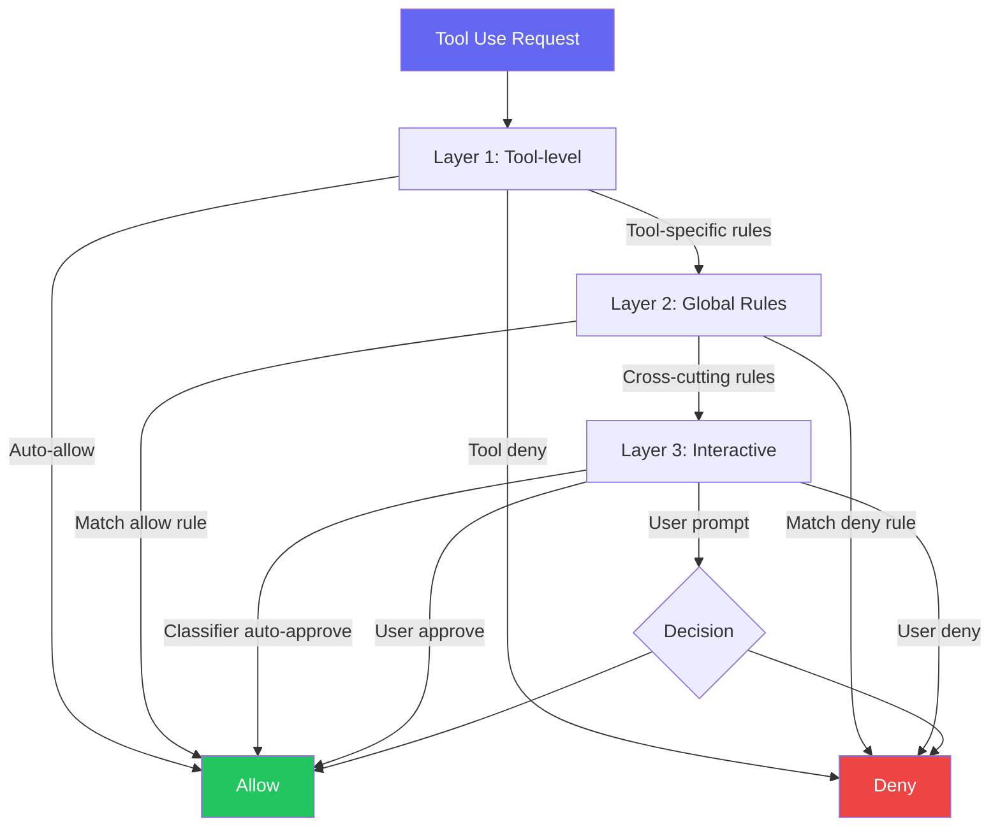

:::note[前置知識橋]
Ch.03 的子代理以 `bypassPermissions` mode 執行，跳過互動確認。本章解釋這個 bypass 是如何運作的——以及當無法 bypass 時，四層系統如何讓三個 handler 同時競賽來做出決定。
:::

## 為什麼權限是最困難的問題？

AI 代理的權限設計面臨一個根本性矛盾：

- **太嚴格** → 每個操作都問使用者，代理變成「需要人工確認的腳本」
- **太寬鬆** → 代理可能執行危險操作，造成不可逆的傷害

Claude Code 的解決方案是 **分層權限系統** — 不同層級的操作對應不同的審批流程，同時透過 ML 分類器加速安全操作的審批。

## 四層權限模型



### Layer 1: Tool-level Permission

每個工具可以定義自己的權限邏輯：

```typescript
// 例：FileReadTool 的權限 — 只讀操作，通常自動允許
checkPermissions(input) {
  if (isPathOutsideProject(input.file_path)) {
    return { behavior: 'ask', reason: 'File is outside project directory' };
  }
  return { behavior: 'allow' };
}
```

### Layer 2: Global Rules Engine

全域規則引擎基於 `PermissionContext`：

```typescript
type PermissionContext = {
  mode: 'default' | 'plan' | 'bypass';
  alwaysAllowRules: ToolPermissionRulesBySource;
  alwaysDenyRules: ToolPermissionRulesBySource;
  alwaysAskRules: ToolPermissionRulesBySource;
  shouldAvoidPermissionPrompts?: boolean;  // 背景代理
};
```

使用者可以在 settings 中配置規則：
- `alwaysAllow: ["FileReadTool", "GlobTool"]` — 這些工具永遠不問
- `alwaysDeny: ["BashTool:rm -rf *"]` — 這些命令永遠禁止

### Layer 3: Interactive & Automated

當前兩層無法做出決定時，進入互動層。這裡有三條平行路徑同時競賽：

## 三條平行審批路徑

```typescript
// src/hooks/toolPermission/ — 三條路徑同時競賽
// 每條路徑是一個獨立的 Promise，Promise.race 取最先完成者
const result = await Promise.race([
  // 路徑 1: UI 對話框 — 推送到 React/Ink 渲染佇列
  interactiveHandler.prompt(toolUse),

  // 路徑 2: Hook 系統 — 執行外部腳本
  hookHandler.evaluate(toolUse),

  // 路徑 3: ML 分類器 — 判斷命令安全性
  classifierHandler.classify(toolUse),
])

// 關鍵設計：如果分類器判斷「不安全」，它不返回 deny，
// 而是返回永遠不 resolve 的 Promise，讓其他 handler 接手：
async function awaitClassifierAutoApproval(command) {
  const safety = await classifyBashCommand(command)
  if (safety === 'safe') {
    return { behavior: 'allow' }
  }
  return new Promise(() => {}) // 永遠不 resolve → race 繼續等待
}
```

### InteractiveHandler — 使用者對話框

推送到 UI 佇列，渲染權限對話框，等待使用者點擊「允許」或「拒絕」。

### Hook Handler — 自訂腳本

使用者可以定義 `permission_request` hooks，由外部腳本自動做出決定。

### Bash Classifier — ML 自動審批

這是最有趣的部分。對於 BashTool，Claude Code 使用一個 **ML 分類器** 來自動判斷命令是否安全：

```typescript
// src/tools/BashTool/bashPermissions.ts
async function awaitClassifierAutoApproval(
  command: string,
  context: PermissionContext
): Promise<PermissionDecision> {
  // ML 模型分析命令安全性
  const safety = await classifyBashCommand(command);

  if (safety === 'safe') {
    return { behavior: 'allow' };
  }
  // 不安全 → 不返回結果，讓其他 handler 接手
  return new Promise(() => {}); // 永遠不 resolve
}
```

:::tip[Tip]
注意最後一行：如果分類器判斷命令不安全，它不返回「拒絕」，而是返回一個永遠不 resolve 的 Promise。這讓 `Promise.race` 繼續等待其他 handler（通常是使用者對話框）做出決定。分類器只加速安全的操作，不會阻擋不安全的操作。
:::

## Permission Decision 型別

```typescript
type PermissionDecision =
  | { behavior: 'allow'; updatedInput?: unknown }  // 允許（可修改輸入）
  | { behavior: 'deny'; reason: string }            // 拒絕（附原因）
  | { behavior: 'ask'; ... }                        // 需要人工判斷
  | { behavior: 'hook_result'; ... };               // Hook 決定
```

## Denial Tracking — 拒絕升級機制

如果使用者連續拒絕多次，系統會升級反應：

```
第 1 次拒絕: 正常處理，代理嘗試其他方案
第 2 次拒絕: 記錄追蹤
第 N 次拒絕: 提示使用者是否要調整權限規則
```

這避免了代理陷入「請求 → 拒絕 → 重試 → 拒絕」的無限迴圈。

## Speculative Classification

為了減少使用者等待時間，分類器在 LLM 回應串流時就開始工作：

```typescript
// 在 LLM 回應串流中，一旦看到 BashTool 呼叫
function startSpeculativeClassifierCheck(command: string) {
  // 在使用者看到權限對話框之前，分類器已經在背景分析
  classifierPromise = classifyBashCommand(command);
}
```

這意味著：如果命令是安全的，使用者可能根本看不到權限對話框 — 分類器已經在毫秒級內批准了。

## 背景代理的權限

背景運行的子代理不能彈出 UI 對話框。它們使用 `shouldAvoidPermissionPrompts: true`，只依賴規則引擎和分類器。如果無法自動決定，子代理會暫停等待。

## bypassPermissions Mode 的設計哲學

自動化 pipeline 中沒有人在場——每次 BashTool 呼叫都彈出對話框，代理不是在工作，而是在等一個永遠不會出現的點擊。這個問題不能靠「更智慧的預測」解決，只能靠架構。

**問題根源**：子代理在無人值守的背景程序中運行，`shouldAvoidPermissionPrompts: true` 讓它無法呼叫 UI，但如果每個工具呼叫都需要互動確認，整個任務就死鎖了。

**Context 繼承機制**：orchestrator 在 spawn 子代理之前已驗證其可信度；這個「擔保關係」透過 `ToolPermissionContext.mode` 傳遞。當 `mode === 'bypassPermissions'` 時，`hasPermissionsToUseToolInner()` 在完成前兩層規則檢查後，直接在步驟 2a 短路返回 allow，跳過所有互動層：

```typescript
// src/utils/permissions/permissions.ts — 步驟 2a
const shouldBypassPermissions =
  appState.toolPermissionContext.mode === 'bypassPermissions' ||
  (appState.toolPermissionContext.mode === 'plan' &&
    appState.toolPermissionContext.isBypassPermissionsModeAvailable)

if (shouldBypassPermissions) {
  return {
    behavior: 'allow',
    updatedInput: getUpdatedInputOrFallback(toolPermissionResult, input),
    decisionReason: { type: 'mode', mode: appState.toolPermissionContext.mode },
  }
}
```

**Bypass 的邊界**：這個短路只發生在步驟 2a，意味著步驟 1（規則層）仍然完整執行。`alwaysDenyRules` 在步驟 1a 就已攔截；`requiresUserInteraction()` 的工具在步驟 1e 仍強制 prompt；`.git/`、`.claude/`、shell config 等路徑的 `safetyCheck` 在步驟 1g 宣告為 bypass-immune。這三類硬封鎖無論如何都無法被 bypass。

```typescript
// src/tools/BashTool/bashPermissions.ts — classifier 在 bypassPermissions 下直接跳過
export function startSpeculativeClassifierCheck(
  command: string,
  toolPermissionContext: ToolPermissionContext,
  signal: AbortSignal,
  isNonInteractiveSession: boolean,
): boolean {
  if (!isClassifierPermissionsEnabled()) return false
  if (toolPermissionContext.mode === 'bypassPermissions') return false  // 無需分類
  // ...
}
```

**工程後果與 Zero Trust 對比**：NIST SP 800-207 Zero Trust 的核心原則是「never trust, always verify」——每次訪問都獨立驗證，不依賴網路位置或先前認可。Claude Code 做了一個刻意的例外：orchestrator 的擔保在子代理的整個 session 中持續有效。這個設計犧牲了 per-request 驗證，換取的是 pipeline 的可執行性。安全性靠另一個機制保障：`bypassPermissions` 模式在 spawning 時，子代理只繼承 `WORKER_ALLOWED_TOOLS` 列表中的工具，限制了 blast radius——即便 orchestrator 的判斷出錯，子代理能做到的破壞也有明確上界。

:::caution[安全邊界]
`bypassPermissions` 需要 `--dangerously-skip-permissions` CLI flag 才能啟用，並有 Statsig 遠端 killswitch（`bypassPermissionsKillswitch.ts`）可即時撤銷。這是一個有明確撤銷路徑的例外，而不是永久信任。
:::

## checkPermissionsAndCallTool：核心決策函式的完整路徑

每個 tool 呼叫都會掉進一個七步決策漏斗，但大多數呼叫在前三步就已離開。理解完整路徑，才能知道哪裡可以插入自訂邏輯、哪裡的決定不可逆。

`checkPermissionsAndCallTool()` 是 `src/services/tools/toolExecution.ts` 中的核心函式，負責驗證輸入、啟動 speculative classifier、跑 pre-tool hooks，最後呼叫 `canUseTool()`（即 `hasPermissionsToUseTool()`）做出最終 permission 決定：

```typescript
// src/services/tools/toolExecution.ts
async function checkPermissionsAndCallTool(
  tool: Tool,
  toolUseID: string,
  input: { [key: string]: boolean | string | number },
  toolUseContext: ToolUseContext,
  canUseTool: CanUseToolFn,
  assistantMessage: AssistantMessage,
  messageId: string,
  requestId: string | undefined,
  mcpServerType: McpServerType,
  mcpServerBaseUrl: ReturnType<typeof getLoggingSafeMcpBaseUrl>,
  onToolProgress: (...) => void,
): Promise<MessageUpdateLazy[]>
```

**完整決策路徑（`hasPermissionsToUseToolInner` 七步）**：

| 步驟 | 檢查項目 | 無法繞過 |
|------|---------|---------|
| 1a | `getDenyRuleForTool()` — `alwaysDenyRules` 全工具封鎖 | 是 |
| 1b | `getAskRuleForTool()` — `alwaysAskRules` 強制提問 | 是 |
| 1c | `tool.checkPermissions(input, context)` — 工具自身規則 | 否（bypass 可跳） |
| 1d | 工具實作回傳 `deny` | 是 |
| 1e | `tool.requiresUserInteraction()` | 是（bypass-immune） |
| 1f | 內容級 ask rule（`ruleBehavior: 'ask'`） | 是 |
| 1g | `safetyCheck` 路徑（`.git/`、`.claude/` 等） | 是（bypass-immune） |
| 2a | `mode === 'bypassPermissions'` → 直接 allow | — |
| 2b | `toolAlwaysAllowedRule()` → `alwaysAllowRules` 命中 | — |
| 3 | `passthrough` → 轉換為 `ask`，進入 handler 競賽 | — |

**為什麼是 Promise.race 而不是循序呼叫？**

循序呼叫意味著：先等 hook（外部腳本，可能需要數百毫秒）→ 再等 classifier（網路呼叫）→ 最後才顯示對話框。每個未命中的層都在使用者體驗上疊加延遲。`Promise.race` 讓三條路徑並行，最先完成的即勝出；對話框不是在其他路徑結束後才出現，而是在 t≈120ms 就已推入 React 渲染佇列，只是如果 classifier 先以 `<50ms` 完成，使用者永遠看不到它。

`PermissionDecision` 型別封裝了所有可能的結果，包含 `allow`（可含修改後的 input）、`ask`（含 `pendingClassifierCheck` metadata）和 `deny`：

```typescript
// src/types/permissions.ts
type PermissionDecision<Input extends { [key: string]: unknown } = ...> =
  | PermissionAllowDecision<Input>   // behavior: 'allow', updatedInput?, decisionReason?
  | PermissionAskDecision<Input>     // behavior: 'ask', pendingClassifierCheck?
  | PermissionDenyDecision           // behavior: 'deny', message, decisionReason

// decisionReason 追蹤決策來源：
type PermissionDecisionReason =
  | { type: 'rule'; rule: PermissionRule }
  | { type: 'mode'; mode: PermissionMode }
  | { type: 'classifier'; classifier: string; reason: string }
  | { type: 'hook'; hookName: string; reason?: string }
  | { type: 'safetyCheck'; reason: string; classifierApprovable: boolean }
  | // ...
```

**工程後果**：`PermissionDecision` 設計刻意讓 `allow` 可以攜帶修改後的 input（`updatedInput`），這讓 hook 和 classifier 能在批准的同時改寫工具參數，而不需要額外的往返。代價是：任何消費 `PermissionDecision` 的下游程式碼都必須處理 input 可能被替換的情況。

## Speculative Classification 的時序競賽

ML 分類器是一個網路呼叫——如果等到使用者看到對話框才發出請求，就已浪費了 ~120ms。Claude Code 的解法是在 input 驗證完成後立刻非同步啟動分類器，讓它和 pre-tool hooks、對話框渲染同步並行。

**時序全景**（以安全命令為例）：

```
t=0ms    LLM stream 回傳 BashTool 呼叫，input 驗證通過
t=0ms    startSpeculativeClassifierCheck() 立即啟動，promise 存入 speculativeChecks Map
t=~50ms  ML classifier 返回 { matches: true, confidence: 'high' }（安全命令）
t=~120ms UI 對話框渲染到 React 佇列（如果沒有更早的決定）
         → classifier 已在 t=50ms 完成，使用者看不到對話框
```

對於不安全命令（`matches: false` 或 `confidence` 不為 `'high'`），`awaitClassifierAutoApproval()` 返回 `undefined`，permission flow 繼續等待對話框或 hook。

```typescript
// src/tools/BashTool/bashPermissions.ts
export function startSpeculativeClassifierCheck(
  command: string,
  toolPermissionContext: ToolPermissionContext,
  signal: AbortSignal,
  isNonInteractiveSession: boolean,
): boolean {
  // 同樣的 guard：bypassPermissions 和 auto mode 下不需要 classifier
  if (!isClassifierPermissionsEnabled()) return false
  if (feature('TRANSCRIPT_CLASSIFIER') && toolPermissionContext.mode === 'auto')
    return false
  if (toolPermissionContext.mode === 'bypassPermissions') return false

  const cwd = getCwd()
  const promise = classifyBashCommand(
    command, cwd, allowDescriptions, 'allow', signal, isNonInteractiveSession,
  )
  // 防止信號中止前的 unhandled rejection
  promise.catch(() => {})
  speculativeChecks.set(command, promise)
  return true
}

// 消費端：awaitClassifierAutoApproval() 優先使用 speculative 結果
export async function awaitClassifierAutoApproval(
  pendingCheck: PendingClassifierCheck,
  signal: AbortSignal,
  isNonInteractiveSession: boolean,
): Promise<PermissionDecisionReason | undefined> {
  const speculativeResult = consumeSpeculativeClassifierCheck(pendingCheck.command)
  const classifierResult = speculativeResult
    ? await speculativeResult    // 直接取已在飛行中的 promise
    : await classifyBashCommand(...)  // fallback：直接呼叫

  if (
    feature('BASH_CLASSIFIER') &&
    classifierResult.matches &&
    classifierResult.confidence === 'high'
  ) {
    return {
      type: 'classifier',
      classifier: 'bash_allow',
      reason: `Allowed by prompt rule: "${classifierResult.matchedDescription}"`,
    }
  }
  return undefined  // 非高置信度 → 讓 race 中的其他 handler 接手
}
```

**關鍵設計細節**：分類器使用 `speculativeChecks` Map（以 command string 為 key）。`consumeSpeculativeClassifierCheck()` 在取出 promise 後刪除 Map entry，確保每個投機檢查只被消費一次，不會被多個 handler 重複使用。

**時序競賽的工程後果**：speculative check 在 `checkPermissionsAndCallTool` 函式的 input 驗證完成後立刻啟動，早於 `canUseTool()` 呼叫——這意味著即使 `hasPermissionsToUseTool` 因為某個規則提前返回 allow（不需要 classifier），那個飛行中的 classifier 請求仍然發出去了。系統靠 `consumeSpeculativeClassifierCheck` 的一次性消費語意和 `promise.catch(() => {})` 的靜默忽略來處理這個浪費，而不是試圖取消網路請求。

## 拒絕的 Cascading 效應

一次拒絕只是反饋；連續拒絕是系統性訊號。如果代理在 auto mode 下反覆被 classifier 封鎖，無限重試會燒掉 token、降低 UX，並掩蓋真正的問題——使用者的 permission rule 可能根本就是錯的。

**DenialTrackingState：雙計數器架構**

`denialTracking.ts` 維護兩個獨立計數器：`consecutiveDenials`（連續拒絕次數）和 `totalDenials`（session 累計拒絕次數），分別對應不同的升級觸發條件：

```typescript
// src/utils/permissions/denialTracking.ts
export type DenialTrackingState = {
  consecutiveDenials: number
  totalDenials: number
}

export const DENIAL_LIMITS = {
  maxConsecutive: 3,   // 連續 3 次 → 觸發 fallback
  maxTotal: 20,        // session 累計 20 次 → 觸發 fallback
} as const

export function shouldFallbackToPrompting(state: DenialTrackingState): boolean {
  return (
    state.consecutiveDenials >= DENIAL_LIMITS.maxConsecutive ||
    state.totalDenials >= DENIAL_LIMITS.maxTotal
  )
}

// recordSuccess() 重置連續計數，但不重置累計計數
export function recordSuccess(state: DenialTrackingState): DenialTrackingState {
  if (state.consecutiveDenials === 0) return state
  return { ...state, consecutiveDenials: 0 }
}
```

**Cascading 升級路徑**：

1. **第 1-2 次連續拒絕**：正常記錄，`consecutiveDenials` 遞增，代理嘗試其他策略
2. **第 3 次連續拒絕**（或累計第 20 次）：`shouldFallbackToPrompting()` 返回 `true`，系統呼叫 `buildDenialLimitWarning()`，在 deny 結果中注入警告訊息：

```typescript
// src/utils/permissions/permissions.ts
const warning = hitTotalLimit
  ? `${totalCount} actions were blocked this session. Please review the transcript before continuing.`
  : `${consecutiveCount} consecutive actions were blocked. Please review the transcript before continuing.`
```

3. **Headless 模式（子代理）**：不是顯示警告，而是直接拋出 `AbortError('Agent aborted: too many classifier denials in headless mode')`，強制終止代理
4. **使用者看到對話框**：系統 fallback 回 interactive prompt，讓使用者能查看 transcript 並決定是否調整 permission rules

**一次成功允許**（`recordSuccess()`）**只重置連續計數**，不重置累計計數。這意味著：即使代理在被拒絕後找到了迂迴方法成功執行，`totalDenials` 仍在累積，防止透過「穿插少量成功操作」來規避 session 級別的上限。

:::tip[工程後果]
雙計數器設計讓「短期正常、長期異常」的模式也能被偵測。例如：代理每隔幾步就嘗試一次被拒的操作，`consecutiveDenials` 永遠不會達到 3，但 `totalDenials` 會在 session 中慢慢累積到 20，最終觸發審查。
:::

## 關鍵要點

:::tip[Key Insight]
Claude Code 的權限系統展示了一個精妙的平衡：**安全性不一定要犧牲效率**。通過 ML 分類器自動批准安全操作、Hook 系統允許自訂策略、以及 Promise.race 並行競賽模式，系統在保持嚴格安全的同時，將大部分操作的延遲降到了近乎零。
:::

:::note[承先啟後]
三條競賽路徑中，Hook Handler 只是被提了一句。Ch.05 完整解析 Hook 系統——它不只能 allow/deny，還能修改工具輸入、向使用者提問、在任何生命週期節點插入自訂邏輯。
:::
