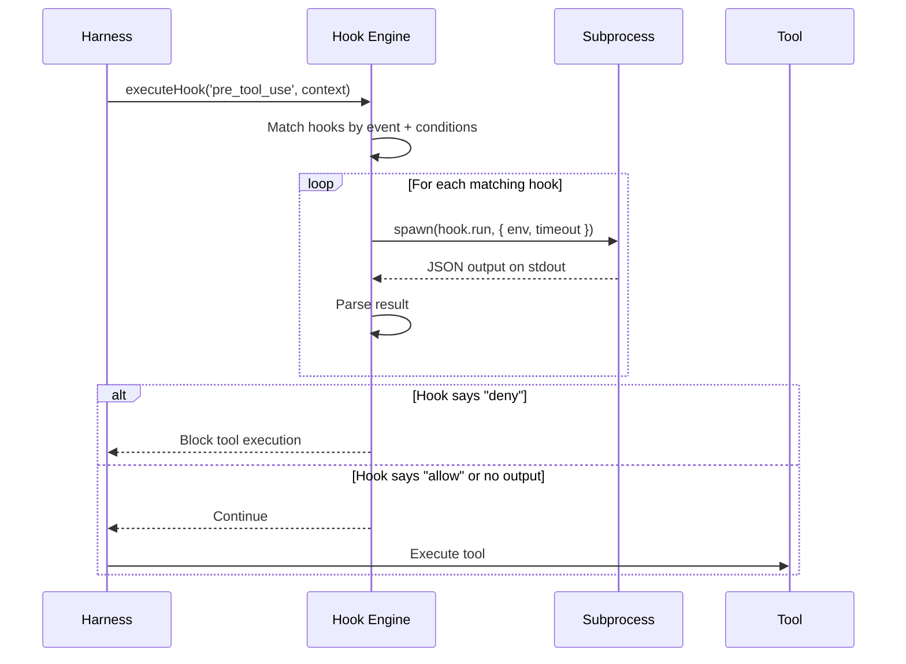

## 為什麼需要 Hook 系統？

Harness Engineering 的一個核心挑戰是：**框架的作者無法預見所有使用場景**。不同的團隊有不同的安全策略、不同的程式碼慣例、不同的工作流程。

Claude Code 的 Hook 系統讓使用者可以在不修改核心程式碼的情況下，插入自訂邏輯到代理的生命週期中。

## Hook 事件類型

Claude Code 定義了豐富的事件觸發點：

```typescript
type HookEvent =
  | 'setup'              // 初始化
  | 'session_start'      // 對話開始
  | 'session_end'        // 對話結束
  | 'pre_tool_use'       // 工具執行前
  | 'post_tool_use'      // 工具執行後
  | 'pre_compact'        // 上下文壓縮前
  | 'post_compact'       // 上下文壓縮後
  | 'permission_denied'  // 權限被拒絕
  | 'stop_failure'       // 停止失敗
  | 'subagent_start'     // 子代理啟動
  | 'subagent_stop'      // 子代理停止
  | 'task_created'       // 任務建立
  | 'task_completed';    // 任務完成
```

## Hook 定義格式

Hook 在 `.claude/hooks.json` 或設定中定義：

```json
{
  "hooks": {
    "pre_tool_use": [
      {
        "if": {
          "tool": "BashTool",
          "input_contains": "npm publish"
        },
        "run": "node scripts/check-publish-auth.js",
        "shell": "bash",
        "env": {
          "NPM_TOKEN": "$NPM_TOKEN"
        }
      }
    ],
    "post_tool_use": [
      {
        "if": { "tool": "FileEditTool" },
        "run": "eslint --fix ${TOOL_INPUT_FILE_PATH}"
      }
    ]
  }
}
```

## 執行架構



### executeHooks — 真實的 async generator

真實的 hook 執行函數是一個 **async generator**，可以逐步 yield 結果：

```typescript
// src/utils/hooks.ts — executeHooks 的真實簽名
async function* executeHooks({
  hookInput,
  toolUseID,
  matchQuery,
  signal,
  timeoutMs = TOOL_HOOK_EXECUTION_TIMEOUT_MS,
  toolUseContext,
  messages,
  requestPrompt,
}: {
  hookInput: HookInput
  toolUseID: string
  matchQuery?: string
  signal?: AbortSignal
  timeoutMs?: number
  toolUseContext?: ToolUseContext
  messages?: Message[]
  requestPrompt?: (sourceName: string) =>
    (request: PromptRequest) => Promise<PromptResponse>
}): AsyncGenerator<AggregatedHookResult> {
  // 安全檢查：未信任的 workspace 不執行任何 hook
  if (shouldSkipHookDueToTrust()) {
    return
  }

  // 查找匹配的 hooks
  const matchingHooks = await getMatchingHooks(
    appState, sessionId, hookEvent, hookInput,
    toolUseContext?.options?.tools,
  )

  if (matchingHooks.length === 0) return

  // 逐一執行並 yield 結果
  for (const hook of matchingHooks) {
    yield* executeHookCallback({
      hook, toolUseID, hookInput,
      signal, timeoutMs, requestPrompt,
    })
  }
}
```

### 子程序的 Promise.race 模式

Hook 子程序的執行使用了多重 race 來處理各種完成條件：

```typescript
// src/utils/hooks.ts — Hook 子程序競賽
// 第一步：寫入 stdin 的同時監聽錯誤
await Promise.race([stdinWritePromise, childErrorPromise])

// 第二步：等待子程序完成，三種可能：
const result = await Promise.race([
  childIsAsyncPromise,   // Hook 標記自己為背景執行
  childClosePromise,     // 子程序正常結束
  childErrorPromise,     // 子程序出錯
])
```

## Hook 與 Tool 的環境變數

Hook 執行時會收到豐富的上下文環境變數：

| 環境變數 | 說明 |
|---------|------|
| `CLAUDE_TOOL_NAME` | 當前工具名稱 |
| `CLAUDE_TOOL_INPUT` | 工具輸入（JSON） |
| `TOOL_INPUT_FILE_PATH` | 檔案路徑（如適用） |
| `TOOL_INPUT_COMMAND` | Bash 命令（如適用） |
| `CLAUDE_SESSION_ID` | 當前 session ID |
| `CLAUDE_PROJECT_DIR` | 專案根目錄 |

## Memoized Hook Loading

Hook 設定的載入使用了 memoization + file watcher 策略：

```typescript
// 1. 首次載入：解析 .claude/hooks.json
const hooks = memoize(() => loadHooksFromConfig());

// 2. 監聽檔案變更
setupFileChangedWatcher('.claude/hooks.json', () => {
  hooks.invalidate();  // 清除快取，下次存取時重新載入
});
```

:::tip[Tip]
這是一個常見的效能優化模式：**熱路徑快取 + 變更驅動失效**。每次工具執行都需要檢查 hooks，如果每次都重新讀取設定檔會太慢。但如果設定檔被修改了，快取會自動失效。
:::

## Hook 來源

Hook 可以來自多個來源，按優先順序合併：

1. **使用者設定** — `~/.claude/hooks.json`
2. **專案設定** — `.claude/hooks.json`
3. **Plugin hooks** — 由安裝的 plugin 提供
4. **Skill hooks** — 由執行中的 skill 注入
5. **MDM/Managed** — 企業管理員強制設定

## 實際應用範例

### 範例 1：自動格式化

每次檔案被修改後，自動執行 prettier：

```json
{
  "post_tool_use": [{
    "if": { "tool": "FileEditTool" },
    "run": "prettier --write ${TOOL_INPUT_FILE_PATH}"
  }]
}
```

### 範例 2：安全審查

阻止對生產環境配置的修改：

```json
{
  "pre_tool_use": [{
    "if": {
      "tool": "FileEditTool",
      "input_contains": "production.yml"
    },
    "run": "echo '{\"decision\": \"deny\", \"reason\": \"Production config is read-only\"}'"
  }]
}
```

### 範例 3：通知系統

子代理完成時發送 Slack 通知：

```json
{
  "task_completed": [{
    "run": "curl -X POST $SLACK_WEBHOOK -d '{\"text\": \"Agent task completed\"}'"
  }]
}
```

## 關鍵要點

:::tip[Key Insight]
Hook System 體現了 Harness Engineering 的擴展性原則：**核心框架提供觸發點，使用者通過外部腳本注入自訂邏輯**。這種「子程序 + JSON 協議」的設計讓 hooks 可以用任何語言實現，完全解耦於核心系統。
:::
