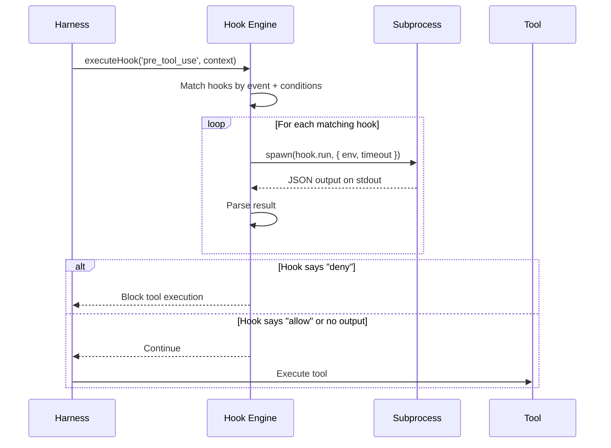

Ch.04 的三條平行審批路徑中，Hook Handler 是最可擴展的一條——它把權限決定外包給使用者自訂腳本。本章解釋這條路徑的完整能力：hooks 不只能 allow/deny，還能改寫工具輸入、向使用者提問、以及在任何生命週期節點注入自訂行為。

## 為什麼需要 Hook 系統？

Harness Engineering 的一個核心挑戰是：**框架的作者無法預見所有使用場景**。不同的團隊有不同的安全策略、不同的程式碼慣例、不同的工作流程。

Claude Code 的 Hook 系統讓使用者可以在不修改核心程式碼的情況下，插入自訂邏輯到代理的生命週期中。

## Hook 事件類型

Claude Code 定義了豐富的事件觸發點：

```typescript
type HookEvent =
  | 'setup'              // 初始化
  | 'session_start'      // 對話開始
  | 'session_end'        // 對話結束
  | 'pre_tool_use'       // 工具執行前
  | 'post_tool_use'      // 工具執行後
  | 'pre_compact'        // 上下文壓縮前
  | 'post_compact'       // 上下文壓縮後
  | 'permission_denied'  // 權限被拒絕
  | 'stop_failure'       // 停止失敗
  | 'subagent_start'     // 子代理啟動
  | 'subagent_stop'      // 子代理停止
  | 'task_created'       // 任務建立
  | 'task_completed';    // 任務完成
```

## Hook 定義格式

Hook 在 `.claude/hooks.json` 或設定中定義：

```json
{
  "hooks": {
    "pre_tool_use": [
      {
        "if": {
          "tool": "BashTool",
          "input_contains": "npm publish"
        },
        "run": "node scripts/check-publish-auth.js",
        "shell": "bash",
        "env": {
          "NPM_TOKEN": "$NPM_TOKEN"
        }
      }
    ],
    "post_tool_use": [
      {
        "if": { "tool": "FileEditTool" },
        "run": "eslint --fix ${TOOL_INPUT_FILE_PATH}"
      }
    ]
  }
}
```

## 執行架構



### executeHooks — 真實的 async generator

真實的 hook 執行函式是一個 **async generator**，可以逐步 yield 結果：

```typescript
// src/utils/hooks.ts — executeHooks 的真實簽名
async function* executeHooks({
  hookInput,
  toolUseID,
  matchQuery,
  signal,
  timeoutMs = TOOL_HOOK_EXECUTION_TIMEOUT_MS,
  toolUseContext,
  messages,
  requestPrompt,
}: {
  hookInput: HookInput
  toolUseID: string
  matchQuery?: string
  signal?: AbortSignal
  timeoutMs?: number
  toolUseContext?: ToolUseContext
  messages?: Message[]
  requestPrompt?: (sourceName: string) =>
    (request: PromptRequest) => Promise<PromptResponse>
}): AsyncGenerator<AggregatedHookResult> {
  // 安全檢查：未信任的 workspace 不執行任何 hook
  if (shouldSkipHookDueToTrust()) {
    return
  }

  // 查找匹配的 hooks
  const matchingHooks = await getMatchingHooks(
    appState, sessionId, hookEvent, hookInput,
    toolUseContext?.options?.tools,
  )

  if (matchingHooks.length === 0) return

  // 逐一執行並 yield 結果
  for (const hook of matchingHooks) {
    yield* executeHookCallback({
      hook, toolUseID, hookInput,
      signal, timeoutMs, requestPrompt,
    })
  }
}
```

### 子程序的 Promise.race 模式

Hook 子程序的執行使用了多重 race 來處理各種完成條件：

```typescript
// src/utils/hooks.ts — Hook 子程序競賽
// 第一步：寫入 stdin 的同時監聽錯誤
await Promise.race([stdinWritePromise, childErrorPromise])

// 第二步：等待子程序完成，三種可能：
const result = await Promise.race([
  childIsAsyncPromise,   // Hook 標記自己為背景執行
  childClosePromise,     // 子程序正常結束
  childErrorPromise,     // 子程序出錯
])
```

## Hook 與 Tool 的環境變數

Hook 執行時會收到豐富的上下文環境變數：

| 環境變數 | 說明 |
|---------|------|
| `CLAUDE_TOOL_NAME` | 當前工具名稱 |
| `CLAUDE_TOOL_INPUT` | 工具輸入（JSON） |
| `TOOL_INPUT_FILE_PATH` | 檔案路徑（如適用） |
| `TOOL_INPUT_COMMAND` | Bash 命令（如適用） |
| `CLAUDE_SESSION_ID` | 當前 session ID |
| `CLAUDE_PROJECT_DIR` | 專案根目錄 |

## Memoized Hook Loading

Hook 設定的載入使用了 memoization + file watcher 策略：

```typescript
// 1. 首次載入：解析 .claude/hooks.json
const hooks = memoize(() => loadHooksFromConfig());

// 2. 監聽檔案變更
setupFileChangedWatcher('.claude/hooks.json', () => {
  hooks.invalidate();  // 清除快取，下次存取時重新載入
});
```

:::tip[Tip]
這是一個常見的效能優化模式：**熱路徑快取 + 變更驅動失效**。每次工具執行都需要檢查 hooks，如果每次都重新讀取設定檔會太慢。但如果設定檔被修改了，快取會自動失效。
:::

## Hook 來源

Hook 可以來自多個來源，按優先順序合併：

1. **使用者設定** — `~/.claude/hooks.json`
2. **專案設定** — `.claude/hooks.json`
3. **Plugin hooks** — 由安裝的 plugin 提供
4. **Skill hooks** — 由執行中的 skill 注入
5. **MDM/Managed** — 企業管理員強制設定

## 實際應用範例

### 範例 1：自動格式化

每次檔案被修改後，自動執行 prettier：

```json
{
  "post_tool_use": [{
    "if": { "tool": "FileEditTool" },
    "run": "prettier --write ${TOOL_INPUT_FILE_PATH}"
  }]
}
```

### 範例 2：安全審查

阻止對生產環境配置的修改：

```json
{
  "pre_tool_use": [{
    "if": {
      "tool": "FileEditTool",
      "input_contains": "production.yml"
    },
    "run": "echo '{\"decision\": \"deny\", \"reason\": \"Production config is read-only\"}'"
  }]
}
```

### 範例 3：通知系統

子代理完成時發送 Slack 通知：

```json
{
  "task_completed": [{
    "run": "curl -X POST $SLACK_WEBHOOK -d '{\"text\": \"Agent task completed\"}'"
  }]
}
```

## Hook 如何修改工具輸入

拒絕一個危險的指令很直觀——但如果能消毒它，為什麼要拒絕？一個只能 block 的 hook 用途受限；`PermissionRequest` hook 可以改寫 Claude 準備執行的工具輸入，讓框架在不中斷任務的前提下強制執行安全策略。

Hook 回傳的 JSON 中有一個 `hookSpecificOutput.updatedInput` 欄位。當 `hookEventName` 為 `PreToolUse` 或 `PermissionRequest` 時，`processHookJSONOutput` 會提取這個值並填入 `HookResult.updatedInput`：

```typescript
// src/utils/hooks.ts — processHookJSONOutput 提取 updatedInput
case 'PreToolUse':
  // ...
  // Extract updatedInput if provided
  if (json.hookSpecificOutput.updatedInput) {
    result.updatedInput = json.hookSpecificOutput.updatedInput
  }
  break
case 'PermissionRequest':
  if (json.hookSpecificOutput.decision.behavior === 'allow' &&
      json.hookSpecificOutput.decision.updatedInput) {
    result.updatedInput = json.hookSpecificOutput.decision.updatedInput
  }
  break
```

這個 `updatedInput` 會沿著 `AggregatedHookResult` 一路傳遞，最終在 `checkPermissionsAndCallTool` 中替換原始輸入——也就是說，`tool.call(updatedInput, context)` 執行的是消毒後的版本，而不是 Claude 原本產生的版本。

實際用例：一個 git push hook 可以偵測到 `--force` 旗標，改寫指令為 `git push --force-with-lease`，然後回傳 `{ behavior: 'allow', updatedInput: { command: 'git push --force-with-lease' } }`——任務繼續，但潛在的破壞被悄悄移除。

代價是透明度：hooks 作為轉換層而非閘門時，Claude 的實際行動可能與它的意圖不一致。框架不會把這個差異告知 Claude，所以 model 的下一步推理是基於它認為它執行了什麼，而不是真正執行了什麼。

## PromptRequest 協議：Hook 向使用者提問

一個 hook 需要人類確認，但完整的互動式 UI 開銷太大。如何讓一個 shell 腳本在執行到一半時暫停、問使用者一個問題、再根據回答決定 allow/deny？

`PromptRequest`/`PromptResponse` 協議讓 hook 子程序能透過 stdin/stdout 向 Claude Code 主程序發送問題請求。hook 把一個符合 `PromptRequest` schema 的 JSON 行寫到 stdout，`executeHooks` 的 stdout 解析迴圈偵測到它，呼叫 `boundRequestPrompt`（由 `requestPrompt` 回呼綁定），把使用者的選擇以 `PromptResponse` 格式寫回 stdin，hook 收到後繼續執行並產出最終決定：

```typescript
// src/types/hooks.ts — 協議類型
export type PromptRequest = {
  prompt: string   // request id（作為 discriminator）
  message: string
  options: Array<{
    key: string
    label: string
    description?: string
  }>
}

export type PromptResponse = {
  prompt_response: string  // request id（echo back）
  selected: string         // 使用者選擇的 key
}
```

`executeHooks` 把 `requestPrompt` 注入子程序執行函式。函式簽名如下：

```typescript
// src/utils/hooks.ts — executeHooks 中的 requestPrompt 參數
requestPrompt?: (
  sourceName: string,
  toolInputSummary?: string | null,
) => (request: PromptRequest) => Promise<PromptResponse>
```

當 hook 腳本輸出 `{"prompt":"req-1","message":"部署到生產環境？","options":[{"key":"yes","label":"確認"},{"key":"no","label":"取消"}]}`，Claude Code 會把問題呈現給使用者，等待回應後寫入 `{"prompt_response":"req-1","selected":"yes"}`，整個過程完全發生在 shell hook 的生命週期內——不需要任何語言層級的非同步框架。

代價是序列性：多個 prompt 請求必須排隊（`promptChain` 序列化處理），因此 hook 無法並行詢問多個問題。

## Hook 超時與錯誤隔離

一個不穩定的 hook 應該影響工具執行嗎？Claude Code 的答案是：不應該。整個系統的設計前提是 hooks 是建議性的（advisory），而非強制性的守門員。

預設超時由 `TOOL_HOOK_EXECUTION_TIMEOUT_MS` 定義——實際值是 **10 分鐘**（`10 * 60 * 1000` 毫秒）：

```typescript
// src/utils/hooks.ts
const TOOL_HOOK_EXECUTION_TIMEOUT_MS = 10 * 60 * 1000
```

子程序的完成有三種路徑，由 `Promise.race` 決定誰先到達：

```typescript
// src/utils/hooks.ts — 三路競賽
// 第一關：寫入 stdin 的同時監聽 crash
await Promise.race([stdinWritePromise, childErrorPromise])

// 第二關：等待子程序完成
const result = await Promise.race([
  childIsAsyncPromise,  // hook 宣告自己為背景執行（{async: true}）
  childClosePromise,    // 子程序正常結束（exit code 已收集）
  childErrorPromise,    // 子程序 crash（Node.js 'error' 事件）
])
```

三種狀態的語義：
- **`childClosePromise`**：子程序乾淨退出，stdout 完整收集後 resolve（等待 `stdoutEndPromise` 和 `stderrEndPromise` 確保所有 data 事件已排清）。
- **`childErrorPromise`**：子程序 spawn 失敗或發生 Node.js 層級的錯誤，以 `reject` 告知呼叫端；呼叫端回傳 `status: 1`，不阻斷工具執行。
- **`childIsAsyncPromise`**：hook 在第一行輸出 `{"async":true}`，主程序立即把它移入背景（`executeInBackground`），繼續執行工具，hook 在背景完成後才可能觸發通知。

超時發生時，`wrapSpawn` 透過 AbortSignal 終止子程序，`childClosePromise` 以 `aborted: true` resolve——等同於 crash 路徑，hook 結果被忽略，工具照常執行。這讓一個執行超過 10 分鐘的 hook 無法無限期阻塞使用者。

## permission_request Hook 的特殊語義

`pre_tool_use` 在權限決定完成後才觸發——它對已成立的決定做後處理。`PermissionRequest` hook 截然不同：它在權限決定期間執行，作為三路競爭者之一。

在互動模式中，`handleInteractivePermission` 函式同時啟動三個並行路徑：

```
使用者互動（對話框）        ─┐
PermissionRequest hook     ─┼─ claim() 取得決定權，其餘兩路自動失效
Bash 分類器（僅 BashTool） ─┘
```

具體實作是 `createResolveOnce` 保護的原子性 `claim()` 函式：

```typescript
// src/hooks/toolPermission/handlers/interactiveHandler.ts
// PermissionRequest hook 非同步競爭
void (async () => {
  if (isResolved()) return
  const hookDecision = await ctx.runHooks(
    permissionMode, suggestions, result.updatedInput,
    permissionPromptStartTimeMs,
  )
  if (!hookDecision || !claim()) return  // claim() 是原子性的
  // Hook 贏得競爭——移除橋接請求和頻道訂閱
  bridgeCallbacks?.cancelRequest(bridgeRequestId)
  channelUnsubscribe?.()
  ctx.removeFromQueue()
  resolveOnce(hookDecision)
})()
```

`claim()` 的原子性保證「check-then-act」不存在競態條件——一旦 hook 呼叫 `claim()` 成功，使用者對話框的 `onAllow`/`onReject` 回呼即使稍後觸發也找不到未 resolved 的 Promise，並且 `ctx.removeFromQueue()` 會把對話框從 UI 中移除。

這個設計的業務後果值得注意：如果 `PermissionRequest` hook 回傳 `allow`，使用者永遠不會看到確認對話框。對於企業 MDM 管理的 hook（例如「在部署視窗期間自動批准所有 Terraform 指令」），這正是預期行為——安全策略可以完全繞過人工審批流程，速度和可靠性有所提升，但人工監督的空間消失了。

## 關鍵要點

:::tip[Key Insight]
Hook System 體現了 Harness Engineering 的擴展性原則：**核心框架提供觸發點，使用者通過外部腳本注入自訂邏輯**。這種「子程序 + JSON 協議」的設計讓 hooks 可以用任何語言實現，完全解耦於核心系統。
:::

Hook 系統在工具執行前後插入邏輯——但所有這些都發生在一個有限的 context window 內。Ch.06 解釋 Claude Code 如何管理這個窗口：壓縮、快取、以及為什麼改變 system prompt 注入也會清除 user context 快取。
