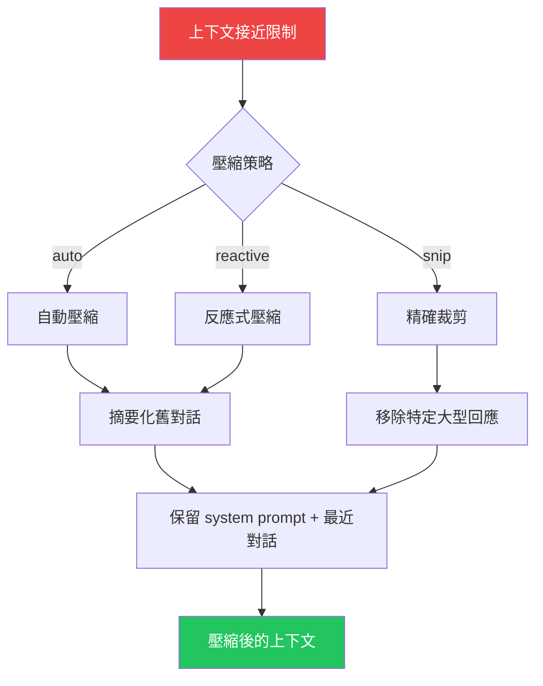

## 上下文窗口的挑戰

LLM 的上下文窗口是有限的資源。Claude 的上下文窗口有 200K tokens（1M 版本可達 1M tokens），聽起來很多，但在一個大型專案中：
- System prompt + tools 可能佔 50K+ tokens
- 對話歷史會持續累積
- 每次工具呼叫的結果都加入上下文

如果不主動管理上下文，它會很快耗盡。Claude Code 的 Context Management 就是為了解決這個問題。

## System Context vs User Context

Claude Code 組裝兩種上下文：

```typescript
// src/context.ts

// 1. 系統上下文 — 環境資訊
const getSystemContext = memoize(async () => ({
  gitStatus: await getGitStatus(),     // Git 狀態快照
  cacheBreaker: getInjectedPrompt(),   // 快取失效觸發
}));

// 2. 使用者上下文 — 記憶與偏好
const getUserContext = memoize(async () => ({
  memorySummary: await loadClaudeMd(),  // CLAUDE.md 內容
  fileIndex: await getProjectIndex(),   // 專案結構索引
}));
```

:::tip[Tip]
兩個上下文都使用了 `memoize()` — 在同一個 session 中，相同的上下文只會被組裝一次。這對效能至關重要，因為上下文組裝涉及大量的檔案系統操作。
:::

## CLAUDE.md 記憶系統

CLAUDE.md 是 Claude Code 最獨特的功能之一。它是一個 markdown 檔案，充當代理的「持久記憶」：

```markdown
# CLAUDE.md

## 專案慣例
- 使用 snake_case 命名 Ruby 方法
- 測試檔案放在 spec/ 目錄
- 提交訊息使用 conventional commits

## 架構決策
- 認證使用 Devise gem
- 前端使用 Turbo + Stimulus
- 資料庫是 PostgreSQL
```

### 載入階層

CLAUDE.md 從多個位置載入，按優先順序合併：

```
~/.claude/CLAUDE.md          → 全域設定（使用者偏好）
<project>/.claude/CLAUDE.md  → 專案設定
<project>/CLAUDE.md          → 專案根目錄
<cwd>/CLAUDE.md              → 當前目錄
```

## Bootstrap State — 全域 Session 狀態

`src/bootstrap/state.ts` 管理了超過 200 個屬性的全域狀態：

```typescript
type State = {
  // Session 身份
  originalCwd: string;       // 永不改變（session 身份）
  cwd: string;              // 隨 EnterWorktreeTool 改變
  projectRoot: string;      // 穩定，用於歷史/技能

  // 成本追蹤
  modelUsage: Record<string, ModelUsage>;
  totalCostUSD: number;

  // Hook 註冊
  registeredHooks: RegisteredHookMatcher[];

  // MCP 狀態
  mcpClients: MCPServerConnection[];

  // 遙測
  otelMeter: Meter;
  otelLogger: Logger;
  otelTracer: Tracer;

  // ... 200+ 其他屬性
};
```

:::note[Note]
`originalCwd` 永遠不會改變，它代表這個 session 的身份。而 `cwd` 可能因為 `EnterWorktreeTool` 而改變（進入子代理的隔離工作區）。這個區分很重要 — 歷史記錄和設定檔查找都基於 `projectRoot`，而不是當前的 `cwd`。
:::

## 上下文壓縮（Compaction）

當上下文接近窗口限制時，Claude Code 啟動壓縮：

### 壓縮策略

```typescript
// src/services/compact/
type CompactionStrategy =
  | 'auto'      // 接近上限時自動觸發
  | 'reactive'  // 收到 "prompt too long" 錯誤後觸發
  | 'snip';     // 精確裁剪特定訊息
```

### 壓縮流程



壓縮的核心是：**用 LLM 自己來摘要化舊的對話**。系統會呼叫一次 Claude 來產生一個精簡的摘要，替代之前長串的對話歷史。

### 壓縮 Hooks

壓縮前後都有 hook 觸發點：

```json
{
  "pre_compact": [{
    "run": "echo 'About to compact context...'"
  }],
  "post_compact": [{
    "run": "node scripts/log-compaction.js"
  }]
}
```

## Memoization 策略

Claude Code 的 memoization 不是簡單的「快取結果」，而是有精心設計的失效機制：

| 資料 | 快取策略 | 失效觸發 |
|------|---------|---------|
| Git 狀態 | Session 級別 memoize | 無（每 session 只取一次） |
| CLAUDE.md | Session 級別 memoize | `setSystemPromptInjection()` |
| Hook 設定 | File watcher | `.claude/hooks.json` 修改 |
| 工具定義 | 永久快取 | 應用重啟 |
| MCP 連線 | 連線級別 | 伺服器斷線 |

## 實際影響

以一個典型的大型重構任務為例：

1. **初始上下文**：~60K tokens（system + tools + CLAUDE.md）
2. **10 輪對話後**：~150K tokens（加上工具呼叫結果）
3. **自動壓縮**：回到 ~80K tokens（摘要 + 最近 3 輪）
4. **繼續工作**：代理保留了關鍵上下文，丟棄了冗餘細節

## 關鍵要點

:::tip[Key Insight]
Context Management 是 Harness Engineering 中最容易被忽視但最關鍵的部分。**上下文窗口是 AI 代理的「工作記憶」，管理它的效率直接決定了代理能處理多大規模的任務。** Claude Code 通過分層的記憶系統（CLAUDE.md 持久 + 上下文臨時 + 壓縮摘要）解決了這個問題。
:::
