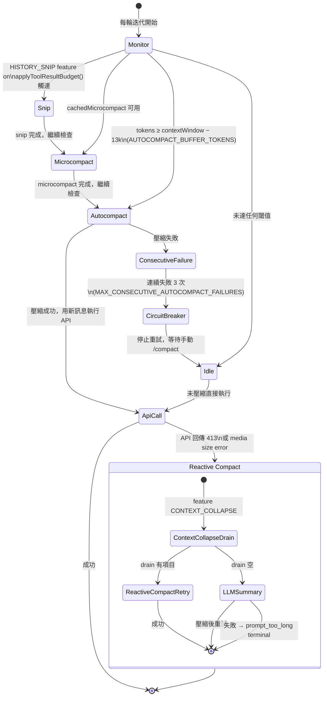

Ch.05 介紹了 hook system 如何攔截工具執行。工具執行、代理通訊、權限檢查——所有這些都在 context window 內發生。本章解釋 Claude Code 如何管理這個有限資源。

## 上下文窗口的挑戰

LLM 的上下文窗口是有限的資源。Claude 的上下文窗口有 200K tokens（1M 版本可達 1M tokens），聽起來很多，但在一個大型專案中：
- System prompt + tools 可能佔 50K+ tokens
- 對話歷史會持續累積
- 每次工具呼叫的結果都加入上下文

如果不主動管理上下文，它會很快耗盡。Claude Code 的 Context Management 就是為了解決這個問題。

## System Context vs User Context

Claude Code 組裝兩種上下文：

```typescript
// src/context.ts — 真實實現（lodash-es memoize）

// Git 狀態：session 級別快取，只取一次
export const getGitStatus = memoize(async (): Promise<string | null> => {
  // git status --short 輸出
})

// 系統上下文：包含 gitStatus + injected prompt
export const getSystemContext = memoize(async () => ({ /* ... */ }))

// 使用者上下文：包含 CLAUDE.md 內容 + 其他記憶
export const getUserContext = memoize(async () => ({ /* ... */ }))

// 快取失效：setSystemPromptInjection() 同時清除兩個快取
export function setSystemPromptInjection(value: string | null): void {
  injectedPrompt = value
  getUserContext.cache.clear?.()   // 強制下一輪重新載入 CLAUDE.md
  getSystemContext.cache.clear?.() // 強制下一輪重新取得 git status
}
```

:::tip[Tip]
兩個上下文都用 `lodash-es/memoize`，在同一個 session 中只組裝一次。唯一的快取失效點是 `setSystemPromptInjection()`，當 `/inject-prompt` 或 system prompt 動態注入時觸發——此時兩個快取**都**清除，確保新的注入內容在下一輪 API call 中生效。
:::

## CLAUDE.md 記憶系統

CLAUDE.md 是 Claude Code 的持久記憶機制。它是一個 markdown 檔案，在每次 session 啟動時載入進 system prompt：

```markdown
# CLAUDE.md

## 專案慣例
- 使用 snake_case 命名 Ruby 方法
- 測試檔案放在 spec/ 目錄
- 提交訊息使用 conventional commits

## 架構決策
- 認證使用 Devise gem
- 前端使用 Turbo + Stimulus
- 資料庫是 PostgreSQL
```

### 載入階層

CLAUDE.md 從多個位置載入，按優先順序合併：

```
~/.claude/CLAUDE.md          → 全域設定（使用者偏好）
<project>/.claude/CLAUDE.md  → 專案設定
<project>/CLAUDE.md          → 專案根目錄
<cwd>/CLAUDE.md              → 當前目錄
```

## Bootstrap State — 全域 Session 狀態

`src/bootstrap/state.ts` 管理了超過 200 個屬性的全域狀態：

```typescript
type State = {
  // Session 身份
  originalCwd: string;       // 永不改變（session 身份）
  cwd: string;              // 隨 EnterWorktreeTool 改變
  projectRoot: string;      // 穩定，用於歷史/技能

  // 成本追蹤
  modelUsage: Record<string, ModelUsage>;
  totalCostUSD: number;

  // Hook 註冊
  registeredHooks: RegisteredHookMatcher[];

  // MCP 狀態
  mcpClients: MCPServerConnection[];

  // 遙測
  otelMeter: Meter;
  otelLogger: Logger;
  otelTracer: Tracer;

  // ... 200+ 其他屬性
};
```

:::note[Note]
`originalCwd` 永遠不會改變，它代表這個 session 的身份。而 `cwd` 可能因為 `EnterWorktreeTool` 而改變（進入子代理的隔離工作區）。這個區分很重要 — 歷史記錄和設定檔查找都基於 `projectRoot`，而不是當前的 `cwd`。
:::

## 上下文壓縮策略與狀態機

Context 過長是 agentic session 的必然結果，不是邊界情況。Claude Code 設計了四種相互協作的壓縮機制，按代價從低到高排列：



### 為什麼需要四層機制？

每一層解決不同的問題：

| 機制 | 觸發時機 | 方法 | 代價 |
|---|---|---|---|
| **Snip** | tool result 超過 budget | 截斷最大的 tool result | 零 API 呼叫，但有資訊損失 |
| **Microcompact** | 快取式壓縮可用 | 複用舊摘要，剪接訊息 | 極低（cache hit） |
| **Autocompact** | tokens ≥ threshold | 呼叫 LLM 產生摘要（保留 20k output tokens） | 1 次 API 呼叫，~50k input tokens |
| **Reactive Compact** | API 413 error | 收到錯誤後才壓縮，保留最大上下文 | 同 autocompact，但時機不同 |

:::tip[Key Insight]
Proactive autocompact 和 reactive compact 是**互斥的**。`isAutoCompactEnabled()` 的邏輯確保：如果啟用了 contextCollapse 或 reactive compact，就不會在 API 呼叫前主動壓縮——因為主動壓縮會丟棄 collapse 正要保存的細粒度歷史。這是「悲觀壓縮」vs「樂觀壓縮」的策略選擇，兩者不能同時存在。
:::

### 壓縮 Hooks

壓縮前後都有 hook 觸發點（由 `postCompactCleanup.ts` 和 hook system 觸發）：

```json
{
  "pre_compact": [{
    "run": "echo 'About to compact context...'"
  }],
  "post_compact": [{
    "run": "node scripts/log-compaction.js"
  }]
}
```

壓縮完成後，`postCompactCleanup.ts` 還會嘗試恢復最多 5 個最近編輯的檔案（`POST_COMPACT_MAX_FILES_TO_RESTORE = 5`），避免壓縮後遺忘剛才修改過的內容。

## Memoization 策略

Claude Code 的 memoization 不是簡單的「快取結果」，而是有精心設計的失效機制：

| 資料 | 快取策略 | 失效觸發 |
|------|---------|---------|
| Git 狀態 | Session 級別 memoize | 無（每 session 只取一次） |
| CLAUDE.md | Session 級別 memoize | `setSystemPromptInjection()` |
| Hook 設定 | File watcher | `.claude/hooks.json` 修改 |
| 工具定義 | 永久快取 | 應用重啟 |
| MCP 連線 | 連線級別 | 伺服器斷線 |

## 實際影響

以一個典型的大型重構任務為例：

1. **初始上下文**：~60K tokens（system + tools + CLAUDE.md）
2. **10 輪對話後**：~150K tokens（加上工具呼叫結果）
3. **自動壓縮**：回到 ~80K tokens（摘要 + 最近 3 輪）
4. **繼續工作**：代理保留了關鍵上下文，丟棄了冗餘細節

## 關鍵要點

:::tip[Key Insight]
Context Management 是 Harness Engineering 中最容易被忽視但最關鍵的部分。**上下文窗口是 AI 代理的「工作記憶」，管理它的效率直接決定了代理能處理多大規模的任務。** Claude Code 通過分層的記憶系統（CLAUDE.md 持久 + 上下文臨時 + 壓縮摘要）解決了這個問題。
:::

## Microcompact 的 Cached 語義

大多數人以為壓縮一定要呼叫 LLM。但 cached microcompact 的核心洞見是：**如果伺服器端 prompt cache 仍然有效，工具結果根本不需要在對話歷史中出現——直接從 API 快取刪除它們即可。**

**問題**：一個長時間的 agentic session 會累積大量工具呼叫結果（file reads、shell outputs、grep 結果）。這些結果在對話早期很重要，但幾十輪之後已是過去式。每次 API call 仍要把它們全部送出，浪費 token，也拖慢速度。

**背景**：Anthropic 的 prompt cache 伺服器端快取有效期約為 1 小時（TTL）。若在 TTL 內且 prompt prefix 未改變，快取命中率接近 100%——這意味著舊的 tool result 內容其實已存在於伺服器快取中，不需要重送。

**解法**：`CACHED_MICROCOMPACT` feature flag 啟用後，`microcompactMessages()` 的執行路徑如下：它不修改本地的 `messages` 陣列，而是透過 Anthropic API 的 **cache editing** 機制，在伺服器端直接刪除舊的 `tool_result` 內容。具體地，它追蹤所有可壓縮工具（`COMPACTABLE_TOOLS` 集合：Bash、file read/write/edit、grep、glob、web fetch/search）的 tool use ID，判斷哪些超過 `triggerThreshold`（由 GrowthBook 配置的 `tengu_slate_heron` 實驗控制），然後建立一個 `CacheEditsBlock`，在下一次 API 呼叫時以 `cache_reference` + `cache_edits` 的形式送出，指示伺服器刪除指定 tool result。本地 `messages` 保持不變——壓縮發生在 API 層，不是對話層。

```typescript
// src/services/compact/microCompact.ts — 真實實現

export type MicrocompactResult = {
  messages: Message[]
  compactionInfo?: {
    pendingCacheEdits?: PendingCacheEdits
  }
}

export type PendingCacheEdits = {
  trigger: 'auto'
  deletedToolIds: string[]
  // 上一次 API 回應的累積 cache_deleted_input_tokens 基線值
  // 用於計算本次操作的 delta（API 值是累積的，非增量）
  baselineCacheDeletedTokens: number
}

export async function microcompactMessages(
  messages: Message[],
  toolUseContext?: ToolUseContext,
  querySource?: QuerySource,
): Promise<MicrocompactResult> {
  // 時間觸發：若距上次 assistant 訊息超過 gapThresholdMinutes（預設 60 分鐘）
  // 伺服器端快取已過期，直接內容清空（不用 cache editing，因為快取已冷）
  const timeBasedResult = maybeTimeBasedMicrocompact(messages, querySource)
  if (timeBasedResult) return timeBasedResult

  // Cached MC 路徑：只對 main thread 啟用（防止 sub-agent 污染全域狀態）
  if (feature('CACHED_MICROCOMPACT')) {
    const mod = await getCachedMCModule()
    if (mod.isCachedMicrocompactEnabled() && isMainThreadSource(querySource)) {
      return await cachedMicrocompactPath(messages, querySource)
    }
  }

  // 外部 build 或不支援的 model：不壓縮，交給 autocompact 處理
  return { messages }
}
```

**觸發條件的精確語義**：cached microcompact 在兩種條件下觸發：
1. **快取仍熱（cache warm）**：距上次 assistant 訊息未超過 `gapThresholdMinutes`（預設 60 分鐘）。快取熱時，cache editing 有效；快取冷時，改走 time-based 路徑，直接清空內容。
2. **工具數量超過閾值**：累積的可壓縮工具 ID 數量超過 `triggerThreshold`（由實驗配置）。

:::tip[Cached vs Regular Microcompact]
**Cached microcompact**（`CACHED_MICROCOMPACT` feature）：不修改本地 messages，透過 API cache editing 在伺服器端刪除工具結果。**零額外 LLM 呼叫**，代價僅為一個 cache editing 請求。

**Time-based microcompact**（快取冷時的後備）：直接修改本地 `messages` 陣列，把舊 tool result 替換為 `'[Old tool result content cleared]'`。同樣零 LLM 呼叫，但下一次 API call 仍需重建快取（cache creation token 代價）。

兩者都與 autocompact 形成互補：microcompact 不移除訊息、不產生摘要，autocompact 才會。
:::

**取捨**：Cached microcompact 犧牲了對 sub-agent 的支援（只對 `repl_main_thread` 啟用），以換取主執行緒的持續壓縮效果。因為 sub-agent 的 tool ID 若被登記進全域 `cachedMCState`，主執行緒下次嘗試 cache editing 那些 ID 時，伺服器端根本不存在對應的快取條目，會導致靜默錯誤。

## contextCollapse：主動壓縮的旗標機制

同一個問題有兩種哲學上截然相反的答案：等到快滿再壓縮（reactive），還是未滿就預先壓縮（proactive）？**contextCollapse 是後者的極致——它在上下文還有餘裕時，就開始把對話歷史切成可丟棄的「span」，主動消化掉歷史。**

**問題**：對於非常長的 agentic session（數百輪工具呼叫），autocompact 的全量 LLM 摘要策略代價高昂（一次壓縮消耗約 50k input tokens），且每次壓縮後失去細粒度上下文。能否更早介入，以更小的代價、保留更多細節？

**背景**：autocompact 是悲觀策略——假設資源很充裕，快滿時才行動。contextCollapse 是樂觀策略——持續把已確認不再需要的歷史段落「提交（commit）」進一個持久化的 commit log，讓 `projectView()` 在每輪開始時用摘要替換原始訊息。這個「歷史洩流佇列（history drain queue）」是漸進的：每次 commit 只移除一個 span，而不是一次清空所有歷史。

**解法**：`feature('CONTEXT_COLLAPSE')` 控制整個機制的程式碼路徑開關（dead code elimination 確保外部 build 不含此邏輯）。當 `isContextCollapseEnabled()` 返回 `true`，query loop 在每輪開始時執行 `contextCollapse.applyCollapsesIfNeeded()`，這會從 commit log 中 replay 所有已提交的 span，把原始訊息替換成摘要。如果上下文使用率達到 90%（commit 觸發），一個名為 `marble_origami` 的 ctx-agent 會被 spawn 出來，非同步地為當前最老的未提交 span 生成摘要，然後把這個 span 寫入 commit log（`type: 'marble-origami-commit'`）。達到 95%（blocking spawn），系統停止接受新輸入直到 spawn 完成。

```typescript
// src/query.ts — contextCollapse 在 query loop 中的位置

// 模組頂層：feature() 決定是否 require 整個 module
const contextCollapse = feature('CONTEXT_COLLAPSE')
  ? (require('./services/contextCollapse/index.js') as
      typeof import('./services/contextCollapse/index.js'))
  : null

// query loop 內，microcompact 之後、autocompact 之前：
if (feature('CONTEXT_COLLAPSE') && contextCollapse) {
  const collapseResult = await contextCollapse.applyCollapsesIfNeeded(
    messagesForQuery,
    toolUseContext,
    querySource,
  )
  messagesForQuery = collapseResult.messages
  // applyCollapsesIfNeeded() 是 read-time projection：
  // 把 commit log 中的已提交 span 替換為摘要訊息。
  // 原始訊息從未從 REPL history 刪除，只是被「遮蔽」。
}

// contextCollapse 與 autocompact 的互斥邏輯（src/services/compact/autoCompact.ts）：
if (feature('CONTEXT_COLLAPSE')) {
  const { isContextCollapseEnabled } =
    require('../services/contextCollapse/index.js')
  if (isContextCollapseEnabled()) {
    return false  // shouldAutoCompact() 直接返回 false
    // 理由：autocompact 在 93% 觸發，正好落在 collapse 的
    // 90%（commit start）和 95%（blocking spawn）之間，
    // 若兩者都啟用，autocompact 會比 collapse 先贏，
    // 毀掉 collapse 精心保存的細粒度歷史。
  }
}
```

**「歷史洩流佇列（history drain queue）」的精確含義**：staged 佇列是一個正在等待被 ctx-agent 摘要的 span 列表（`ContextCollapseSnapshotEntry.staged`）。每個 span 有 `startUuid`、`endUuid`、`risk` 分數等。staged span 被 ctx-agent 摘要後，從 staged 移入 committed，`projectView()` 下次執行時就會用摘要取代原始訊息。這個「drain」是漸進的洩流，而不是一次倒空。

**為什麼 contextCollapse 與 autocompact 不能同時啟用**：
- contextCollapse（主動）：在上下文達到 90% 時就開始提交 span，漸進保留細節
- autocompact（被動）：在達到 `effectiveWindow - 13k`（約 93%）時一次性 LLM 摘要全部歷史
- 兩個閾值重疊：autocompact 幾乎必然比 collapse 的 blocking spawn（95%）先觸發，導致 collapse 的分段摘要工作前功盡棄
- 解法：`shouldAutoCompact()` 在 `isContextCollapseEnabled()` 為 true 時直接返回 false；反應式壓縮（reactive compact）保留作為 413 error 的後備

**取捨**：contextCollapse 犧牲了實現的簡單性（需要一個額外的 ctx-agent、commit log 持久化、staged 佇列快照），換取細粒度的歷史保留——每個 span 都有獨立摘要，而不是整個 session 的單一摘要。代價是：當 ctx-agent 本身的上下文過長時，系統必須阻止對其觸發 autocompact（`marble_origami` querySource 在 `shouldAutoCompact()` 中被特別排除），否則會破壞 main thread 的 commit log（共享 module-level 狀態）。

## 快取失效的一致性語義

快取失效是電腦科學中最難的兩件事之一。在 Claude Code 的 context 系統中，**一個看起來無關的操作——設定 system prompt injection——必須同時清除兩個看似獨立的快取。** 理解這個設計，就理解了 Claude Code 為何把 system context 和 user context 視為一個一致性單元。

**問題**：`getSystemContext` 和 `getUserContext` 都是用 `lodash-es/memoize` 快取的函式，在 session 期間各自獨立。但如果只清除其中一個，下次組裝 system prompt 時，stale 的那個快取可能產生不一致的假設——舊的 user context（CLAUDE.md 內容）和新的 system context（含新注入）或反之，形成概念上的不一致。

**背景**：`setSystemPromptInjection()` 是 ant-only 的 `/inject-prompt` 命令的核心，也是 `BREAK_CACHE_COMMAND` feature 的一部分。它的目的是動態地在 system prompt 中插入 `[CACHE_BREAKER: ...]` 標記，強制伺服器端 cache 失效（用於除錯）。一旦 system prompt 結構改變，整個 prompt prefix 都不同了，user context 的快取（CLAUDE.md 的內容）也必須重新組裝才能確保一致。

**解法**：`setSystemPromptInjection()` 在設定 `systemPromptInjection` 的同一行之後，**立即同時清除兩個快取**：

```typescript
// src/context.ts — 快取失效的一致性實現

export function setSystemPromptInjection(value: string | null): void {
  systemPromptInjection = value
  // 必須同時清除：兩者共同構成一個 prompt prefix，
  // 任一 stale 都可能導致 cache 命中舊的不一致狀態。
  getUserContext.cache.clear?.()   // 清除 CLAUDE.md 快取
  getSystemContext.cache.clear?.() // 清除 git status + injection 快取
}

// getSystemContext 讀取 injection（ant-only）：
export const getSystemContext = memoize(async () => {
  const injection = feature('BREAK_CACHE_COMMAND')
    ? getSystemPromptInjection()
    : null
  return {
    ...(gitStatus && { gitStatus }),
    ...(feature('BREAK_CACHE_COMMAND') && injection
      ? { cacheBreaker: `[CACHE_BREAKER: ${injection}]` }
      : {}),
  }
})

// getUserContext 讀取 CLAUDE.md（與 injection 無直接關係，但同屬 prefix）：
export const getUserContext = memoize(async () => {
  const claudeMd = shouldDisableClaudeMd
    ? null
    : getClaudeMds(filterInjectedMemoryFiles(await getMemoryFiles()))
  return {
    ...(claudeMd && { claudeMd }),
    currentDate: `Today's date is ${getLocalISODate()}.`,
  }
})
```

**為什麼 compaction 也清除 getUserContext**：在 `postCompactCleanup.ts` 中，`runPostCompactCleanup()` 也會呼叫 `getUserContext.cache.clear?.()`。理由相同：compaction 後 `getMemoryFiles()` 的 one-shot hook（`InstructionsLoaded`）需要重新觸發，但如果 `getUserContext` 的快取沒清除，下一輪呼叫永遠不會到達 `getMemoryFiles()`，hook 永遠不會再次觸發：

```typescript
// src/services/compact/postCompactCleanup.ts
if (isMainThreadCompact) {
  // getUserContext 是 getClaudeMds() → getMemoryFiles() 的外層 memoize。
  // 只清 getMemoryFiles 快取是不夠的：getUserContext 仍命中 memoize 快取，
  // 下一輪不會深入到 getMemoryFiles，InstructionsLoaded hook 永不觸發。
  getUserContext.cache.clear?.()
  resetGetMemoryFilesCache('compact')
}
```

**「一致性單元」的含義**：system context 和 user context 是 system prompt 的兩個組成部分，它們在同一個 API call 中一起送出。若其中一個是舊值，另一個是新值，模型接收到的是一個內部不一致的 prompt——它的「世界觀」是混雜的。清除兩個快取的代價只是下一輪多做一次 context 組裝（幾十毫秒），但確保了模型看到的 prompt 永遠是一致的快照。

**取捨**：這個設計讓 `setSystemPromptInjection()` 成為唯一的快取失效點（除了 compaction），代價是每次注入都必須雙倍清除。系統不允許「只刷新一半」的情況——一致性優先，效能可接受損失。

## 認知科學類比：為什麼這個設計是對的

人類解決「有限工作記憶管理」的問題已有幾千年歷史。令人驚訝的是，**Claude Code 的三層記憶架構與 Baddeley（1974, 2000）的工作記憶模型幾乎完全對應——不是刻意設計，而是因為兩者面對的是同一個基本約束問題。**

**問題**：為什麼 Claude Code 要用三種不同的記憶機制，而不是一個統一的「大上下文窗口」？這個問題在 GPT-4 剛出來、大家都在討論「更大的上下文窗口就能解決一切」時尤其尖銳。

**背景**：Alan Baddeley 在 1974 年與 Graham Hitch 提出工作記憶（Working Memory）模型，取代了早期的「短期記憶是單一緩衝區」假設。他觀察到人類在執行複雜認知任務時，同時需要**主動處理**（不只是儲存）資訊——單一緩衝區無法解釋這個現象。他的模型分為三個子系統（2000 年擴展為四個），各有不同的容量與功能。

**對應關係**：

| Baddeley 模型 | Claude Code 對應 | 特性 |
|---|---|---|
| **Working Memory（工作記憶）**<br/>容量有限（7±2 個 chunks），主動處理當前任務 | **Context Window（上下文窗口）**<br/>200K tokens，每輪 API call 的「工作台」 | 有限容量，積極處理，超限即需卸載 |
| **Long-term Memory（長期記憶）**<br/>持久，低訪問成本，不隨任務重置 | **CLAUDE.md 記憶系統**<br/>每次 session 載入，跨 session 持久 | 持久，慢更新，讀取廉價（已在 system prompt） |
| **Episodic Memory（情節記憶）**<br/>過去經驗的壓縮版本，保留語義不保留細節 | **Compression Summary（壓縮摘要）**<br/>autocompact / contextCollapse 的輸出 | 資訊有損，但保留關鍵語義，比原始歷史小很多 |
| **Episodic Buffer（情節緩衝）**<br/>整合不同系統資訊的暫存區（2000 年新增） | **microcompact 的 staged edits**<br/>pending cache edits 等待 API 確認 | 暫時性，等待整合進永久儲存 |

```
Baddeley Working Memory Model (1974/2000)        Claude Code Memory Architecture
─────────────────────────────────────────        ────────────────────────────────────
Long-term Memory ←──────────────────────→        CLAUDE.md
  (持久，語義壓縮)                                 (跨 session 持久，session 啟動載入)

Central Executive                                Query Loop (query.ts)
  (協調各子系統)                    ←──→           (協調壓縮策略選擇)

Working Memory Buffer                            Context Window (200K tokens)
  (有限容量，主動處理)               ←──→           (有限容量，每輪 API call 工作台)

Episodic Buffer                                  Pending Cache Edits / Staged Collapses
  (整合暫存)                        ←──→           (等待確認的壓縮操作)

Episodic Memory                                  Compression Summary
  (過去經驗的壓縮版)                ←──→           (autocompact / contextCollapse 摘要)
```

**為什麼「更大的上下文窗口就能解決一切」是錯的**：Baddeley 的研究表明，工作記憶的限制不只是儲存容量，還有**處理頻寬**——同時維持和操作太多資訊會導致認知過載。即使 context window 擴展到 1M tokens，模型在 1M token 的文本中尋找相關片段的「注意力成本」是真實的（self-attention 的計算複雜度與序列長度的平方成正比）。壓縮的必要性不會隨著窗口擴大而消失，只是觸發時機後移。

**為什麼摘要（而非截斷）是正確的**：Baddeley 的情節記憶不是「最近的 N 個事件」，而是「語義上重要的事件的壓縮版本」。Claude Code 的 autocompact 生成一個 LLM 摘要，正是在模擬這個過程——保留語義（任務狀態、決策理由），丟棄細節（具體的文件內容、中間步驟的 shell 輸出）。若改用截斷（只保留最近 N 輪），等同於逆轉情節記憶的工作方式，結果是模型「忘記」了它為什麼要做當前的事。

:::note[認知科學引用]
Baddeley, A. D., & Hitch, G. (1974). Working memory. In G. H. Bower (Ed.), *The psychology of learning and motivation*, Vol. 8, pp. 47–89.

Baddeley, A. D. (2000). The episodic buffer: A new component of working memory? *Trends in Cognitive Sciences*, 4(11), 417–423.

Weng, L. (2023). LLM Powered Autonomous Agents. *Lilianweng.github.io*. （Memory 章節提出 sensory/short-term/long-term 三層分類，與本文分析形成互補視角。）
:::

**取捨**：把設計類比為認知科學模型，犧牲了技術準確性的部分——情節記憶是人類腦神經系統的概念，映射到 LLM 壓縮摘要是類比，不是嚴格對應。但這個類比提供了正確的直覺：**有損壓縮 + 語義保留是有界資源管理的普世解法，不論是人腦還是 AI 代理。**

---

Context 的管理是被動防禦。Ch.07 展示主動的一面：query loop 如何在每輪決策中協調所有這些機制——決定什麼時候壓縮、什麼時候允許工具並行、什麼時候終止。
