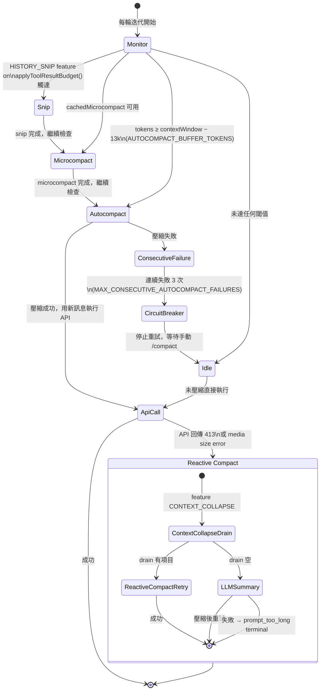

## 上下文窗口的挑戰

LLM 的上下文窗口是有限的資源。Claude 的上下文窗口有 200K tokens（1M 版本可達 1M tokens），聽起來很多，但在一個大型專案中：
- System prompt + tools 可能佔 50K+ tokens
- 對話歷史會持續累積
- 每次工具呼叫的結果都加入上下文

如果不主動管理上下文，它會很快耗盡。Claude Code 的 Context Management 就是為了解決這個問題。

## System Context vs User Context

Claude Code 組裝兩種上下文：

```typescript
// src/context.ts — 真實實現（lodash-es memoize）

// Git 狀態：session 級別快取，只取一次
export const getGitStatus = memoize(async (): Promise<string | null> => {
  // git status --short 輸出
})

// 系統上下文：包含 gitStatus + injected prompt
export const getSystemContext = memoize(async () => ({ /* ... */ }))

// 使用者上下文：包含 CLAUDE.md 內容 + 其他記憶
export const getUserContext = memoize(async () => ({ /* ... */ }))

// 快取失效：setSystemPromptInjection() 同時清除兩個快取
export function setSystemPromptInjection(value: string | null): void {
  injectedPrompt = value
  getUserContext.cache.clear?.()   // 強制下一輪重新載入 CLAUDE.md
  getSystemContext.cache.clear?.() // 強制下一輪重新取得 git status
}
```

:::tip[Tip]
兩個上下文都用 `lodash-es/memoize`，在同一個 session 中只組裝一次。唯一的快取失效點是 `setSystemPromptInjection()`，當 `/inject-prompt` 或 system prompt 動態注入時觸發——此時兩個快取**都**清除，確保新的注入內容在下一輪 API call 中生效。
:::

## CLAUDE.md 記憶系統

CLAUDE.md 是 Claude Code 的持久記憶機制。它是一個 markdown 檔案，在每次 session 啟動時載入進 system prompt：

```markdown
# CLAUDE.md

## 專案慣例
- 使用 snake_case 命名 Ruby 方法
- 測試檔案放在 spec/ 目錄
- 提交訊息使用 conventional commits

## 架構決策
- 認證使用 Devise gem
- 前端使用 Turbo + Stimulus
- 資料庫是 PostgreSQL
```

### 載入階層

CLAUDE.md 從多個位置載入，按優先順序合併：

```
~/.claude/CLAUDE.md          → 全域設定（使用者偏好）
<project>/.claude/CLAUDE.md  → 專案設定
<project>/CLAUDE.md          → 專案根目錄
<cwd>/CLAUDE.md              → 當前目錄
```

## Bootstrap State — 全域 Session 狀態

`src/bootstrap/state.ts` 管理了超過 200 個屬性的全域狀態：

```typescript
type State = {
  // Session 身份
  originalCwd: string;       // 永不改變（session 身份）
  cwd: string;              // 隨 EnterWorktreeTool 改變
  projectRoot: string;      // 穩定，用於歷史/技能

  // 成本追蹤
  modelUsage: Record<string, ModelUsage>;
  totalCostUSD: number;

  // Hook 註冊
  registeredHooks: RegisteredHookMatcher[];

  // MCP 狀態
  mcpClients: MCPServerConnection[];

  // 遙測
  otelMeter: Meter;
  otelLogger: Logger;
  otelTracer: Tracer;

  // ... 200+ 其他屬性
};
```

:::note[Note]
`originalCwd` 永遠不會改變，它代表這個 session 的身份。而 `cwd` 可能因為 `EnterWorktreeTool` 而改變（進入子代理的隔離工作區）。這個區分很重要 — 歷史記錄和設定檔查找都基於 `projectRoot`，而不是當前的 `cwd`。
:::

## 上下文壓縮策略與狀態機

Context 過長是 agentic session 的必然結果，不是邊界情況。Claude Code 設計了四種相互協作的壓縮機制，按代價從低到高排列：



### 為什麼需要四層機制？

每一層解決不同的問題：

| 機制 | 觸發時機 | 方法 | 代價 |
|---|---|---|---|
| **Snip** | tool result 超過 budget | 截斷最大的 tool result | 零 API 呼叫，但有資訊損失 |
| **Microcompact** | 快取式壓縮可用 | 複用舊摘要，剪接訊息 | 極低（cache hit） |
| **Autocompact** | tokens ≥ threshold | 呼叫 LLM 產生摘要（保留 20k output tokens） | 1 次 API 呼叫，~50k input tokens |
| **Reactive Compact** | API 413 error | 收到錯誤後才壓縮，保留最大上下文 | 同 autocompact，但時機不同 |

:::tip[Key Insight]
Proactive autocompact 和 reactive compact 是**互斥的**。`isAutoCompactEnabled()` 的邏輯確保：如果啟用了 contextCollapse 或 reactive compact，就不會在 API 呼叫前主動壓縮——因為主動壓縮會丟棄 collapse 正要保存的細粒度歷史。這是「悲觀壓縮」vs「樂觀壓縮」的策略選擇，兩者不能同時存在。
:::

### 壓縮 Hooks

壓縮前後都有 hook 觸發點（由 `postCompactCleanup.ts` 和 hook system 觸發）：

```json
{
  "pre_compact": [{
    "run": "echo 'About to compact context...'"
  }],
  "post_compact": [{
    "run": "node scripts/log-compaction.js"
  }]
}
```

壓縮完成後，`postCompactCleanup.ts` 還會嘗試恢復最多 5 個最近編輯的檔案（`POST_COMPACT_MAX_FILES_TO_RESTORE = 5`），避免壓縮後遺忘剛才修改過的內容。

## Memoization 策略

Claude Code 的 memoization 不是簡單的「快取結果」，而是有精心設計的失效機制：

| 資料 | 快取策略 | 失效觸發 |
|------|---------|---------|
| Git 狀態 | Session 級別 memoize | 無（每 session 只取一次） |
| CLAUDE.md | Session 級別 memoize | `setSystemPromptInjection()` |
| Hook 設定 | File watcher | `.claude/hooks.json` 修改 |
| 工具定義 | 永久快取 | 應用重啟 |
| MCP 連線 | 連線級別 | 伺服器斷線 |

## 實際影響

以一個典型的大型重構任務為例：

1. **初始上下文**：~60K tokens（system + tools + CLAUDE.md）
2. **10 輪對話後**：~150K tokens（加上工具呼叫結果）
3. **自動壓縮**：回到 ~80K tokens（摘要 + 最近 3 輪）
4. **繼續工作**：代理保留了關鍵上下文，丟棄了冗餘細節

## 關鍵要點

:::tip[Key Insight]
Context Management 是 Harness Engineering 中最容易被忽視但最關鍵的部分。**上下文窗口是 AI 代理的「工作記憶」，管理它的效率直接決定了代理能處理多大規模的任務。** Claude Code 通過分層的記憶系統（CLAUDE.md 持久 + 上下文臨時 + 壓縮摘要）解決了這個問題。
:::
