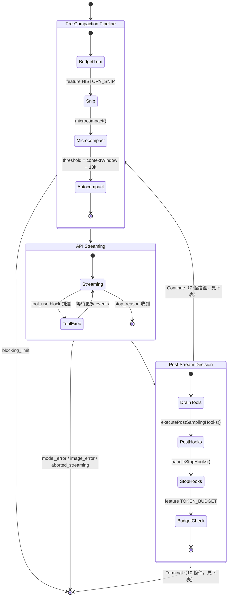
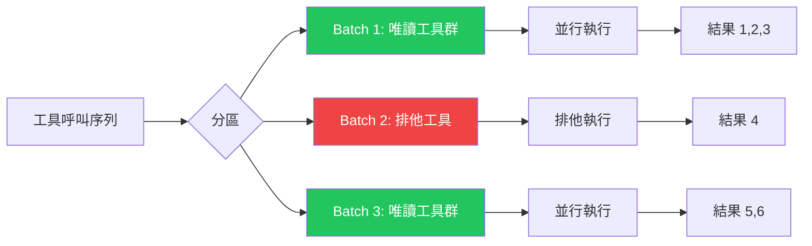

## Master Query 狀態機

在深入細節之前，先看整體：`queryLoop()` 本質上是一個帶有明確狀態轉移的有限狀態機（FSM）。每輪迭代從 Pre-Compaction 管線進入，通過 API Streaming，再到 Post-Stream Decision 點——在那裡決定是「繼續下一輪」還是「終止對話」。



:::tip[Key Insight]
注意 `Decision --> PreCompaction` 的回頭箭頭——這是整個 agentic loop 的核心。每次工具呼叫完成後，狀態機都回到 PreCompaction 的開頭，讓下一輪的 API call 有機會看到最新的工具結果。這個「工具呼叫 → 結果回饋 → 再次 LLM」的迴圈，就是 AI 代理能夠「思考-行動-觀察」的底層機制。
:::

## Query Loop — 系統的心臟

`src/query.ts` 是 Claude Code 的核心 — 一個 1,729 行的 async generator function，驅動整個代理的主迴圈：

```typescript
// src/query.ts — 簡化版
async function* query(
  params: QueryParams
): AsyncGenerator<Message | StreamEvent | Continue, Terminal> {
  // 1. Pre-call hooks
  await executeHook('pre_sampling');

  // 2. Build system prompt with context
  const systemPrompt = await assembleSystemPrompt(params);

  // 3. API request with streaming
  const stream = await anthropicAPI.messages.create({
    model: params.model,
    system: systemPrompt,
    messages: params.messages,
    tools: params.tools,
    stream: true,
  });

  // 4. Process streaming response
  for await (const event of stream) {
    if (event.type === 'tool_use') {
      // Execute tools as they stream in
      yield* runTools(event.toolUses, params);
    }
    yield event;
  }

  // 5. Post-call hooks
  await executeHook('post_sampling');

  // 6. Terminal decision
  if (shouldContinue(response)) {
    yield Continue;  // 繼續下一輪
  } else {
    return Terminal;  // 結束對話
  }
}
```

:::tip[Key Insight]
注意這是一個 **async generator** (`function*`)。它不是一次性返回所有結果，而是通過 `yield` 逐步產出訊息和事件。這讓 UI 可以即時顯示進度，而不需要等待整個回合完成。
:::

## 狀態機的記憶體 — State 型別

`queryLoop()` 是一個 `while (true)` 迴圈，但它不是用全域變數或閉包捕獲狀態——每次 `continue` 都寫一個全新的 `State` 物件：

```typescript
// src/query.ts — State 型別（真實定義，line ~201）
type State = {
  messages: Message[]                              // 當前完整對話歷史（含工具結果）
  toolUseContext: ToolUseContext                   // 工具上下文，含 abortController
  autoCompactTracking: AutoCompactTrackingState | undefined  // 壓縮輪次追蹤
  maxOutputTokensRecoveryCount: number            // max_output_tokens 恢復次數（上限 3）
  hasAttemptedReactiveCompact: boolean            // 防止 reactive compact 死循環
  maxOutputTokensOverride: number | undefined     // 首次 escalate 到 64k（ESCALATED_MAX_TOKENS）
  pendingToolUseSummary: Promise<...> | undefined // 背景產生的工具摘要（Haiku call）
  stopHookActive: boolean | undefined             // stop hook 是否已觸發過
  turnCount: number                               // 當前輪次計數（從 1 開始）
  transition: Continue | undefined               // 上一輪 continue 的原因（用於 debug）
}
```

**為什麼把狀態全放在一個物件？** 實際程式碼有 7 個 `continue` 站點，每個都需要更新多個欄位。如果用 `let x = ...` 散佈在迴圈裡，漏更新某個欄位就是 bug。`state = { ...newState }` 的模式讓每個 `continue` 形成一個完整的「狀態快照」，也讓測試能直接斷言 `state.transition` 而不需要解析訊息內容。

## 為什麼用 Generator 而不是 Callback？

傳統的串流處理通常使用 callback 或 event emitter。Claude Code 選擇 generator 有幾個關鍵原因：

1. **背壓控制** — 消費者可以控制消費速度，不會被生產者淹沒
2. **組合性** — Generator 可以用 `yield*` 委派，形成執行鏈
3. **取消性** — 通過 `return()` 方法可以從外部取消 generator
4. **型別安全** — TypeScript 可以精確表達 `yield` 和 `return` 的型別

## StreamingToolExecutor

在 LLM 回應串流時，工具呼叫可能在回應完成之前就開始出現。`StreamingToolExecutor` 負責即時執行這些工具：

```typescript
// src/services/tools/StreamingToolExecutor.ts — 真實實現
export class StreamingToolExecutor {
  private tools: TrackedTool[] = []
  private siblingAbortController: AbortController

  constructor(
    private readonly toolDefinitions: Tools,
    private readonly canUseTool: CanUseToolFn,
    toolUseContext: ToolUseContext,
  ) {
    // 建立子 AbortController，Bash 失敗時取消所有兄弟工具
    this.siblingAbortController = createChildAbortController(
      toolUseContext.abortController,
    )
  }

  // 加入工具到執行佇列（串流中即時呼叫）
  addTool(block: ToolUseBlock, assistantMessage: AssistantMessage): void {
    const toolDef = findToolByName(this.toolDefinitions, block.name)
    const isConcurrencySafe = toolDef?.isConcurrencySafe(parsedInput.data)

    this.tools.push({
      id: block.id, block,
      status: 'queued',
      isConcurrencySafe,
      pendingProgress: [],
    })
    void this.processQueue()
  }

  // 核心排程邏輯
  private canExecuteTool(isConcurrencySafe: boolean): boolean {
    const executing = this.tools.filter(t => t.status === 'executing')
    // 只有在「無工具執行中」或「全部都是 concurrency-safe」時才能並行
    return (
      executing.length === 0 ||
      (isConcurrencySafe && executing.every(t => t.isConcurrencySafe))
    )
  }

  // 等待結果的 async generator — 關鍵 Promise.race 模式
  async *getRemainingResults(): AsyncGenerator<MessageUpdate, void> {
    while (this.hasUnfinishedTools()) {
      await this.processQueue()
      for (const result of this.getCompletedResults()) {
        yield result
      }
      // Race: 工具完成 vs 進度更新到達
      if (this.hasExecutingTools() && !this.hasCompletedResults()) {
        const executingPromises = this.tools
          .filter(t => t.status === 'executing' && t.promise)
          .map(t => t.promise!)
        const progressPromise = new Promise<void>(resolve => {
          this.progressAvailableResolve = resolve
        })
        await Promise.race([...executingPromises, progressPromise])
      }
    }
  }
}
```

### runToolUse — 工具執行的 Generator 入口

每個工具呼叫都通過 `runToolUse` async generator，它可以在工具完成前就 yield 進度更新：

```typescript
// src/services/tools/toolExecution.ts
export async function* runToolUse(
  toolUse: ToolUseBlock,
  assistantMessage: AssistantMessage,
  canUseTool: CanUseToolFn,
  toolUseContext: ToolUseContext,
): AsyncGenerator<MessageUpdateLazy, void> {
  // 1. 查找工具（含舊名稱 alias 向後相容）
  let tool = findToolByName(toolUseContext.options.tools, toolUse.name)
  if (!tool) {
    const fallback = findToolByName(getAllBaseTools(), toolUse.name)
    if (fallback?.aliases?.includes(toolUse.name)) tool = fallback
  }

  // 2. 工具不存在 → 回傳錯誤結果
  if (!tool) {
    yield { message: createUserMessage({ /* error */ }) }
    return
  }

  // 3. 透過 Stream 物件交織進度事件和最終結果
  for await (const update of streamedCheckPermissionsAndCallTool(
    tool, toolUse.id, toolInput, toolUseContext,
    canUseTool, assistantMessage,
  )) {
    yield update
  }
}
```

## 並行控制：批次分區策略

`src/services/tools/toolOrchestration.ts` 將工具呼叫分成可並行和不可並行的批次：



分區規則：

```typescript
function partitionToolCalls(toolUses: ToolUseBlock[]): Batch[] {
  const batches: Batch[] = [];
  let currentBatch: ToolUseBlock[] = [];
  let currentIsReadOnly = true;

  for (const toolUse of toolUses) {
    const tool = lookupTool(toolUse.name);
    const isReadOnly = tool.isReadOnly();

    if (isReadOnly && currentIsReadOnly) {
      // 連續的唯讀工具 → 同一批次（並行）
      currentBatch.push(toolUse);
    } else {
      // 遇到非唯讀工具 → 結束當前批次，開始新批次
      if (currentBatch.length > 0) batches.push(currentBatch);
      currentBatch = [toolUse];
      currentIsReadOnly = isReadOnly;
    }
  }

  return batches;
}
```

## Context Modifier 模式

某些工具（如 `FileEditTool`）修改了檔案系統狀態。如果兩個編輯操作並行執行，可能會產生衝突。

Claude Code 的解決方案是 **Context Modifier**：

```typescript
// 工具可以返回一個 contextModifier callback
const result = await tool.call(input, context);

if (result.contextModifier) {
  // 在批次完成後，順序應用所有 modifier
  contextModifiers.push(result.contextModifier);
}

// 批次結束後
for (const modifier of contextModifiers) {
  await modifier(context);  // 順序應用，確保一致性
}
```

## Sibling Abort Controller

當一個批次中的 Bash 工具失敗時，同批次的其他工具也應該被取消：

```typescript
const siblingAbortController = new AbortController();

// 任何一個工具失敗
try {
  await tool.call(input, context, siblingAbortController.signal);
} catch (error) {
  siblingAbortController.abort();  // 取消所有兄弟工具
  throw error;
}
```

## Coordinator Mode — 多代理 Swarm

在 Coordinator Mode 中，一個 Leader 代理可以建立和管理多個 Worker 代理：

```typescript
// Leader 可用的內部工具
const COORDINATOR_TOOLS = [
  'TeamCreateTool',    // 建立 Worker
  'TeamDeleteTool',    // 刪除 Worker
  'SendMessageTool',   // 傳訊息給 Worker
  'SyntheticOutputTool', // 產生佔位結果
];

// Worker 可用的工具（受限子集）
const WORKER_ALLOWED_TOOLS = [
  'BashTool', 'FileReadTool', 'FileEditTool',
  'GlobTool', 'GrepTool', 'AgentTool',
  // ... ~30 個核心工具
];
```

:::note[Note]
Worker 的工具集是 Leader 的子集。Worker 不能安裝 plugin、修改設定或建立自己的 team。這是刻意的限制 — 防止 Worker 改變全域狀態。
:::

## Terminal Conditions

`queryLoop()` 通過 `return` 終止，每個終止點都帶有明確的 `reason` 字串（可用於 telemetry 與測試斷言）：

| `reason` | 觸發條件 | 程式碼位置 |
|---|---|---|
| `completed` | 無待執行工具，LLM 不再 tool_use | 正常 end_turn 路徑 |
| `max_turns` | `nextTurnCount > maxTurns` | 工具結果加入後檢查 |
| `blocking_limit` | Context 超硬性上限，且無自動壓縮或 reactive compact | Pre-Compaction 入口 |
| `prompt_too_long` | 收到 413，collapse 佇列空、reactive compact 也失敗 | Post-Stream，withheld 413 處理後 |
| `model_error` | API 或 runtime 拋出異常 | try/catch 包裹串流迴圈 |
| `image_error` | `ImageSizeError` 或 `ImageResizeError` | 同上 |
| `aborted_streaming` | `abortController.signal.aborted`（串流中） | 串流後、工具前 |
| `aborted_tools` | `abortController.signal.aborted`（工具執行中） | 工具執行後 |
| `stop_hook_prevented` | Stop hook 返回 `preventContinuation: true` | `handleStopHooks()` 返回後 |
| `hook_stopped` | 工具執行中 hook 發出 `hook_stopped_continuation` attachment | tool updates 迴圈中 |

## Continue 轉換路徑

每個 `continue` 都寫入 `state.transition.reason`，讓下一輪迭代（或測試）能知道「上輪為什麼繼續」：

| `transition.reason` | 觸發條件 | 對 State 的主要修改 |
|---|---|---|
| `next_turn` | 收到 tool_use blocks，工具執行完畢 | `messages` 加入工具結果，`turnCount++` |
| `collapse_drain_retry` | 收到 withheld 413，contextCollapse 佇列有待 drain 的項目 | `messages` 替換為 drained 版本 |
| `reactive_compact_retry` | 413 或 media error，reactive compact 成功壓縮 | `messages` 替換，`hasAttemptedReactiveCompact = true` |
| `max_output_tokens_escalate` | 觸達 token 上限，`maxOutputTokensOverride` 尚未設定 | `maxOutputTokensOverride = ESCALATED_MAX_TOKENS`（64k），僅首次 |
| `max_output_tokens_recovery` | Escalate 後仍觸達上限，`recoveryCount < 3` | 注入 recovery meta message，`recoveryCount++` |
| `stop_hook_blocking` | Stop hook 返回 blocking errors | 將 errors 加入 messages，`stopHookActive = true` |
| `token_budget_continuation` | `turnTokens < budget × 0.9` 且非 diminishing returns | 注入 nudge message，`continuationCount++` |

:::note[Note]
`max_output_tokens_recovery` 最多執行 3 次（`MAX_OUTPUT_TOKENS_RECOVERY_LIMIT = 3`）。第 3 次恢復失敗後，withheld error message 被 yield 出去，loop 以 `completed` 終止。`ESCALATED_MAX_TOKENS`（64k）在 `src/utils/context.ts` 定義，只在特定 feature gate 啟用時生效。
:::

## 關鍵要點

:::tip[Key Insight]
Claude Code 的並行控制展現了一個務實的策略：**不追求最大化並行，而是確保正確性**。唯讀工具可以自由並行，但任何有副作用的工具都會觸發排他執行。這種「保守但正確」的策略，配合 Sibling Abort 和 Context Modifier，讓系統在複雜場景下也能保持一致性。
:::
