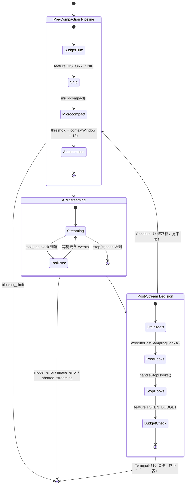
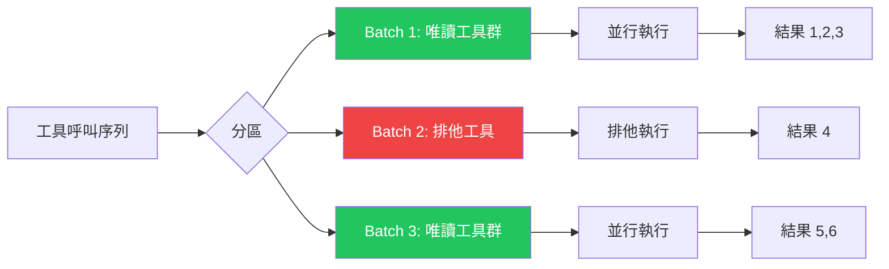

這是全書的核心章節。前六章的所有機制——工具系統（Ch.02）、代理編排（Ch.03）、權限（Ch.04）、Hook（Ch.05）、context 壓縮（Ch.06）——在這裡被一個 1729 行的 `query.ts` 協調運作。

## 為什麼需要這個 Loop?

一個常見的誤解是：Claude Code 的主迴圈只是一個普通的 `while (true)`，把「呼叫 LLM」和「執行工具」串在一起。事實上，這個迴圈是系統能夠正確運作的根本原因——不是實作細節，而是架構前提。

**問題所在：** LLM 本質上是一個無狀態的函數：接受輸入 tokens，輸出 tokens，然後結束。它無法「等待」非同步操作、無法在回應中途暫停、也無法自行觀察前幾輪的工具執行結果。工具執行是真正的非同步 I/O：一個 `BashTool("npm test")` 可能需要 30 秒；一個 `WebFetch` 可能觸發網路請求。這兩個現實——LLM 的無狀態性與工具執行的非同步性——需要一個協調層來橋接。

**解決方案：** `queryLoop()` 就是這個橋接層。每次迭代做三件事：（1）把前一輪的工具執行結果寫入對話歷史；（2）把完整的歷史送給 LLM，讓它「看到」工具的輸出；（3）等待 LLM 決定是繼續呼叫工具，還是結束對話。這個 loop 不是 trivial 的——它同時需要處理 context 壓縮（context 超出模型上限時）、使用者中斷（按 Esc 取消）、cost limits（token budget 超支）、以及工具並行（同一輪可以有多個工具同時執行）。

```typescript
// src/query.ts, line 307
// eslint-disable-next-line no-constant-condition
while (true) {
  // 每輪迭代開始：從 state 解構（不是從全域變數讀取）
  let { toolUseContext } = state
  const { messages, turnCount, ... } = state

  // 立即 yield 串流開始事件，讓 UI 知道新一輪開始
  yield { type: 'stream_request_start' }

  // Pre-compaction：壓縮、snip、collapse（Ch.06 的機制在此觸發）
  // API streaming：呼叫 LLM，逐 token yield 回應
  // Tool execution：await 工具完成，把結果加入 messages
  // Post-stream decision：決定 continue 還是 return Terminal

  // 每個 continue 站點寫一個全新的 state 物件（不是 mutation）
  state = { ...state, messages: updatedMessages, turnCount: turnCount + 1, ... }
}
```

**這個設計的代價是什麼？** 每一輪 LLM call 都必須重新發送完整的對話歷史（因為 LLM 是無狀態的）。隨著對話輪數增加，context 長度線性成長，API 成本也隨之上升。這正是 Ch.06 context 壓縮機制存在的理由：在不破壞語義的前提下，縮短歷史記錄。

:::note[學術映射]
電腦科學家 C.A.R. Hoare 在 1978 年提出 Communicating Sequential Processes（CSP）時寫道：

> "A process is … a finite set of communications. … A communication is an event which … simultaneously synchronizes two processes."
> — C.A.R. Hoare, *Communicating Sequential Processes*, CACM Vol. 21, No. 8 (1978)
> https://dl.acm.org/doi/10.1145/359576.359585

Claude Code 的 `queryLoop` 正是 Hoare 意義下的 sequential process：每次工具呼叫是兩個 process（LLM 生成 vs. 工具執行）之間的 communication event，必須「同步」——等待工具完成——才能繼續下一次 LLM turn。這不是巧合：任何需要跨越「計算邊界」的協調，最終都會收斂到某種 CSP 語義的實現。
:::

## Master Query 狀態機

在深入細節之前，先看整體：`queryLoop()` 本質上是一個帶有明確狀態轉移的有限狀態機（FSM）。每輪迭代從 Pre-Compaction 管線進入，通過 API Streaming，再到 Post-Stream Decision 點——在那裡決定是「繼續下一輪」還是「終止對話」。



:::tip[Key Insight]
注意 `Decision --> PreCompaction` 的回頭箭頭——這是整個 agentic loop 的核心。每次工具呼叫完成後，狀態機都回到 PreCompaction 的開頭，讓下一輪的 API call 有機會看到最新的工具結果。這個「工具呼叫 → 結果回饋 → 再次 LLM」的迴圈，就是 AI 代理能夠「思考-行動-觀察」的底層機制。
:::

## Query Loop — 系統的心臟

`src/query.ts` 是 Claude Code 的核心 — 一個 1,729 行的 async generator function，驅動整個代理的主迴圈：

```typescript
// src/query.ts — 簡化版
async function* query(
  params: QueryParams
): AsyncGenerator<Message | StreamEvent | Continue, Terminal> {
  // 1. Pre-call hooks
  await executeHook('pre_sampling');

  // 2. Build system prompt with context
  const systemPrompt = await assembleSystemPrompt(params);

  // 3. API request with streaming
  const stream = await anthropicAPI.messages.create({
    model: params.model,
    system: systemPrompt,
    messages: params.messages,
    tools: params.tools,
    stream: true,
  });

  // 4. Process streaming response
  for await (const event of stream) {
    if (event.type === 'tool_use') {
      // Execute tools as they stream in
      yield* runTools(event.toolUses, params);
    }
    yield event;
  }

  // 5. Post-call hooks
  await executeHook('post_sampling');

  // 6. Terminal decision
  if (shouldContinue(response)) {
    yield Continue;  // 繼續下一輪
  } else {
    return Terminal;  // 結束對話
  }
}
```

:::tip[Key Insight]
注意這是一個 **async generator** (`function*`)。它不是一次性返回所有結果，而是通過 `yield` 逐步產出訊息和事件。這讓 UI 可以即時顯示進度，而不需要等待整個回合完成。
:::

## 狀態機的記憶體 — State 型別

`queryLoop()` 是一個 `while (true)` 迴圈，但它不是用全域變數或閉包捕獲狀態——每次 `continue` 都寫一個全新的 `State` 物件：

```typescript
// src/query.ts — State 型別（真實定義，line ~201）
type State = {
  messages: Message[]                              // 當前完整對話歷史（含工具結果）
  toolUseContext: ToolUseContext                   // 工具上下文，含 abortController
  autoCompactTracking: AutoCompactTrackingState | undefined  // 壓縮輪次追蹤
  maxOutputTokensRecoveryCount: number            // max_output_tokens 恢復次數（上限 3）
  hasAttemptedReactiveCompact: boolean            // 防止 reactive compact 死循環
  maxOutputTokensOverride: number | undefined     // 首次 escalate 到 64k（ESCALATED_MAX_TOKENS）
  pendingToolUseSummary: Promise<...> | undefined // 背景產生的工具摘要（Haiku call）
  stopHookActive: boolean | undefined             // stop hook 是否已觸發過
  turnCount: number                               // 當前輪次計數（從 1 開始）
  transition: Continue | undefined               // 上一輪 continue 的原因（用於 debug）
}
```

**為什麼把狀態全放在一個物件？** 實際程式碼有 7 個 `continue` 站點，每個都需要更新多個欄位。如果用 `let x = ...` 散佈在迴圈裡，漏更新某個欄位就是 bug。`state = { ...newState }` 的模式讓每個 `continue` 形成一個完整的「狀態快照」，也讓測試能直接斷言 `state.transition` 而不需要解析訊息內容。

## 為什麼用 Generator 而不是 Callback？

傳統的串流處理通常使用 callback 或 event emitter。Claude Code 選擇 generator 有幾個關鍵原因：

1. **背壓控制** — 消費者可以控制消費速度，不會被生產者淹沒
2. **組合性** — Generator 可以用 `yield*` 委派，形成執行鏈
3. **取消性** — 通過 `return()` 方法可以從外部取消 generator
4. **型別安全** — TypeScript 可以精確表達 `yield` 和 `return` 的型別

## Generator vs Callback：非同步協調的語言選擇

在 Node.js 的早期，每一段需要「等待某件事完成後再做另一件事」的程式碼，都用 callback 表達。這個選擇在 LLM agent 的場景下會導致什麼問題？

**Callback 版本：金字塔的誕生**

想像用 callback 來協調「呼叫 LLM → 執行工具 → 再呼叫 LLM → 再執行工具」的多輪流程：

```typescript
// ❌ Callback 版本（pyramid of doom）
function runAgentWithCallbacks(params, onComplete) {
  callLLM(params, (response1) => {
    if (!response1.hasTool) {
      onComplete(response1)
      return
    }
    executeTool(response1.tool, (toolResult1) => {
      callLLM({
        ...params,
        messages: [...params.messages, toolResult1]
      }, (response2) => {
        if (!response2.hasTool) {
          onComplete(response2)
          return
        }
        executeTool(response2.tool, (toolResult2) => {
          callLLM({
            ...params,
            messages: [...params.messages, toolResult1, toolResult2]
          }, (response3) => {
            // 每多一輪，就多一層縮排
            // 錯誤處理在哪裡？壓縮邏輯在哪裡？中斷在哪裡？
            onComplete(response3)
          })
        })
      })
    })
  })
}
```

這個「金字塔」有三個根本缺陷：**無法在任意點插入邏輯**（比如在每輪開始前壓縮 context）；**錯誤處理必須在每個 callback 層重複**；**呼叫深度在編譯時就固定了**，無法處理「不知道要執行幾輪」的動態情況。

**Generator 版本：展開金字塔**

`async function*` 把同樣的邏輯線性化：

```typescript
// ✅ Generator 版本（Claude Code 的實際模式）
// src/query.ts, lines 241-1728
async function* queryLoop(params: QueryParams): AsyncGenerator<StreamEvent, Terminal> {
  while (true) {
    // 每輪開始前可以插入任意邏輯（壓縮、預算檢查…）
    yield { type: 'stream_request_start' }

    // yield* 把子 generator 的輸出「透傳」給消費者
    // 消費者拉取一個 token，就向 API 請求一個 token
    for await (const event of apiStream) {
      if (event.type === 'tool_use') {
        // yield* 委派給工具執行 generator
        yield* runTools(event.toolUses, toolUseContext)
      }
      yield event   // 向消費者（UI）透傳 streaming event
    }

    // 線性的 continue / return 決策，不需要再多一層 callback
    if (shouldTerminate(response)) {
      return { type: 'completed' }
    }
    // 更新 state，繼續下一輪迭代
    state = { ...state, messages: updatedMessages }
  }
}
```

**Backpressure：為什麼 pull 比 push 更適合 LLM streaming**

Anthropic API 以串流（SSE）方式回應，每隔幾毫秒就發出一個 token 事件。如果用 push-based 的設計（例如 EventEmitter），生產者（API 串流）會不斷 emit 事件，消費者（UI 渲染、token 計數、context 壓縮判斷）可能跟不上速度，導致事件在記憶體中無界累積。

Generator 的 pull 語義解決這個問題：消費者每次執行 `for await (const event of generator)` 才向生產者請求下一個值。如果消費者正在忙於渲染前一個 token，生產者就在 `yield` 點「掛起」，等消費者準備好了再繼續。這就是 backpressure——消費者隱式地「告訴」生產者自己的速率上限。

`StreamingToolExecutor.getRemainingResults()` 用 `Promise.race` 把這個概念延伸到並行工具的等待場景：

```typescript
// src/services/tools/StreamingToolExecutor.ts, line 453-485
async *getRemainingResults(): AsyncGenerator<MessageUpdate, void> {
  while (this.hasUnfinishedTools()) {
    await this.processQueue()
    for (const result of this.getCompletedResults()) {
      yield result  // 完成一個就交出一個，不等全部完成
    }
    // 如果有工具還在執行，但沒有新結果也沒有 progress 更新：
    // 等待「任何工具完成」或「progress 事件到達」，哪個先到算哪個
    if (this.hasExecutingTools() && !this.hasCompletedResults()) {
      const executingPromises = this.tools
        .filter(t => t.status === 'executing' && t.promise)
        .map(t => t.promise!)
      const progressPromise = new Promise<void>(resolve => {
        this.progressAvailableResolve = resolve
      })
      await Promise.race([...executingPromises, progressPromise])
    }
  }
}
```

這個 `Promise.race` 模式讓 UI 能在「工具還在執行」的同時顯示進度更新——不需要等整批工具全部完成才能更新畫面。

:::note[學術映射]
Rob Pike 在 "Concurrency is Not Parallelism"（Go Blog, 2013）中寫道：

> "Concurrency is about dealing with lots of things at once. Parallelism is about doing lots of things at once. … Concurrency is a way to structure a program, by breaking it into pieces that can be executed independently."
> — Rob Pike, *Concurrency is Not Parallelism*, Go Blog (2013)
> https://go.dev/blog/concurrency-is-not-parallelism

Claude Code 的 generator-based 設計體現的正是 Pike 的 concurrency 觀念：`queryLoop` 用單一 generator 處理「LLM streaming」和「tool execution」這兩件同時進行的事，不需要多執行緒。真正的並行（`runToolsConcurrently` 用 `Promise.all` 語義執行多個工具）只在批次內的安全工具之間出現——concurrency 是結構，parallelism 是執行，兩者分開處理。
:::

## StreamingToolExecutor

在 LLM 回應串流時，工具呼叫可能在回應完成之前就開始出現。`StreamingToolExecutor` 負責即時執行這些工具：

```typescript
// src/services/tools/StreamingToolExecutor.ts — 真實實現
export class StreamingToolExecutor {
  private tools: TrackedTool[] = []
  private siblingAbortController: AbortController

  constructor(
    private readonly toolDefinitions: Tools,
    private readonly canUseTool: CanUseToolFn,
    toolUseContext: ToolUseContext,
  ) {
    // 建立子 AbortController，Bash 失敗時取消所有兄弟工具
    this.siblingAbortController = createChildAbortController(
      toolUseContext.abortController,
    )
  }

  // 加入工具到執行佇列（串流中即時呼叫）
  addTool(block: ToolUseBlock, assistantMessage: AssistantMessage): void {
    const toolDef = findToolByName(this.toolDefinitions, block.name)
    const isConcurrencySafe = toolDef?.isConcurrencySafe(parsedInput.data)

    this.tools.push({
      id: block.id, block,
      status: 'queued',
      isConcurrencySafe,
      pendingProgress: [],
    })
    void this.processQueue()
  }

  // 核心排程邏輯
  private canExecuteTool(isConcurrencySafe: boolean): boolean {
    const executing = this.tools.filter(t => t.status === 'executing')
    // 只有在「無工具執行中」或「全部都是 concurrency-safe」時才能並行
    return (
      executing.length === 0 ||
      (isConcurrencySafe && executing.every(t => t.isConcurrencySafe))
    )
  }

  // 等待結果的 async generator — 關鍵 Promise.race 模式
  async *getRemainingResults(): AsyncGenerator<MessageUpdate, void> {
    while (this.hasUnfinishedTools()) {
      await this.processQueue()
      for (const result of this.getCompletedResults()) {
        yield result
      }
      // Race: 工具完成 vs 進度更新到達
      if (this.hasExecutingTools() && !this.hasCompletedResults()) {
        const executingPromises = this.tools
          .filter(t => t.status === 'executing' && t.promise)
          .map(t => t.promise!)
        const progressPromise = new Promise<void>(resolve => {
          this.progressAvailableResolve = resolve
        })
        await Promise.race([...executingPromises, progressPromise])
      }
    }
  }
}
```

### runToolUse — 工具執行的 Generator 入口

每個工具呼叫都通過 `runToolUse` async generator，它可以在工具完成前就 yield 進度更新：

```typescript
// src/services/tools/toolExecution.ts
export async function* runToolUse(
  toolUse: ToolUseBlock,
  assistantMessage: AssistantMessage,
  canUseTool: CanUseToolFn,
  toolUseContext: ToolUseContext,
): AsyncGenerator<MessageUpdateLazy, void> {
  // 1. 查找工具（含舊名稱 alias 向後相容）
  let tool = findToolByName(toolUseContext.options.tools, toolUse.name)
  if (!tool) {
    const fallback = findToolByName(getAllBaseTools(), toolUse.name)
    if (fallback?.aliases?.includes(toolUse.name)) tool = fallback
  }

  // 2. 工具不存在 → 回傳錯誤結果
  if (!tool) {
    yield { message: createUserMessage({ /* error */ }) }
    return
  }

  // 3. 透過 Stream 物件交織進度事件和最終結果
  for await (const update of streamedCheckPermissionsAndCallTool(
    tool, toolUse.id, toolInput, toolUseContext,
    canUseTool, assistantMessage,
  )) {
    yield update
  }
}
```

## 並行控制：批次分區策略

`src/services/tools/toolOrchestration.ts` 將工具呼叫分成可並行和不可並行的批次：



分區規則：

```typescript
function partitionToolCalls(toolUses: ToolUseBlock[]): Batch[] {
  const batches: Batch[] = [];
  let currentBatch: ToolUseBlock[] = [];
  let currentIsReadOnly = true;

  for (const toolUse of toolUses) {
    const tool = lookupTool(toolUse.name);
    const isReadOnly = tool.isReadOnly();

    if (isReadOnly && currentIsReadOnly) {
      // 連續的唯讀工具 → 同一批次（並行）
      currentBatch.push(toolUse);
    } else {
      // 遇到非唯讀工具 → 結束當前批次，開始新批次
      if (currentBatch.length > 0) batches.push(currentBatch);
      currentBatch = [toolUse];
      currentIsReadOnly = isReadOnly;
    }
  }

  return batches;
}
```

## Batch Partitioning：安全並行的資料驅動排程

直覺上很吸引人的策略是：讓所有工具同時並行執行，最快完成。這個策略在第一次遇到兩個工具同時寫入同一個檔案時就會崩潰。但反過來，完全串行執行又浪費了大量 I/O 等待時間——當兩個 `FileRead` 在等待磁碟時，它們彼此毫無干擾。

**分類機制：`isConcurrencySafe`**

Claude Code 用一個 boolean 方法 `isConcurrencySafe(input)` 標記每個工具是否可以安全地與其他工具並行執行。這個方法是 `Tool` 介面的必要成員，預設值是 fail-closed（`false`，保守假設）：

```typescript
// src/Tool.ts, line 402, 750, 759
// 介面定義（每個工具必須實作）
isConcurrencySafe(input: z.infer<Input>): boolean

// buildTool() 提供的預設值 — fail-closed
isConcurrencySafe: (_input?: unknown) => false,
```

各工具的具體實現：

| 工具 | `isConcurrencySafe` 結果 | 原因 |
|------|--------------------------|------|
| `FileReadTool` | `true`（靜態） | 唯讀，無副作用 |
| `GlobTool` | `true`（靜態） | 唯讀，無副作用 |
| `GrepTool` | `true`（靜態） | 唯讀，無副作用 |
| `BashTool` | 動態（依命令內容） | `isReadOnly(input)` 分析命令字串 |
| `FileEditTool` | `false`（預設） | 修改檔案系統 |
| `WriteFileTool` | `false`（預設） | 修改檔案系統 |
| MCP 第三方工具 | `false`（預設） | 副作用未知 |

`BashTool` 的動態判斷特別值得注意：`isConcurrencySafe(input)` 呼叫 `isReadOnly?.(input) ?? false`，後者透過 `checkReadOnlyConstraints` 分析命令字串中是否含有寫入操作（`>`, `>>`, `rm`, `mkdir` 等）。因此 `BashTool("cat README.md")` 是 safe，而 `BashTool("echo hello > file.txt")` 是 exclusive。

**真實的 `partitionToolCalls` 實現**

```typescript
// src/services/tools/toolOrchestration.ts, line 84-116
type Batch = { isConcurrencySafe: boolean; blocks: ToolUseBlock[] }

function partitionToolCalls(
  toolUseMessages: ToolUseBlock[],
  toolUseContext: ToolUseContext,
): Batch[] {
  return toolUseMessages.reduce((acc: Batch[], toolUse) => {
    const tool = findToolByName(toolUseContext.options.tools, toolUse.name)
    const parsedInput = tool?.inputSchema.safeParse(toolUse.input)
    const isConcurrencySafe = parsedInput?.success
      ? (() => {
          try {
            return Boolean(tool?.isConcurrencySafe(parsedInput.data))
          } catch {
            // isConcurrencySafe 拋出異常時（例如 shell-quote 解析失敗）
            // 保守處理：視為不安全
            return false
          }
        })()
      : false
    // 若當前工具和最後一個 batch 都是 safe → 合併
    if (isConcurrencySafe && acc[acc.length - 1]?.isConcurrencySafe) {
      acc[acc.length - 1]!.blocks.push(toolUse)
    } else {
      // 否則開一個新 batch
      acc.push({ isConcurrencySafe, blocks: [toolUse] })
    }
    return acc
  }, [])
}
```

分批完成後，`runTools()` 根據 `isConcurrencySafe` 決定執行策略：

```typescript
// src/services/tools/toolOrchestration.ts, line 26-81
for (const { isConcurrencySafe, blocks } of partitionToolCalls(...)) {
  if (isConcurrencySafe) {
    // 並行執行：所有 safe 工具同時啟動，用 all() 合併結果
    yield* runToolsConcurrently(blocks, ...)
  } else {
    // 串行執行：一個個按順序等待
    yield* runToolsSerially(blocks, ...)
  }
}
```

**具體範例：[ReadFile, ReadFile, WriteFile, BashTool]**

假設 LLM 在一輪回應中請求執行四個工具：

```
輸入序列: [ReadFile("a.ts"), ReadFile("b.ts"), WriteFile("c.ts"), BashTool("git status")]
```

`partitionToolCalls` 的逐步處理：

```
step 1: ReadFile("a.ts")  → isConcurrencySafe=true
        acc 為空 → 建立新 batch
        acc = [{ safe=true, blocks=[ReadFile(a)] }]

step 2: ReadFile("b.ts")  → isConcurrencySafe=true
        最後一個 batch 也是 safe → 合併
        acc = [{ safe=true, blocks=[ReadFile(a), ReadFile(b)] }]

step 3: WriteFile("c.ts") → isConcurrencySafe=false（預設 fail-closed）
        最後一個 batch 是 safe，但當前工具不是 → 開新 batch
        acc = [
          { safe=true,  blocks=[ReadFile(a), ReadFile(b)] },
          { safe=false, blocks=[WriteFile(c)] }
        ]

step 4: BashTool("git status") → checkReadOnlyConstraints → isConcurrencySafe=true
        最後一個 batch 是 safe=false（WriteFile），無法合併 → 開新 batch
        acc = [
          { safe=true,  blocks=[ReadFile(a), ReadFile(b)] },
          { safe=false, blocks=[WriteFile(c)] },
          { safe=true,  blocks=[BashTool("git status")] }
        ]
```

最終執行順序：

```
Batch 1: ReadFile("a.ts") ‖ ReadFile("b.ts")   ← 並行（runToolsConcurrently）
         ↓ 兩個都完成後繼續
Batch 2: WriteFile("c.ts")                      ← 串行（runToolsSerially），獨佔執行
         ↓ 完成後繼續
Batch 3: BashTool("git status")                 ← 串行（runToolsSerially）
         注意：即使 git status 是唯讀，WriteFile 之後的 batch 邊界不可跨越
```

**這個設計的代價是什麼？** 分批是「連續相同類型才合併」的貪婪策略，不是最優化的全局排程。如果工具序列是 `[ReadFile, WriteFile, ReadFile]`，三個工具會被分成三個批次串行執行，即使兩個 ReadFile 彼此毫無干擾。這是正確性優先於最大化效能的刻意選擇：系統不試圖「重新排序」工具來最大化並行度，因為工具的語義依賴關係只有 LLM 才知道，代碼無法安全地重排。

## Context Modifier 模式

某些工具（如 `FileEditTool`）修改了檔案系統狀態。如果兩個編輯操作並行執行，可能會產生衝突。

Claude Code 的解決方案是 **Context Modifier**：

```typescript
// 工具可以返回一個 contextModifier callback
const result = await tool.call(input, context);

if (result.contextModifier) {
  // 在批次完成後，順序應用所有 modifier
  contextModifiers.push(result.contextModifier);
}

// 批次結束後
for (const modifier of contextModifiers) {
  await modifier(context);  // 順序應用，確保一致性
}
```

## Sibling Abort Controller

當一個批次中的 Bash 工具失敗時，同批次的其他工具也應該被取消：

```typescript
const siblingAbortController = new AbortController();

// 任何一個工具失敗
try {
  await tool.call(input, context, siblingAbortController.signal);
} catch (error) {
  siblingAbortController.abort();  // 取消所有兄弟工具
  throw error;
}
```

## Coordinator Mode — 多代理 Swarm

在 Coordinator Mode 中，一個 Leader 代理可以建立和管理多個 Worker 代理：

```typescript
// Leader 可用的內部工具
const COORDINATOR_TOOLS = [
  'TeamCreateTool',    // 建立 Worker
  'TeamDeleteTool',    // 刪除 Worker
  'SendMessageTool',   // 傳訊息給 Worker
  'SyntheticOutputTool', // 產生佔位結果
];

// Worker 可用的工具（受限子集）
const WORKER_ALLOWED_TOOLS = [
  'BashTool', 'FileReadTool', 'FileEditTool',
  'GlobTool', 'GrepTool', 'AgentTool',
  // ... ~30 個核心工具
];
```

:::note[Note]
Worker 的工具集是 Leader 的子集。Worker 不能安裝 plugin、修改設定或建立自己的 team。這是刻意的限制 — 防止 Worker 改變全域狀態。
:::

## Terminal Conditions

`queryLoop()` 通過 `return` 終止，每個終止點都帶有明確的 `reason` 字串（可用於 telemetry 與測試斷言）：

| `reason` | 觸發條件 | 程式碼位置 |
|---|---|---|
| `completed` | 無待執行工具，LLM 不再 tool_use | 正常 end_turn 路徑 |
| `max_turns` | `nextTurnCount > maxTurns` | 工具結果加入後檢查 |
| `blocking_limit` | Context 超硬性上限，且無自動壓縮或 reactive compact | Pre-Compaction 入口 |
| `prompt_too_long` | 收到 413，collapse 佇列空、reactive compact 也失敗 | Post-Stream，withheld 413 處理後 |
| `model_error` | API 或 runtime 拋出異常 | try/catch 包裹串流迴圈 |
| `image_error` | `ImageSizeError` 或 `ImageResizeError` | 同上 |
| `aborted_streaming` | `abortController.signal.aborted`（串流中） | 串流後、工具前 |
| `aborted_tools` | `abortController.signal.aborted`（工具執行中） | 工具執行後 |
| `stop_hook_prevented` | Stop hook 返回 `preventContinuation: true` | `handleStopHooks()` 返回後 |
| `hook_stopped` | 工具執行中 hook 發出 `hook_stopped_continuation` attachment | tool updates 迴圈中 |

## Continue 轉換路徑

每個 `continue` 都寫入 `state.transition.reason`，讓下一輪迭代（或測試）能知道「上輪為什麼繼續」：

| `transition.reason` | 觸發條件 | 對 State 的主要修改 |
|---|---|---|
| `next_turn` | 收到 tool_use blocks，工具執行完畢 | `messages` 加入工具結果，`turnCount++` |
| `collapse_drain_retry` | 收到 withheld 413，contextCollapse 佇列有待 drain 的項目 | `messages` 替換為 drained 版本 |
| `reactive_compact_retry` | 413 或 media error，reactive compact 成功壓縮 | `messages` 替換，`hasAttemptedReactiveCompact = true` |
| `max_output_tokens_escalate` | 觸達 token 上限，`maxOutputTokensOverride` 尚未設定 | `maxOutputTokensOverride = ESCALATED_MAX_TOKENS`（64k），僅首次 |
| `max_output_tokens_recovery` | Escalate 後仍觸達上限，`recoveryCount < 3` | 注入 recovery meta message，`recoveryCount++` |
| `stop_hook_blocking` | Stop hook 返回 blocking errors | 將 errors 加入 messages，`stopHookActive = true` |
| `token_budget_continuation` | `turnTokens < budget × 0.9` 且非 diminishing returns | 注入 nudge message，`continuationCount++` |

:::note[Note]
`max_output_tokens_recovery` 最多執行 3 次（`MAX_OUTPUT_TOKENS_RECOVERY_LIMIT = 3`）。第 3 次恢復失敗後，withheld error message 被 yield 出去，loop 以 `completed` 終止。`ESCALATED_MAX_TOKENS`（64k）在 `src/utils/context.ts` 定義，只在特定 feature gate 啟用時生效。
:::

## 關鍵要點

:::tip[Key Insight]
Claude Code 的並行控制展現了一個務實的策略：**不追求最大化並行，而是確保正確性**。唯讀工具可以自由並行，但任何有副作用的工具都會觸發排他執行。這種「保守但正確」的策略，配合 Sibling Abort 和 Context Modifier，讓系統在複雜場景下也能保持一致性。
:::

---

query loop 決定了 Claude Code 的執行節奏。但 Claude Code 的能力不是固化的——Skills 和 Plugins（Ch.08）讓使用者和第三方擴展它的工具集和行為，而 query loop 的 hook 機制（`pre_sampling`、`post_sampling`）正是這個擴展點的入口。
