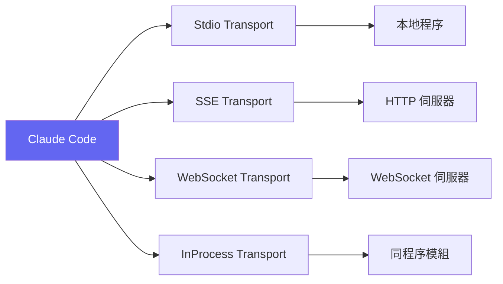

:::note[前置知識橋]
Ch.07 的 query loop 是整個系統的心跳。Skill 的執行方式就是：在同一個 query loop 內，遞迴地呼叫自身。本章解釋這個遞迴呼叫繼承了什麼、不繼承什麼——以及 MCP 如何讓外部伺服器加入這個生態系統。
:::

## 為什麼需要技能與插件？

Claude Code 的核心提供了「通用」的工程代理能力。但真實世界的開發者有高度特化的需求：
- 前端團隊需要元件生成技能
- DevOps 團隊需要 Terraform 部署技能
- 資料團隊需要 SQL 查詢技能

**Skills** 讓使用者定義可重複使用的「專家提示」。**Plugins** 和 **MCP** 則讓外部工具和服務無縫接入 Claude Code 的生態系統。

## Skills System

### Skill 定義格式

Skill 是一個 Markdown 檔案，用 frontmatter 定義元資料：

```markdown
---
name: review-pr
description: Pre-landing PR review with security focus
model: opus
shell: bash
env:
  REVIEW_MODE: strict
---

# PR Review Skill

You are a senior code reviewer. Analyze the current PR for:

1. **Security vulnerabilities** — OWASP top 10
2. **Performance issues** — N+1 queries, memory leaks
3. **Code style** — Project conventions from CLAUDE.md

Use `gh pr diff` to get the diff, then review file by file.
```

### Skill 發現機制

Skills 從多個來源載入，按優先順序：

```typescript
// src/skills/loadSkillsDir.ts
const SKILL_SOURCES = [
  '.claude/skills/',          // 專案級
  '~/.claude/skills/',        // 使用者級
  'managed/.claude/skills/',  // 企業管理
  'bundled/skills/',          // 內建
  'mcp://prompts',            // MCP 伺服器提供
];
```

### SkillTool 執行

當使用者輸入 `/review-pr` 時：

1. `SkillTool` 解析技能名稱
2. 讀取 markdown 檔案，解析 frontmatter
3. 將技能內容注入為新的對話訊息
4. 遞迴呼叫 `query()`（代理主迴圈）執行技能

```typescript
// src/tools/SkillTool/SkillTool.ts — 簡化版
async function executeSkill(skillName: string, args: string) {
  const skill = resolveSkill(skillName);
  const prompt = skill.content.replace('${ARGS}', args);

  // 作為新的 query 執行
  yield* query({
    model: skill.model || defaultModel,
    messages: [{ role: 'user', content: prompt }],
    // ... 繼承父代理的 tools 和 permissions
  });
}
```

## MCP（Model Context Protocol）

MCP 是一個開放協議，讓外部服務向 AI 代理提供工具、資源和提示。Claude Code 是 MCP 的一等公民客戶端。

### MCP Transport 類型



| Transport | 適用場景 | 特點 |
|-----------|---------|------|
| Stdio | 本地 CLI 工具 | 透過 stdin/stdout 通訊 |
| SSE | 遠端 HTTP 服務 | Server-Sent Events 串流 |
| WebSocket | 即時雙向通訊 | 支援 mTLS |
| InProcess | 內建 MCP 伺服器 | 零延遲，同程序 |

### MCP 連線生命週期

```typescript
// src/services/mcp/client.ts — 真實實現（含 memoization）
export const connectToServer = memoize(
  async (
    name: string,
    serverRef: ScopedMcpServerConfig,
    serverStats?: {
      totalServers: number
      stdioCount: number
      sseCount: number
      httpCount: number
    },
  ): Promise<MCPServerConnection> => {
    let transport

    // 根據伺服器類型選擇 transport
    if (serverRef.type === 'sse') {
      const authProvider = new ClaudeAuthProvider(name, serverRef)
      const combinedHeaders = await getMcpServerHeaders(name, serverRef)
      transport = new SSEClientTransport({
        authProvider,
        // SSE 長連線使用獨立的無超時 fetch
        fetch: wrapFetchWithTimeout(
          wrapFetchWithStepUpDetection(createFetchWithInit(), authProvider),
        ),
        requestInit: {
          headers: {
            'User-Agent': getMCPUserAgent(),
            ...combinedHeaders,
          },
        },
      })
    } else if (serverRef.type === 'stdio') {
      // stdio: 透過 stdin/stdout 與本地程序通訊
      transport = new StdioClientTransport(/* ... */)
    } else if (serverRef.type === 'http') {
      // HTTP Streamable: 新的 MCP transport 標準
      transport = new StreamableHTTPClientTransport(/* ... */)
    }

    const client = new Client({ name, version: '1.0.0' })
    await client.connect(transport)
    return { type: 'connected', name, client, config: serverRef, transport }
  },
)
```

:::tip[Tip]
`connectToServer` 使用了 memoization — 同一個 `(name, config)` 的連線只會建立一次。這避免了每次工具呼叫都重新連線的開銷。SSE transport 的 EventSource（長連線）使用獨立的無超時 fetch，確保長時間運行的串流不會被意外中斷。
:::

### MCP 工具呼叫的 URL Elicitation 重試

MCP 規範定義了 `-32042` 錯誤碼（`UrlElicitationRequired`），當伺服器需要使用者授權 URL 時觸發：

```typescript
// src/services/mcp/client.ts — callMCPToolWithUrlElicitationRetry
export async function callMCPToolWithUrlElicitationRetry({
  client, tool, args, signal, handleElicitation,
}): Promise<MCPToolCallResult> {
  const MAX_URL_ELICITATION_RETRIES = 3
  for (let attempt = 0; ; attempt++) {
    try {
      return await callToolFn({ client, tool, args, signal })
    } catch (error) {
      if (!(error instanceof McpError) ||
          error.code !== ErrorCode.UrlElicitationRequired) {
        throw error
      }
      if (attempt >= MAX_URL_ELICITATION_RETRIES) {
        throw new McpToolCallError(/* 超過最大重試次數 */)
      }
      // 提取 URL 並要求使用者授權，然後重試
      await handleElicitation(/* ... */)
    }
  }
}
```

### MCPTool — MCP 工具包裝

MCP 伺服器提供的工具會被自動包裝為 Claude Code 原生工具：

```typescript
// src/tools/MCPTool/MCPTool.ts
class MCPTool implements Tool {
  constructor(
    private mcpTool: MCPToolDefinition,
    private client: MCPClient
  ) {}

  get inputSchema() {
    // MCP JSON Schema → Zod Schema 自動轉換
    return jsonSchemaToZod(this.mcpTool.inputSchema);
  }

  async call(input, context) {
    const result = await this.client.callTool(
      this.mcpTool.name,
      input
    );

    // 處理大型結果（寫入磁碟避免上下文溢出）
    if (result.length > MAX_RESULT_SIZE) {
      return truncateAndSaveToDisk(result);
    }

    return result;
  }
}
```

## Plugin System

### Plugin 來源

```typescript
// src/plugins/builtinPlugins.ts
type PluginSource =
  | 'bundled'      // 預裝在 binary 中
  | 'marketplace'  // 透過 npm 包名解析
  | 'local';       // 使用者的 .claude/plugins/ 目錄
```

### Plugin 生命週期

```
Discovery → Loading → Validation → Hook Registration → Active
    ↓          ↓          ↓              ↓              ↓
  搜尋       讀取       驗證          註冊 hooks      可用
  套件       設定       相容性        和工具          運行
```

### 錯誤隔離

Plugin 的一個關鍵設計是**錯誤隔離**：

```typescript
// src/utils/plugins/pluginLoader.ts
async function loadAllPlugins(options) {
  const results = await Promise.allSettled(
    pluginConfigs.map(config => loadPlugin(config))
  );

  // 單一 plugin 失敗不會影響其他 plugin 或核心系統
  const loaded = results.filter(r => r.status === 'fulfilled');
  const errors = results.filter(r => r.status === 'rejected');

  if (errors.length > 0) {
    logPluginErrors(errors);  // 記錄但不崩潰
  }

  return { plugins: loaded, errors };
}
```

:::tip[Tip]
使用 `Promise.allSettled` 而非 `Promise.all` 是錯誤隔離的關鍵。如果用 `Promise.all`，任何一個 plugin 載入失敗都會導致所有 plugin 都無法載入。`allSettled` 確保每個 plugin 獨立成敗。
:::

## 建立自訂 Skill 範例

以下是一個完整的自訂 Skill 範例：

```markdown
---
name: db-migrate
description: Generate and run database migrations
model: sonnet
---

# Database Migration Skill

You are a database migration expert. Help the user create
and execute database migrations.

## Steps

1. Ask what schema changes are needed
2. Generate migration file using the project's ORM
3. Review the generated SQL
4. Run the migration in development
5. Verify the schema change

## Rules

- Always create a reversible migration
- Test rollback before committing
- Follow naming convention: YYYYMMDD_description
```

將此檔案存為 `.claude/skills/db-migrate.md`，然後在 Claude Code 中輸入 `/db-migrate` 即可使用。

## Skill 如何繼承父代理上下文

一個 skill 若必須從零開始建立自己的工具清單和權限，它就什麼事也做不了。你會以為 skill 是隔離的沙箱——事實正好相反。

**背景**：Claude Code 的 `SkillTool` 有兩條執行路徑：inline 執行（直接展開 skill 提示注入父對話）和 fork 執行（透過 `runAgent` 啟動獨立的子代理）。兩條路徑都需要從父代理繼承關鍵上下文。

**繼承機制**：在 inline 路徑，`SkillTool.call()` 回傳的 `contextModifier` 函式會修改 `ToolUseContext`，讓後續的 query loop iteration 能夠取得 skill 指定的 `allowedTools` 和 `model`。在 fork 路徑，`executeForkedSkill()` 直接將父代理的 `context`（包含 `getAppState`、`toolPermissionContext`）傳遞給 `runAgent`，子代理看到的 permission context 與父代理完全相同。

**什麼被繼承：**
- `toolPermissionContext`（權限規則完整傳遞——skill 看不到比父代理更多的權限）
- 父代理的 tool 清單（`context.options.tools`，可用 `allowedTools` frontmatter 再縮減）
- `getAppState` 回呼（`modifiedGetAppState` 透過 closure 鏈結到父代理）

**什麼不被繼承（可被覆寫）：**
- 模型選擇（skill frontmatter 的 `model: opus` 透過 `resolveSkillModelOverride` 函式計算新模型；1m context window 標記也會保留，防止上下文視窗意外縮減）

```typescript
// src/tools/SkillTool/SkillTool.ts — contextModifier（inline 路徑）
contextModifier(ctx) {
  let modifiedContext = ctx
  // 將 skill 的 allowedTools 合併到 permission context
  if (allowedTools.length > 0) {
    const previousGetAppState = modifiedContext.getAppState
    modifiedContext = {
      ...modifiedContext,
      getAppState() {
        const appState = previousGetAppState()
        return {
          ...appState,
          toolPermissionContext: {
            ...appState.toolPermissionContext,
            alwaysAllowRules: {
              ...appState.toolPermissionContext.alwaysAllowRules,
              command: [
                ...new Set([
                  ...(appState.toolPermissionContext.alwaysAllowRules.command || []),
                  ...allowedTools,
                ]),
              ],
            },
          },
        }
      },
    }
  }
  // 模型覆寫：preserves [1m] suffix to prevent context window regression
  if (model) {
    modifiedContext = {
      ...modifiedContext,
      options: {
        ...modifiedContext.options,
        mainLoopModel: resolveSkillModelOverride(model, ctx.options.mainLoopModel),
      },
    }
  }
  return modifiedContext
},
```

**代價**：skill 無法取得它不應有的權限——這是安全設計。但這也意味著，一個需要特殊工具或更高權限的 skill，必須要求使用者以正確的父代理配置來執行，而不能自行提升。

---

## MCP 工具發現：JSON Schema 直送 API

你可能以為 MCP 工具的 schema 需要轉換成 Zod 才能工作——這個假設是錯的。

**問題**：MCP 伺服器用 JSON Schema 描述工具輸入，但 Claude Code 內建工具使用 Zod 做型別定義與 runtime 驗證。如果強行轉換，任何不支援的 JSON Schema 關鍵字都會導致工具無法使用。

**實際設計**：`MCPTool.ts` 的 `inputSchema` 使用 `lazySchema(() => z.object({}).passthrough())` ——這是一個直接通過的 Zod schema，不做任何型別限制。與此同時，MCP 工具的真實 JSON Schema 被儲存在 `inputJSONSchema` 欄位（型別 `ToolInputJSONSchema`），並直接傳送給 Anthropic API 作為工具描述。

```typescript
// src/Tool.ts — 雙軌 schema 設計
export type ToolInputJSONSchema = {
  [x: string]: unknown
  type: 'object'
  properties?: { [x: string]: unknown }
}

interface Tool {
  readonly inputSchema: Input         // Zod schema（MCP 工具用 passthrough）
  readonly inputJSONSchema?: ToolInputJSONSchema  // 原始 JSON Schema（MCP 工具專用）
}

// src/services/mcp/client.ts — MCP 工具包裝
return {
  ...MCPTool,
  inputJSONSchema: tool.inputSchema as Tool['inputJSONSchema'],
  // inputSchema 繼承自 MCPTool：z.object({}).passthrough()
  // API 呼叫使用 inputJSONSchema，runtime 驗證使用 passthrough Zod
}
```

**這個設計解決了什麼邊界問題：**
- JSON Schema 的任意複雜度（`anyOf`、`$ref`、巢狀物件）不需要任何轉換，直接送給 API
- MCP 伺服器更新 schema 時，不需要重新啟動 Claude Code（schema 在工具連線時讀取，儲存於記憶體）
- Runtime 驗證使用 passthrough——如果模型生成了不符合 schema 的輸入，MCP 伺服器本身負責回傳錯誤

**代價**：這個設計讓 Claude Code 無法在客戶端預先驗證 MCP 工具輸入的型別正確性。不合規的輸入只有在 MCP 伺服器端才會被發現，錯誤訊息的品質完全取決於 MCP 伺服器的實作。

---

## MCP Sampling Protocol：伺服器反向呼叫 LLM

你以為 MCP 伺服器只是被動接受呼叫的工具——實際上 MCP 規範允許伺服器主動要求 Claude 生成文字。

**問題**：一個 MCP 伺服器（例如程式碼審查工具）可能需要 Claude 先總結一段差異，才能套用自己的規則。但 MCP 伺服器是獨立的外部程序，沒有直接存取 LLM 的能力。

**MCP Sampling 協議**：MCP 規範定義了 `sampling/createMessage` 請求——伺服器可以透過同一條 MCP 連線，反向向客戶端（Claude Code）要求進行 LLM 呼叫。Claude Code 收到這個請求後，以自己的 API 憑證發送 Anthropic API 請求，將結果回傳給 MCP 伺服器。

這創造了一個雙向流程：
```
Claude → 呼叫 MCP 工具
         MCP 工具 → 發送 sampling/createMessage
                    Claude Code → 呼叫 Anthropic API
                    Claude Code ← 收到生成結果
         MCP 工具 ← 收到生成結果
Claude ← 收到 MCP 工具的最終結果
```

在 Claude Code 的源碼中，post-sampling 鉤子機制透過 `registerPostSamplingHook` 和 `executePostSamplingHooks` 提供了類似的「模型回應後執行邏輯」能力，並在 `query.ts` 的主迴圈中，每次 LLM 回應完成後執行：

```typescript
// src/query.ts — 模型回應後執行 post-sampling hooks
if (assistantMessages.length > 0) {
  void executePostSamplingHooks(
    [...messagesForQuery, ...assistantMessages],
    systemPrompt,
    userContext,
    systemContext,
    toolUseContext,
    querySource,
  )
}
```

**應用場景**：一個資料庫遷移 MCP 伺服器在套用 schema 變更前，可以要求 Claude 審查遷移腳本的風險；一個文件 MCP 伺服器可以要求 Claude 將技術文件翻譯成多種語言，再儲存回文件系統。

**代價**：每次 MCP 伺服器發出 `sampling/createMessage` 請求，都會消耗 session 的 token 預算。設計不良的 MCP 伺服器可能觸發鏈式 LLM 呼叫，導致 token 消耗失控；而這些費用由 Claude Code 使用者承擔，而非 MCP 伺服器提供者。

---

## Plugin 安全模型：擴展點的邊界

一個可以自行授予權限的插件，就是一個安全漏洞。Claude Code 的 Plugin 系統從設計上封堵了這個攻擊面。

**問題**：Plugins 可以提供工具和 hooks——如果沒有清晰的邊界，惡意插件可以宣稱自己需要任何權限，或者覆寫系統的拒絕規則。

**安全設計**：Plugin 提供的工具進入與內建工具完全相同的 `checkPermissionsAndCallTool` 管道（`src/services/tools/toolExecution.ts`）。沒有任何特殊快速通道——一個 MCP plugin 工具和 `BashTool` 走相同的 `toolPermissionContext` 查詢邏輯。

**管理層級（階層式）**：
- **policySettings（企業 MDM 管理設定）** > 使用者設定 > 專案設定
- 透過 `getManagedPluginNames()` 讀取的 managed plugin 清單，無法被 `--plugin-dir` CLI 旗標覆寫（`mergePluginSources` 函式明確保護這一點）
- `isRestrictedToPluginOnly()` 和 `isSourceAdminTrusted()` 函式（`pluginOnlyPolicy.ts`）控制哪些客製化面向只允許來自 plugin 或 policySettings 的來源

```typescript
// src/utils/plugins/pluginLoader.ts — mergePluginSources 中的管理保護
// 受 policySettings 管理的插件，不能被 --plugin-dir 覆寫
if (managed?.has(sessionPlugin.name)) {
  errors.push({ type: 'session-overrides-managed', ... })
  continue  // 直接丟棄 session plugin
}

// src/utils/plugins/managedPlugins.ts — 讀取企業管理的插件名單
export function getManagedPluginNames(): Set<string> | null {
  const enabledPlugins = getSettingsForSource('policySettings')?.enabledPlugins
  // 只保護 boolean 型別的 plugin@marketplace 條目（true 或 false 都受保護）
  // ...
}
```

**`Promise.allSettled` 的角色**：`loadPluginsFromMarketplaces` 使用 `Promise.allSettled` 並行載入所有 marketplace plugins。每個 plugin 的載入失敗（網路錯誤、schema 驗證失敗、版本衝突）都被個別捕捉，不會影響其他 plugin 或核心系統啟動。結果分類為 `enabled`、`disabled`、`errors` 三組回傳。

```typescript
// src/utils/plugins/pluginLoader.ts — 並行載入，個別容錯
const results = await Promise.allSettled(
  marketplacePluginEntries.map(async ([pluginId, enabledValue]) => {
    // 每個 plugin 獨立載入；失敗只影響自己
    // ...
  }),
)
// results 中的 rejected 條目轉為 PluginError，不拋出異常
```

**代價**：這個設計讓企業可以鎖定插件生態系統，但也意味著 plugin 無法為自己申請比父 session 更高的權限——如果一個 plugin 想要執行某項需要特殊權限的操作，它必須要求使用者在正確的 permission context 下執行 Claude Code。

---

## 關鍵要點

:::tip[Key Insight]
Skills 和 Plugins 共同構成了 Claude Code 的擴展層。Skills 是「提示級擴展」— 用 markdown 定義專家行為。Plugins 和 MCP 是「工具級擴展」— 引入新的能力和資源。兩者結合，讓 Claude Code 從一個通用代理變成一個可高度客製化的工程平台。
:::

:::note[承先啟後]
Skills 和 Plugins 擴展了 Claude Code 的能力邊界。Ch.09 退後一步，問一個更基礎的問題：這些能力在執行期間產生的所有狀態——工具呼叫上下文、快取條目、session 資料——儲存在哪裡？是什麼設計讓 agent 系統的狀態管理如此不同於普通 Web 應用？
:::
