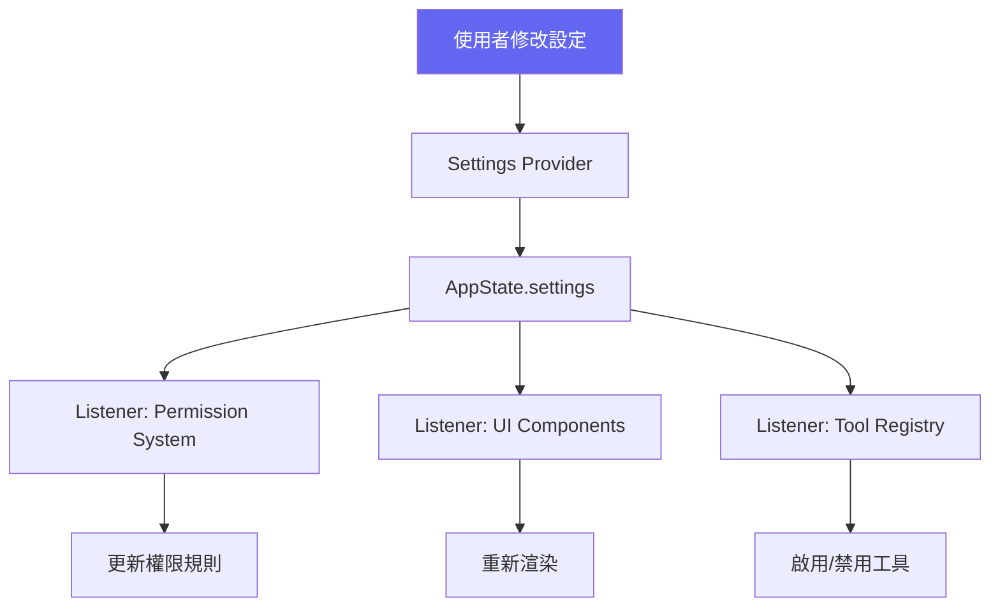

:::note[前置知識橋]
Ch.07 的 `query()` loop 在每輪都讀寫 `AppState` 物件。本章解釋這個 `AppState` 的設計哲學——為什麼一個簡單的 store 比 Redux 更適合 agent 系統，以及 `ToolUseContext` 如何成為貫穿整個調用棧的上下文載體。
:::

## 為什麼 AI 代理需要狀態管理？

Claude Code 不是一個無狀態的請求-回應系統。在一個工作 session 中，它需要追蹤：
- 當前的對話歷史
- 所有正在執行的背景任務
- 工具權限的即時狀態
- MCP 伺服器連線
- 使用者設定的變更
- Token 消耗和成本

這些狀態需要在多個元件間同步，而且需要即時反映在 UI 上。

## AppState Store — 簡單而有效

Claude Code 沒有使用 Redux、Zustand 或其他狀態管理庫。它使用了一個極簡的自製 Store：

```typescript
// src/state/store.ts
type Store<T> = {
  getState(): T;
  setState(updater: (prev: T) => T): void;
  subscribe(listener: () => void): () => void;
};

function createStore<T>(initialState: T): Store<T> {
  let state = initialState;
  const listeners = new Set<() => void>();

  return {
    getState: () => state,
    setState: (updater) => {
      state = updater(state);
      listeners.forEach(fn => fn());
    },
    subscribe: (listener) => {
      listeners.add(listener);
      return () => listeners.delete(listener);
    },
  };
}
```

:::tip[Tip]
這個 Store 的設計刻意簡單 — 只有 `getState`、`setState`、`subscribe` 三個方法。沒有 middleware、沒有 selector、沒有 action 分派。在 AI 代理的場景中，這種簡單性是一個優勢：更少的抽象 = 更少的 bug = 更容易除錯。
:::

## 為什麼不用 Redux？

Redux 很成熟，Zustand 很輕量，Jotai 很優雅——那 Claude Code 為什麼要自己寫一個 12 行的 store？這個問題的答案揭示了 agent 系統的狀態管理需求，與傳統 web app 的需求之間有多大的本質差距。

**Redux 為了解決的問題，agent 系統根本不存在**。Redux 的核心賣點是可預測的狀態變更歷史（action log），以及 Redux DevTools 的「時光旅行除錯」（time-travel debugging）。這些功能的存在前提是：開發者需要在複雜的用戶互動序列中找到「哪一步出錯了」。

但 Claude Code 的 session 不是這樣除錯的。一個 agent session 的狀態變更來自工具呼叫的結果，而工具呼叫是由 LLM 決定的——它本質上是不可重現的。在一個 LLM-driven 的系統中，「回到三步前的狀態」毫無意義，因為你無法讓 LLM 重現完全一樣的決策序列。Redux DevTools 在這裡是一個 UI 精美的零用工具。

**agent 系統有自己的特殊需求，Redux 的 API 沒有直接對應**：

1. **Snapshot 能力**（用於 context compression）：當對話歷史太長，Claude Code 需要把整個 `messages` 陣列打包成摘要。這需要能夠「拍下」整個狀態的快照，再以新狀態替換。Redux 的 selector 體系設計為讀取局部狀態，不是整個 store 的序列化。

2. **Diff 能力**（用於成本追蹤）：每輪 LLM 呼叫後，系統需要計算「這一輪用了多少 token、花了多少錢」。這需要比較前後兩個 `AppState` 的 token 計數欄位。Redux 的 middleware 可以做到，但需要額外的 action 設計。

3. **Ephemeral by design**：agent session 結束，狀態就丟棄。沒有 localStorage 持久化，沒有 session restore，沒有跨 session 的 state hydration 需求。Redux 的 persistence middleware 在這裡完全無用。

**API surface 的比例問題**。Dan Abramov 在 2016 年的文章〈You Might Not Need Redux〉中指出：如果你不需要 server-side rendering、不需要跨 tab 同步、不需要可序列化的 action log，那 Redux 只是在增加複雜度。Claude Code 的自製 store 恰好對應了這個判斷：

```typescript
// src/state/store.ts — 完整實作，只有 3 個公開方法
export function createStore<T>(
  initialState: T,
  onChange?: OnChange<T>,       // 可選的 onChange hook，僅用於 debug logging
): Store<T> {
  let state = initialState
  const listeners = new Set<Listener>()

  return {
    getState: () => state,                         // 讀取

    setState: (updater: (prev: T) => T) => {
      const prev = state
      const next = updater(prev)
      if (Object.is(next, prev)) return            // 淺比較，避免無效觸發
      state = next
      onChange?.({ newState: next, oldState: prev })
      for (const listener of listeners) listener() // 通知所有訂閱者
    },

    subscribe: (listener: Listener) => {
      listeners.add(listener)
      return () => listeners.delete(listener)       // 回傳 unsubscribe 函式
    },
  }
}
```

Redux 的 API surface 超過 20 個頂層函式與 middleware interface。這個 store 是 3 個。**匹配需求的複雜度，而不是匹配生態系的期望**，是這個設計的核心邏輯。

## ToolUseContext：貫穿調用棧的上下文物件

如果每個工具都需要讀寫 `AppState`、檢查中止信號、記錄進度、以及存取工具列表，最直覺的做法是使用全域變數。但全域變數讓工具無法在不同的執行環境下運作——主代理和子代理共用全域狀態，意味著子代理的 `setState` 會影響主代理的 UI；子代理的中止信號無法與主代理分離。

`ToolUseContext` 是解法：把所有執行期依賴打包成一個物件，從調用棧頂端傳到底端，每一層都可以看到完整的上下文，而不需要存取全域狀態。

**完整的傳播路徑：**

```
query() — 持有 ToolUseContext，包含 options.tools、getAppState、setAppState
  │
  ▼ new StreamingToolExecutor(toolUseContext.options.tools, canUseTool, toolUseContext)
StreamingToolExecutor — 持有 toolUseContext，傳給每個工具執行
  │
  ▼ runToolUse(toolUse, assistantMessage, canUseTool, toolUseContext)
runToolUse() — toolExecution.ts 的入口，用 toolUseContext 查找工具
  │
  ▼ checkPermissionsAndCallTool(tool, ..., toolUseContext, ...)
checkPermissionsAndCallTool() — Zod 驗證、hook 執行、權限檢查，全部依賴 context
  │
  ▼ tool.checkPermissions(input, toolUseContext)
tool.checkPermissions() — 每個工具的權限邏輯，接收完整 context
  │
  ▼ tool.call(callInput, { ...toolUseContext, toolUseId }, canUseTool, ...)
tool.call() — 工具主體，可以讀寫 AppState、使用 abortController、呼叫 onProgress
```

真實型別定義（`src/Tool.ts`）揭示了 `ToolUseContext` 攜帶的所有依賴：

```typescript
// src/Tool.ts — ToolUseContext 的核心結構（簡化）
export type ToolUseContext = {
  options: {
    tools: Tools                  // 可用工具列表（子代理可以是子集）
    commands: Command[]
    verbose: boolean
    isNonInteractiveSession: boolean
    // ...其他設定
  }
  abortController: AbortController    // 取消信號（子代理有自己的 controller）
  getAppState(): AppState             // 讀取狀態
  setAppState(f: (prev: AppState) => AppState): void  // 寫入狀態
  setAppStateForTasks?: (f: (prev: AppState) => AppState) => void
  // 子代理的 setAppState 是 no-op（避免子代理改到主代理的 UI 狀態）
  // 但 setAppStateForTasks 永遠指向根 store（背景任務需要跨層級更新）
  messages: Message[]              // 當前對話歷史
  agentId?: AgentId                // 僅子代理有此欄位
  toolUseId?: string               // 當前工具呼叫 ID（call() 時注入）
}
```

**為什麼是單一物件而不是個別參數？** 如果把這些依賴分開傳遞，`runToolUse` 的簽名就會變成：

```typescript
// 如果沒有 ToolUseContext，函式簽名會失控
async function* runToolUse(
  toolUse: ToolUseBlock,
  assistantMessage: AssistantMessage,
  canUseTool: CanUseToolFn,
  tools: Tools,
  abortController: AbortController,
  getAppState: () => AppState,
  setAppState: (f: ...) => void,
  messages: Message[],
  verbose: boolean,
  // ... 還有 10+ 個參數
)
```

`ToolUseContext` 是一個依賴注入（DI）的輕量實現——沒有 container、沒有 IoC framework，只是一個型別明確的 record，在整個調用棧中顯式傳遞。子代理在 `createSubagentContext()` 中建立一個派生的 context，其中 `setAppState` 被替換為 no-op，`abortController` 被替換為子代理自己的 controller，`options.tools` 被替換為過濾後的子集。

**代價**：`ToolUseContext` 變得越來越肥——目前已有超過 20 個欄位，其中很多是 optional 的。這是依賴注入的常見病症：當依賴越來越多，container 就越來越難以閱讀。

## AppState 結構

```typescript
// src/state/AppStateStore.ts — 簡化版
type AppState = {
  // 設定
  settings: SettingsJson;
  verbose: boolean;
  mainLoopModel: ModelSetting;

  // 對話
  messages: Message[];
  isBriefOnly: boolean;

  // MCP
  mcp: {
    clients: MCPServerConnection[];
    commands: Command[];
  };

  // 任務
  tasks: Map<string, TaskState>;

  // 權限
  toolPermissionContext: ToolPermissionContext;
  classifierApprovals: Map<string, PermissionDecision>;
  denialTracking: DenialTrackingState;

  // UI
  expandedView: 'none' | 'tasks' | 'teammates';

  // ... 更多欄位
};
```

## DeepImmutable — 型別級不可變性

為了防止意外的狀態突變，Claude Code 使用了 `DeepImmutable` 型別：

```typescript
type DeepImmutable<T> = {
  readonly [K in keyof T]: T[K] extends object
    ? DeepImmutable<T[K]>
    : Readonly<T[K]>;
};

// 使用
function getState(): DeepImmutable<AppState> {
  return state;  // TypeScript 確保返回值是完全唯讀的
}

// 嘗試修改會在編譯時報錯
const state = store.getState();
state.messages.push(msg);  // ❌ TypeScript Error!

// 正確的方式是透過 setState
store.setState(prev => ({
  ...prev,
  messages: [...prev.messages, msg],
}));
```

:::note[Note]
`DeepImmutable` 是純粹的編譯期檢查，運行時沒有任何開銷。它不像 Immutable.js 那樣使用特殊的資料結構，而是利用 TypeScript 的型別系統來防止突變。
:::

## 依賴注入模式

Claude Code 使用 `ToolUseContext` 作為依賴注入的載體，將所有執行期依賴集中傳遞：

```typescript
type ToolUseContext = {
  // 狀態存取
  getState: () => DeepImmutable<AppState>;
  setState: (updater: (prev: AppState) => AppState) => void;

  // 權限
  canUseTool: CanUseToolFn;

  // 進度回報
  onProgress: (progress: ToolCallProgress) => void;

  // 取消信號
  abortSignal: AbortSignal;

  // 工具查找
  lookupTool: (name: string) => Tool | undefined;

  // Session 資訊
  sessionId: string;
  projectRoot: string;
};
```

每個工具的 `call` 方法都接收這個 context，而不是直接引用全域變數。這使得：
- 工具可以在不同的上下文中執行（主代理 vs 子代理）
- 權限可以按需注入（不同的 `canUseTool` 實現）
- 測試更容易（可以 mock context）

## Settings 變更傳播



```typescript
// 設定變更觸發重新計算
store.subscribe(() => {
  const newSettings = store.getState().settings;

  // 重新計算權限上下文
  updatePermissionContext(newSettings);

  // 重新評估工具可用性
  refreshToolAvailability(newSettings);
});
```

## Task State 管理

任務使用 `Map<string, TaskState>` 管理，有明確的狀態轉移：

```
pending → running → completed
                  → failed
                  → killed
```

```typescript
// 更新任務狀態
store.setState(prev => ({
  ...prev,
  tasks: new Map(prev.tasks).set(taskId, {
    ...prev.tasks.get(taskId)!,
    status: 'completed',
    endTime: Date.now(),
  }),
}));
```

## 與 React 整合

Claude Code 的 UI 使用 Ink（React for CLI）。AppState 通過 React Context 和 hooks 整合：

```typescript
// Provider
function AppStateProvider({ children }: { children: ReactNode }) {
  const [state, setState] = useState(store.getState);

  useEffect(() => {
    return store.subscribe(() => {
      setState(store.getState());
    });
  }, []);

  return (
    <AppStateContext.Provider value={state}>
      {children}
    </AppStateContext.Provider>
  );
}

// Consumer hook
function useAppState() {
  return useContext(AppStateContext);
}
```

## 雙層快取設計

某些服務（如 Policy Limits）使用雙層快取：

| 層級 | 媒介 | 速度 | 生命週期 |
|------|------|------|---------|
| L1 | 記憶體（AppState） | 即時 | Session |
| L2 | 磁碟檔案 | 毫秒 | 跨 Session |

```typescript
// 先查記憶體
let limits = getFromMemory('policyLimits');

if (!limits) {
  // 再查磁碟
  limits = await readFromDisk('~/.claude/cache/policy-limits.json');

  if (!limits) {
    // 最後查遠端
    limits = await fetchFromAPI('/policy-limits');
    await saveToDisk(limits);
  }

  saveToMemory('policyLimits', limits);
}
```

## L2 Disk Cache 的失效策略

快取的最難問題不是「怎麼存」，而是「什麼時候要認定快取已過期而必須丟棄」。這個問題在 Claude Code 的 L2 磁碟快取中有一個直接可見的設計決策。

**兩種失效策略的本質差異**：

- **TTL（Time-To-Live）失效**：每筆快取記錄帶有一個過期時間戳。系統不追蹤「為什麼這份資料可能過時」，只看「它存在多久了」。簡單，但有一個根本問題：一份資料在 TTL 到期前就可能已經過時（例如 policy limits 在 API 端更新了），系統卻繼續使用舊資料。

- **Explicit Invalidation（明確失效）**：系統追蹤「哪些事件會讓這份資料失效」，當這些事件發生時，主動清除快取。正確，但代價是必須建模所有可能的失效觸發器——漏掉一個，就會有 stale data bug。

**L2 快取的 key 結構設計**是失效策略的基礎。key 的組成決定了快取的粒度：

```
cache key = session_id + tool_name + hash(input)
```

每個組成部分都有明確的語意：

- `session_id`：確保不同 session 的快取不會互相污染。即使工具和輸入完全相同，不同的 session context（不同的 working directory、不同的 permission mode）可能需要不同的結果。
- `tool_name`：不同工具的輸出不可互換。`GrepTool` 和 `GlobTool` 的快取 key 空間必須隔離。
- `hash(input)`：相同工具的不同輸入需要獨立的快取 entry。用 hash 而不是原始輸入字串，是因為輸入可能很長（例如複雜的 grep pattern），而 hash 的長度固定。

這個 key 結構選擇了 **explicit invalidation 的一個特殊形式：session 結束即失效**。當 session ID 不再有效，所有以該 session ID 為前綴的快取 key 自然就成為孤兒，下次清理時被回收。這是一個聰明的簡化：它把「session 結束」這個單一事件作為最強的失效觸發器，而不需要追蹤每個工具的具體依賴關係。

**代價是什麼？** 相同的工具、相同的輸入、在不同 session 中執行——快取必須重建。對於跨 session 確實不變的資料（例如 policy limits 這種遠端設定），這意味著每個新 session 的第一次存取都必須去遠端拉一次。這正是 L1（記憶體快取）和 L2（磁碟快取）分層存在的原因：L1 在 session 內提供即時存取，L2 提供跨 session 的快取（用於確實跨 session 穩定的資料），兩層的 TTL 策略是分開設計的。

## 關鍵要點

:::tip[Key Insight]
Claude Code 的狀態管理展示了一個反直覺的決策：**在 2026 年的專案中使用自製的極簡 Store，而不是成熟的狀態管理庫**。這是因為 AI 代理的狀態管理需求與傳統 web app 非常不同 — 它更像是一個有狀態的 server 而不是互動式 UI。簡單的 pub/sub + immutable 更新已經足夠，額外的抽象只會增加認知負擔。
:::

---

State management 是一個具體的設計模式——簡單 store、`DeepImmutable`、`ToolUseContext` 依賴注入、分層快取。Ch.10 收集整本書中所有出現的設計模式，給出一個統一的視角——這些設計決策為什麼聚合成一個一致的哲學：能力與控制邊界的分離，以及在每個層級都選擇匹配問題複雜度的最小工具集。
