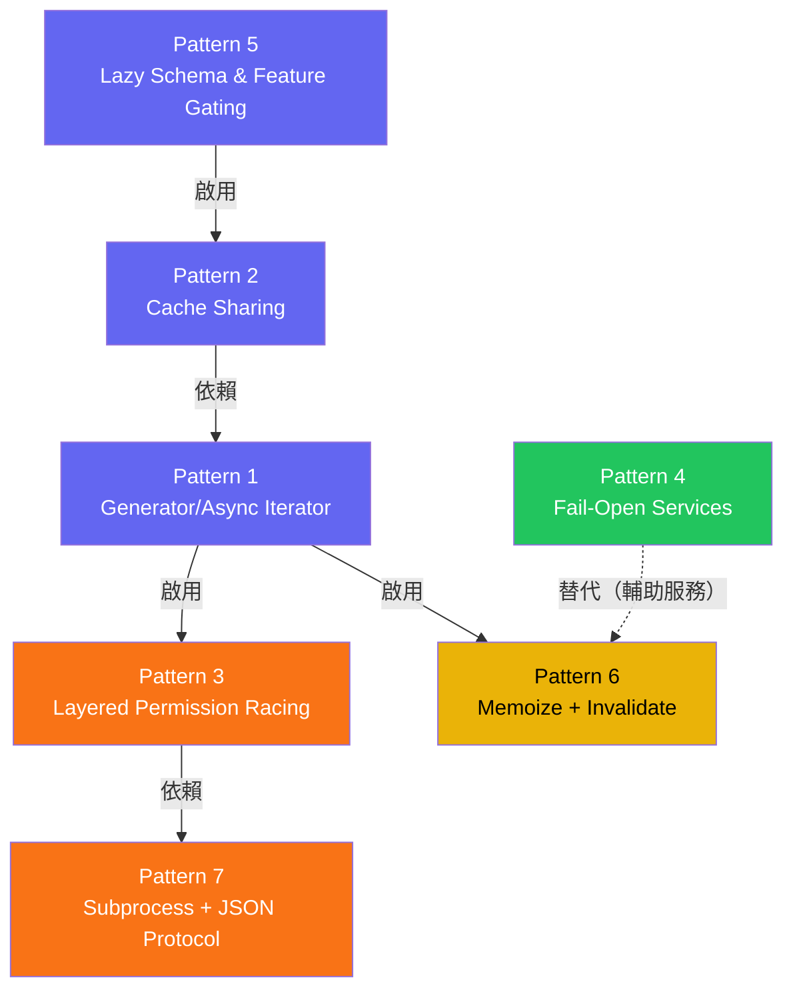

:::note[前置知識橋]
你已經讀完了 9 個章節。現在我們退一步，看這些設計決策的共同主題。每一個模式，背後都是一個曾經讓工程師痛苦過的問題。
:::

## 從 Claude Code 學到的設計模式

經過前 9 章的深入分析，讓我們提煉出 Claude Code 架構中最重要的設計模式，以及它們對 AI Agent 開發的啟示。

## Pattern 1: Generator/Async Iterator

**問題：** 如果用 callback 處理串流回應，你最終會得到「回呼地獄」（callback hell）：巢狀縮排越來越深，錯誤只能在最內層處理，單元測試幾乎不可能。更致命的是，callback 沒有「背壓」（backpressure）機制 — 當 API 以高速推送事件時，消費者沒有辦法說「慢一點」，記憶體會被瞬間塞滿。沒有 `return()` 語義，也無法從外部乾淨地取消一個進行中的非同步鏈。AI 代理的執行天生是串流式的：API 回應逐步到達、工具可能長時間執行、UI 需要即時更新——這三個需求疊加，讓 callback 架構徹底崩潰。

**Claude Code 的做法：**

```typescript
async function* query(params): AsyncGenerator<Message, Terminal> {
  for await (const event of apiStream) {
    yield event;  // 即時產出，不等待完成
    if (event.type === 'tool_use') {
      yield* runTools(event);  // 委派給工具執行 generator
    }
  }
}
```

**為什麼不用 Callback？**
- Callback 沒有背壓控制 — 生產者可能淹沒消費者
- Callback 難以組合 — 沒有 `yield*` 的委派語義
- Callback 難以取消 — generator 可以用 `return()` 外部取消

:::tip[Tip]
如果你的 AI 代理需要串流式執行，優先考慮 async generator 而不是 callback 或 event emitter。它在型別安全、組合性和取消語義上都更優越。
:::

## Pattern 2: Cache-Sharing Between Contexts

**問題：** 多代理系統中，每個代理呼叫 API 都需要傳送完整的 system prompt + tools，成本極高。

**Claude Code 的做法：**

```typescript
// 1. 父代理儲存 cache-safe params
saveCacheSafeParams({ systemPrompt, tools, model, messages });

// 2. 子代理取得相同的 params
const params = getLastCacheSafeParams();

// 3. 因為前綴完全一致，prompt cache 命中率 ~100%
// 結果：子代理的 system prompt 成本只有 10%
```

**架構約束：** 子代理不能自訂 system prompt 或 tools — 這是刻意的，犧牲彈性換取成本節省。

:::tip[Key Insight]
在設計多代理系統時，**成本是第一約束**。一個沒有 cache sharing 的多代理系統，成本會隨代理數量線性增長。Cache sharing 讓成本接近常數。
:::

## Pattern 3: Layered Permission with Racing

**問題：** 如果權限系統只有「等待使用者點擊確認」這一條路徑，延遲成本是可怕的。想像一次有 5 個工具並行執行，每個工具需要等待使用者 2 秒確認：序列化處理 = 10 秒，而這 10 秒內代理完全靜止。相反地，如果跳過確認、默認全部允許，安全性又形同虛設。真正的挑戰在於：有些操作（讀取不敏感的日誌文件）可以 0 延遲批准，有些操作（執行 `rm -rf`）必須強制人工確認，而系統在運行時無法預先知道哪種情況會發生。用 if-else 鏈來判斷只會把複雜度分散到四處，每新增一個判斷條件都有引入安全漏洞的風險。

**Claude Code 的做法：**

```typescript
// 三條路徑同時競賽
const decision = await Promise.race([
  userDialog.prompt(),       // 使用者判斷（慢但可靠）
  hookSystem.evaluate(),     // Hook 腳本（中等速度）
  mlClassifier.classify(),   // ML 分類器（快但只處理安全案例）
]);
```

**精妙之處：** ML 分類器只對「安全」的操作返回結果。對「不確定」的操作，它返回一個永遠不 resolve 的 Promise — 這讓 `Promise.race` 自動 fallback 到其他路徑。

## Pattern 4: Fail-Open Services

**問題：** AI 代理依賴多個外部服務（API、遠端設定、分析系統），任何一個失敗都不應該讓代理完全停止。

**Claude Code 的做法：**

```typescript
// Policy Limits 服務 — 典型的 fail-open 設計
try {
  const limits = await fetchPolicyLimits({ timeout: 5000 });
  applyLimits(limits);
} catch (error) {
  // 服務不可用 → 使用預設值，不阻塞
  console.warn('Policy limits unavailable, using defaults');
  applyDefaultLimits();
}
```

**原則：** 輔助服務（遙測、分析、設定）的失敗不應該阻塞核心功能（讀寫檔案、執行命令）。

## Pattern 5: Lazy Schema & Feature Gating

**問題：** Node.js（和 Bun）的模組系統在載入時解析所有 `import`。如果模組 A 在頂層 `import` 模組 B，而 B 又反過來 `import` A，你就得到了循環相依（circular dependency）：兩個模組都在等對方先完成初始化，結果都得到 `undefined`，代理靜默崩潰。在 Claude Code 的工具集合中，這個問題是真實存在的：`tools.ts` 需要 `TeamCreateTool`，而 `TeamCreateTool` 的依賴鏈又繞回 `tools.ts`——原始碼注解裡甚至直接寫明了「`// Lazy require to break circular dependency: tools.ts -> TeamCreateTool/TeamDeleteTool -> ... -> tools.ts`」。除了循環依賴，啟動時全部初始化意味著 Zod schema 的構建、正規表達式編譯、設定驗證全部疊加在冷啟動路徑上，讓 Claude Code 的第一次回應延遲大幅增加。某些功能（如 Coordinator Mode 的 `TeamCreateTool`、`TeamDeleteTool`）在特定環境下完全不需要，但仍然占用記憶體和初始化時間。

**Claude Code 的做法：**

```typescript
// 延遲 schema 載入 — 只在使用時才實例化
const schema = lazySchema(() => z.object({
  file_path: z.string(),
  content: z.string(),
}));

// Feature gating — 編譯時死程式碼消除
if (feature('COORDINATOR_MODE')) {
  registerTool(TeamCreateTool);
  registerTool(TeamDeleteTool);
}
// 如果 feature flag 關閉，bundler 會完全移除這段程式碼
```

## Pattern 6: Memoize + Invalidate

**問題：** 某些昂貴的操作（Git 狀態、CLAUDE.md 解析）在同一 session 中結果很少變化，但需要能感知到外部變更。

**Claude Code 的做法：**

```typescript
// 層次化的 memoization 策略
const getGitStatus = memoize(async () => {
  return execSync('git status --short');
});
// → Session 級快取，不會被失效（Git 狀態是快照）

const loadHooks = memoize(async () => {
  return parseHooksConfig('.claude/hooks.json');
});
setupFileWatcher('.claude/hooks.json', () => loadHooks.invalidate());
// → File watcher 驅動失效
```

**核心洞見：** 不同的資料有不同的快取語義。有些資料是「快照」（取一次就夠），有些是「活的」（需要響應外部變更）。

## Pattern 7: Subprocess + JSON Protocol

**問題：** 允許使用者擴展代理行為，但不能讓擴展程式碼影響核心穩定性。

**Claude Code 的做法（Hook System）：**

```
Harness ─── spawn ──→ User Script
         ← stdout ──  { "decision": "allow" }
```

- Hook 是獨立的子程序，崩潰不影響主程序
- 通訊協議是 JSON，語言無關
- 超時機制防止 hang
- 環境變數傳遞上下文

## 綜合：Harness Engineering Checklist

如果你要建立自己的 AI Agent 系統，以下是從 Claude Code 學到的設計清單：

### 安全性
- [ ] 所有外部操作都通過受控的工具介面
  - 在 Claude Code 中：`src/Tool.ts:Tool` — 所有工具繼承自 `Tool` 介面，核心執行路徑（`query.ts:queryLoop`）只能透過這個介面呼叫工具，沒有「繞過」工具系統直接呼叫的路徑。
- [ ] 工具預設是 fail-closed（不可並行、有副作用）
  - 在 Claude Code 中：`src/services/tools/StreamingToolExecutor.ts:executeTools` — 有副作用的工具（BashTool、FileWriteTool 等）必須等待前一個工具完成才能執行，只有唯讀工具（GrepTool、GlobTool）可以並行。
- [ ] 分層權限：自動 → Hook → ML 分類 → 使用者確認
  - 在 Claude Code 中：`src/hooks/useCanUseTool.tsx:useCanUseTool` — `Promise.race` 在 ML 分類器 (`peekSpeculativeClassifierCheck`) 和使用者對話之間競賽；分類器只對高信心「安全」操作返回結果，不確定時永遠不 resolve，讓 race 自動降級到下一層。
- [ ] 拒絕追蹤防止無限重試
  - 在 Claude Code 中：`src/utils/permissions/PermissionRule.ts` — 記錄已拒絕的操作，防止代理在同一個 session 中對相同操作無限重複請求授權。

### 效能
- [ ] Prompt cache sharing 在多代理間共享
  - 在 Claude Code 中：`src/utils/forkedAgent.ts:saveCacheSafeParams` — 主循環每次 turn 結束後呼叫 `saveCacheSafeParams()` 儲存完整的快取前綴；子代理呼叫 `getLastCacheSafeParams()` 取得相同前綴，確保 system prompt + tools 完全一致，Anthropic API prompt cache 命中率接近 100%。
- [ ] 唯讀工具並行，有副作用工具排他
  - 在 Claude Code 中：`src/services/tools/StreamingToolExecutor.ts` — 根據工具的 `readonly` 屬性決定是否可以與其他工具同時執行，這是 Ch.05 批次分割策略的核心實作。
- [ ] 串流式執行，不等待完整回應
  - 在 Claude Code 中：`src/query.ts:query` — 整個主循環是 `async function* query(...): AsyncGenerator`；每個 API 事件到達時立即 `yield`，UI 可以即時消費，不需等待 API 回應完整結束。
- [ ] Memoization + invalidation 策略
  - 在 Claude Code 中：`src/utils/memoize.ts:memoizeWithTTL` — 實作了 stale-while-revalidate 語義：回傳過期快取值的同時在背景更新，避免阻塞；`memoizeWithLRU` 則用 LRU 驅逐防止記憶體無限增長。

### 擴展性
- [ ] Hook 系統提供生命週期擴展點
  - 在 Claude Code 中：`src/utils/hooks.ts` — 覆蓋 22 個生命週期事件（PreToolUse、PostToolUse、SessionStart、Stop 等）；透過 `Promise.race` 在子程序執行和超時之間競賽，確保 hook 崩潰不影響主程序。
- [ ] Skill 系統允許使用者定義專家行為
  - 在 Claude Code 中：`src/tools/SkillTool/SkillTool.ts` — Skill 以 Markdown 文件形式存在，`SkillTool` 在呼叫時載入並注入到 system prompt；使用者可在 `.claude/skills/` 目錄下新增自訂 skill，無需修改核心程式碼。
- [ ] MCP 協議接入外部工具和資源
  - 在 Claude Code 中：`src/services/mcp/client.ts` — `MCPClient` 透過 stdio 或 HTTP 與外部 MCP 伺服器通訊；工具定義透過 `toolToAPISchema()` 轉換成標準格式後注入 API 請求。
- [ ] Plugin 錯誤隔離，不影響核心
  - 在 Claude Code 中：`src/utils/plugins/pluginLoader.ts` — plugin 的 hook 透過獨立子程序執行（Pattern 7 的 Subprocess + JSON Protocol），即使 plugin 崩潰，主程序也不受影響。

### 可觀測性
- [ ] 工具有型別化的進度回報
  - 在 Claude Code 中：`src/Tool.ts:ToolProgressToken` — 工具可在執行中途透過 `onProgress` 回呼回報部分結果，類型安全；UI 層接收後立即顯示，讓使用者看到工具的即時狀態而非黑盒等待。
- [ ] 任務有完整的生命週期追蹤
  - 在 Claude Code 中：`src/utils/task/diskOutput.ts:getTaskOutputPath` — 每個 AgentTool 任務有唯一的 task ID，執行期間的輸出寫入磁碟（`~/.claude/tasks/`），coordinator 可隨時透過 `TaskOutputTool` 查詢子代理的即時進度。
- [ ] 成本和 token 消耗即時統計
  - 在 Claude Code 中：`src/query.ts:queryLoop` — 每次 API 回應都累積 `usage` 資料（`input_tokens`、`output_tokens`、`cache_read_input_tokens`）；`RequestStartEvent` 讓 UI 在請求開始時就能顯示模型和預估成本。
- [ ] 遙測整合（OpenTelemetry）
  - 在 Claude Code 中：`src/utils/telemetry/instrumentation.ts` — 透過 OpenTelemetry SDK 輸出 span；使用 `Promise.race` 在完成和超時之間競賽，確保遙測失敗不阻塞主流程（Fail-open 設計）。

### 韌性
- [ ] 上下文壓縮防止窗口溢出
  - 在 Claude Code 中：`src/services/compact/autoCompact.ts` — 監控 token 消耗，在接近上限前自動觸發壓縮；`src/services/compact/compact.ts` 實作多輪摘要策略，保留關鍵決策脈絡。
- [ ] Fail-open 設計，輔助服務失敗不阻塞
  - 在 Claude Code 中：`src/services/policyLimits/index.ts:isPolicyAllowed` — `// fail open` 注釋直接在程式碼中說明設計意圖：當 Policy Limits 服務不可用時，預設返回 `true`（允許），核心功能不受影響。
- [ ] Graceful shutdown 清理資源
  - 在 Claude Code 中：`src/utils/gracefulShutdown.ts` — 透過 `Promise.race` 在正常完成和強制超時之間競賽；確保 MCP 連線關閉、子程序終止、暫存文件清理，即使在 Ctrl+C 中斷時也能執行。
- [ ] 雙層快取（記憶體 + 磁碟）跨 session 保持
  - 在 Claude Code 中：`src/services/policyLimits/index.ts:loadCachedRestrictions` — 以 `sessionCache` 作為記憶體層（O(1) 存取），以 `policy-limits.json` 作為磁碟層（跨 session 保持）；啟動時先讀磁碟，運行中更新記憶體，兩層同步維護。

## Pattern 之間的關係圖

七個模式不是孤立存在的。有些模式是「基礎設施」，讓其他模式得以實現；有些模式則是在解決同一問題的不同取捨。理解這張關係圖，可以在你自己的系統中更策略性地選擇要先投資哪個模式。



### 依賴關係（Dependencies）

| 上游 Pattern | 下游 Pattern | 關係說明 |
|---|---|---|
| **P1 Generator** | **P3 Permission Racing** | `useCanUseTool` 的 `Promise.race` 需要在 generator 執行框架內才能被 `yield` 出去；沒有 generator，race 結果無法安全地回到主循環。 |
| **P1 Generator** | **P6 Memoize** | `memoizeWithTTL` 的背景更新（stale-while-revalidate）需要非阻塞的執行環境；generator 提供了這個環境，讓 memoize 的 Promise.resolve 更新不會卡住 yield 鏈。 |
| **P5 Lazy Schema** | **P2 Cache Sharing** | `lazySchema` 打破了 `tools.ts → TeamCreateTool → tools.ts` 的循環依賴，讓工具集合能在模組加載時正確初始化；`saveCacheSafeParams` 依賴完整的工具集合才能建立一致的快取前綴。 |
| **P3 Racing** | **P7 Subprocess** | Hook 系統的腳本評估（`hookSystem.evaluate()`）本身就是一個 Subprocess + JSON Protocol 呼叫；P7 是 P3 中間層的實作基礎。 |

### 替代關係（Alternatives）

| 問題 | 方案 A | 方案 B | 取捨 |
|---|---|---|---|
| 輔助服務不可用 | **P4 Fail-Open**（預設允許） | **P6 Memoize**（用過期快取） | Fail-Open 放棄正確性換可用性；Memoize 嘗試用舊資料維持正確性。適用不同的服務 SLA。 |
| 昂貴操作快取 | **P6 Memoize + Invalidate** | **P2 Cache Sharing** | Memoize 是程序內快取（記憶體）；Cache Sharing 是跨 API 呼叫快取（Anthropic 伺服器端）。兩者可以同時存在，解決不同層次的重複計算問題。 |
| 使用者擴展點 | **P7 Subprocess（Hook）** | **P5 Feature Gating（Skill）** | Hook 是即時行為攔截，影響每次工具呼叫；Skill 是預載行為注入，影響 LLM 的決策方式。前者適合安全審計，後者適合能力擴展。 |

## 對未來的展望

Claude Code 的 Harness Engineering 展示了 AI 代理工程的一個成熟範式。但這個領域仍在快速演進：

1. **更細粒度的權限** — 不只是「允許/拒絕」，而是「允許但限制範圍」
2. **更智慧的上下文管理** — 預測性地載入相關上下文，而不是被動壓縮
3. **跨代理學習** — 代理從過去的 session 中學習效率模式
4. **正式驗證** — 對關鍵操作（如生產部署）進行形式化安全驗證

## 結語

:::tip[Key Insight]
Harness Engineering 的核心不是限制 AI 的能力，而是**以工程的嚴謹度來釋放 AI 的能力**。Claude Code 展示了一個系統如何在給予 AI 巨大自由度的同時，保持安全、效率和可控性。這不只是一個產品的架構 — 這是未來所有 AI Agent 系統的設計藍圖。
:::

感謝閱讀到這裡。希望這份教學日誌能幫助你在自己的 AI 專案中應用這些工程模式。

:::note[承先啟後]
所有的工具、代理、權限都在一個最終的媒介上運作：system prompt。Ch.11 解析 Claude Code 如何把這本書前十章的所有知識，壓縮成 LLM 能理解的指令——以及這個壓縮過程本身如何決定每次 API 呼叫的成本。
:::
